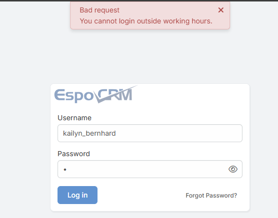
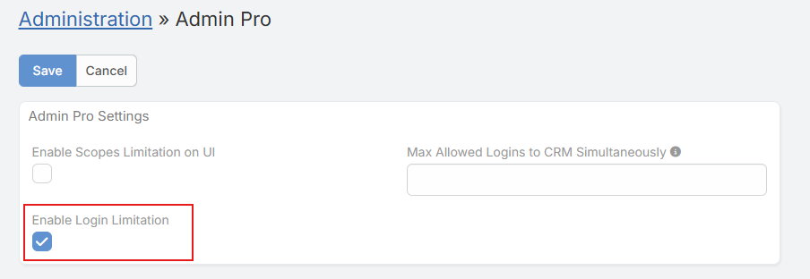
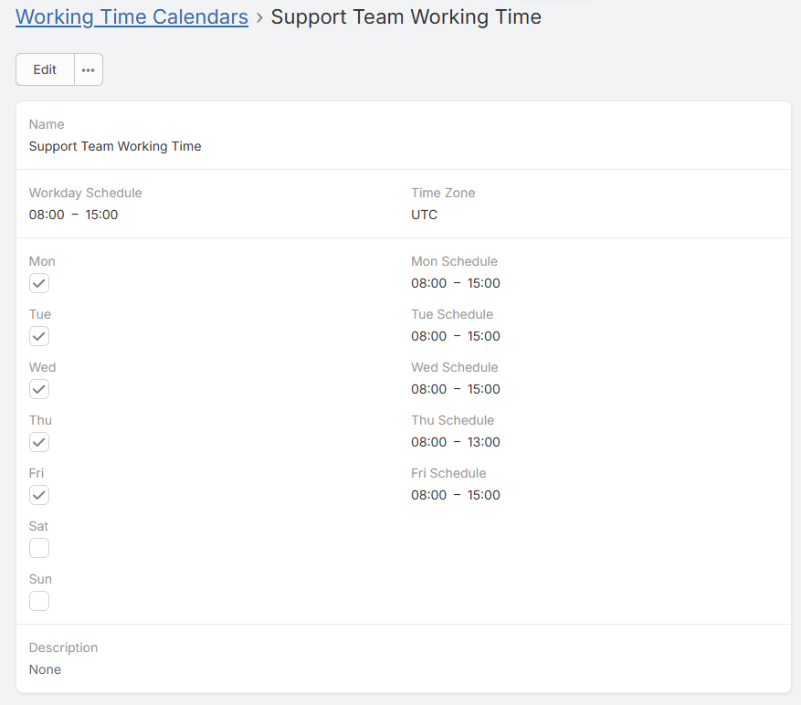
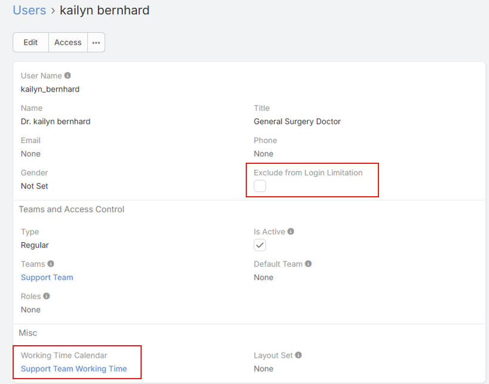

# Check Work Time

> Check Work Time in EspoCRM is available in [Ebla Admin Pro](https://www.eblasoft.com.tr/espocrm-extension-page/espocrm-admin-pro).

This feature restricts user access to the CRM based on the configured Working Time Calendar and ensures that system access is aligned with defined working schedules.

## Description

The **Check Work Time** feature controls when users are allowed to access the CRM according to the assigned **Working Time Calendar**. Users can only log in during their configured working hours. This helps organizations enforce security policies, prevent unauthorized after-hours access, and support proper work-time management.

In addition to login restriction, the system continuously validates the user's working time during an active session. If a user remains logged in and their working hours end, the system will automatically log the user out.

## Usage

1. Go to **Administration > Admin Pro settings**.
2. Enable the **Enable Login Limitation** option.
3. Make sure a **Working Time Calendar** is properly configured and assigned.
4. (Optional) To exclude specific users from this restriction:
    - Go to **Administration > Users**.
    - Open the desired user record.
    - Enable the **Exclude From Login Limitation** checkbox.
5. Save the settings.

## Automatic Logout Behavior

- If a user is actively working in the CRM and their configured working time ends, the system will automatically log the user out.
- This ensures that access is always limited strictly to the allowed working period, even if the session started earlier.

## Timezone Configuration (Important)

- The Working Time Calendar relies on the user’s configured timezone.
- Make sure the **working time calendars timezone** and **system timezone** are correctly set to match the user’s actual working hours.
- Incorrect timezone configuration may cause users to be logged out earlier or allowed access outside their intended schedule.

## Notes

- Administrator users are automatically excluded from this limitation.
- Portal users are automatically excluded from this limitation.
- The feature applies only to regular user accounts unless explicitly excluded.