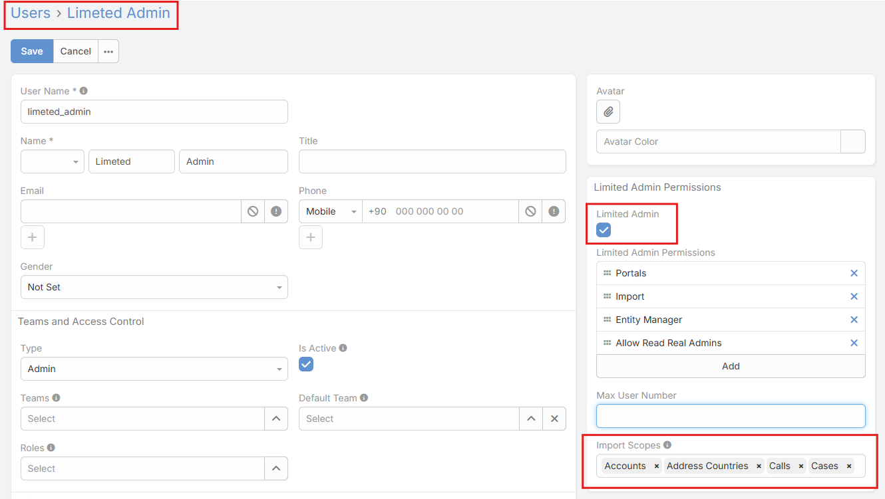

# Import Scope

> Import Scope is a feature in EspoCRM
> of [Ebla Admin Pro](https://www.eblasoft.com.tr/espocrm-extension-page/espocrm-admin-pro) extension.

___

**-** Go to **Administration > Users** .

!!! note

    If no scope is selected, the Limited Admin will not be able to perform any import operations.
