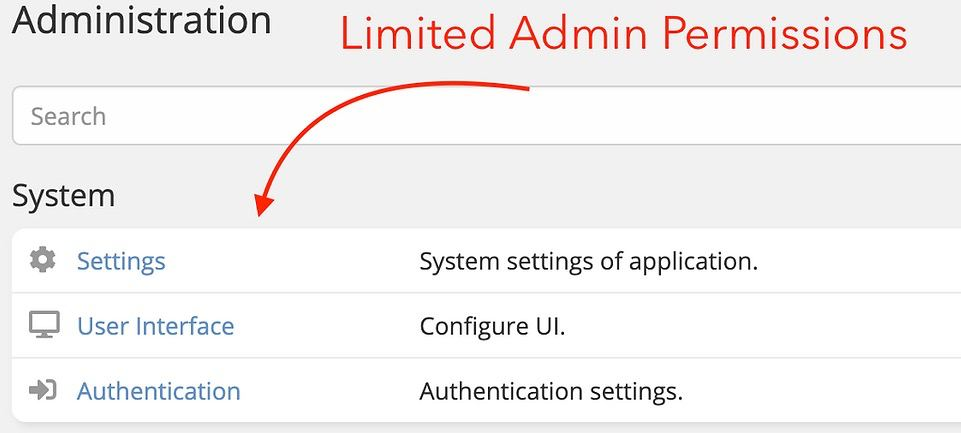
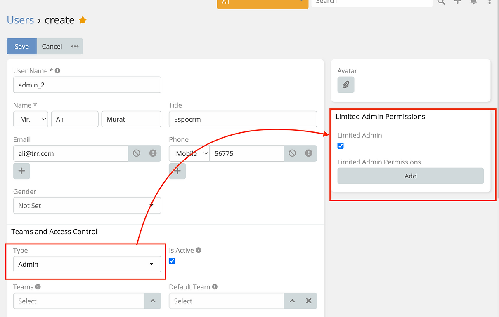

# Limit Admin User Permissions

>  Limit Admin User Permissions in EspoCRM is available in [Ebla Admin Pro](https://www.eblasoft.com.tr/espocrm-extension-page/espocrm-admin-pro).

---

---

**-** Go to **Administration -> Users -> {user} -> Edit**. (**User must be admin**)

