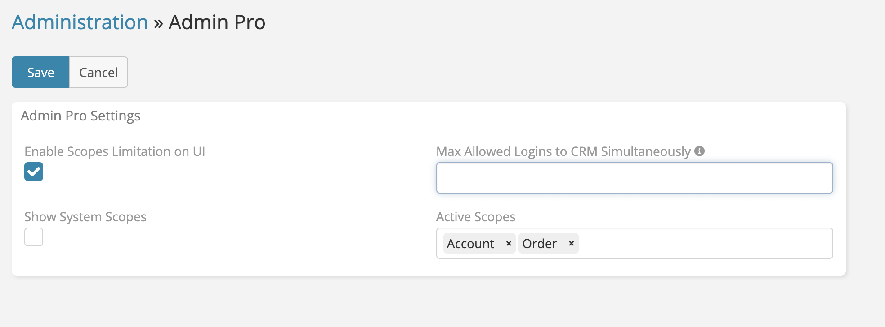

# Max Allowed Logins

> Max allowed logins is a feature in EspoCRM
> of [Ebla Admin Pro](https://www.eblasoft.com.tr/espocrm-extension-page/espocrm-admin-pro) extension.

___

**-** Go to **Administration -> Admin Pro settings** .

!!! note

    If empty or 0, no limitation will be applied 
    When the number of logins exceeds the limit, the oldest login will be logged out

