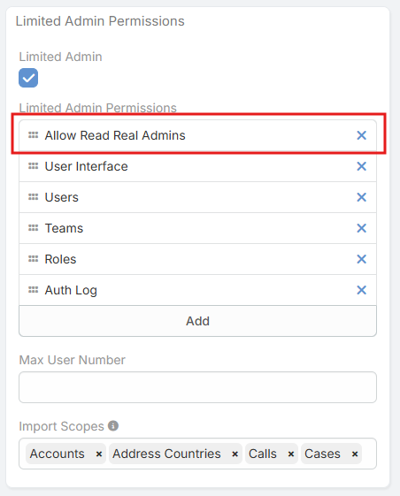

# Allow Read Real Admins.

> Allow Read Real Admins is a feature in EspoCRM
> of [Ebla Admin Pro](https://www.eblasoft.com.tr/espocrm-extension-page/espocrm-admin-pro) extension.

___

**-** Go to **Administration > Users** .

!!! note

        This permission is commonly required when a Limited Admin needs to tag or mention a Real Admin user in the Stream.

