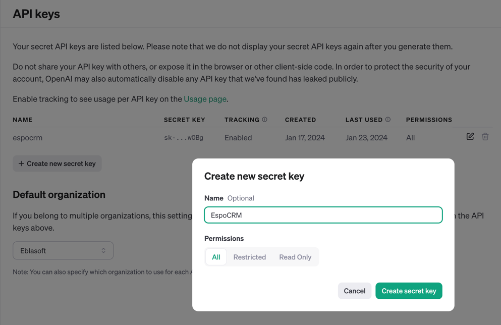
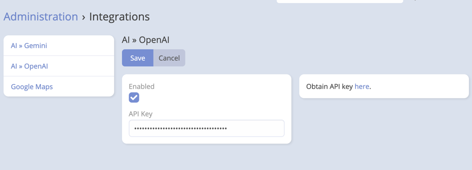

# OpenAI Integration Setup

## API Setup

1. Go to [OpenAI](https://platform.openai.com/api-keys) and sign in to your account.
2. Press "Create new secret key" to generate a new API key.
3. Give it a name and All permissions then press "Create secret key".
   
4. Copy the API key.

## EspoCRM Setup

1. Navigate to **Administration** -> **Integrations** -> **OpenAI**.
2. Paste the API key obtained from OpenAI into API Key field.

   
