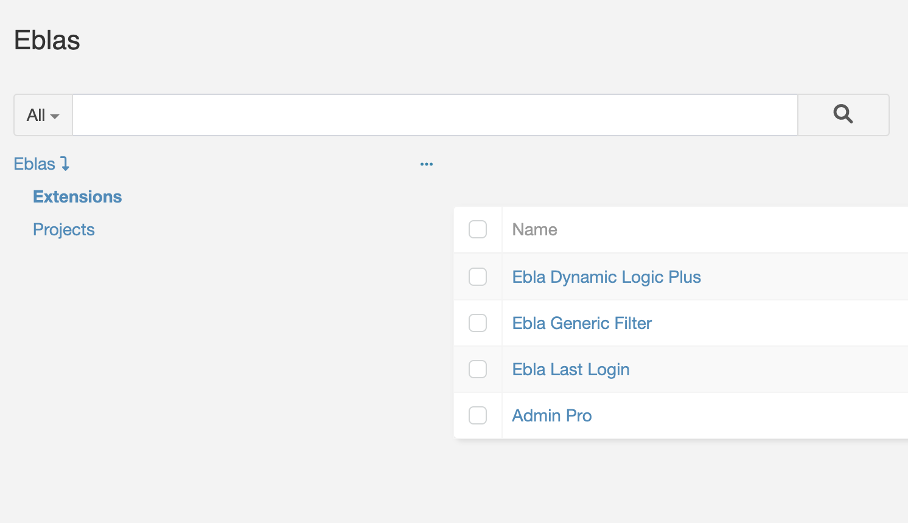
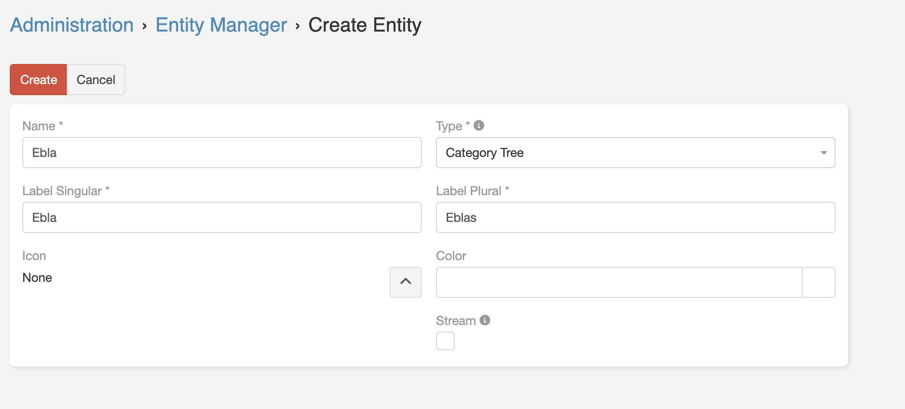

# Category Tree 

<!-- DOC:OVERVIEW START -->

## Overview

**Category Tree** is a template entity type that enables you to create hierarchical category structures with unlimited
parent-child relationships in EspoCRM. When you create a Category Tree entity, the extension automatically generates two
linked entities: a category entity with tree capabilities and an associated item entity, streamlining the setup of
organized, categorized data.

This extension is ideal for organizing products, documents, support tickets, or any other entity type that benefits from
hierarchical classification.
<!-- DOC:OVERVIEW END -->

<!-- DOC:FEATURES START -->

## Key Features

- **Automatic Entity Pair Creation**: Creates both category and item entities automatically when you define a new
  Category Tree type.
- **Hierarchical Tree Structure**: Build unlimited levels of parent-child category relationships.
- **Visual Tree Navigation**: Navigate through categories using an intuitive tree interface in list views.
- **Automatic Relationship Setup**: Pre-configured relationships between categories and their associated items.
- **Flexible Layout Integration**: Automatically adds category fields to list and detail layouts for easy access.

<!-- DOC:FEATURES END -->

<!-- DOC:USE-CASES START -->

## Use Cases

1. **Product Categorization** – Organize products into hierarchical categories and subcategories (Electronics →
   Computers → Laptops).
2. **Document Management** – Structure documents by department, project, or document type with multiple levels.
3. **Knowledge Base Organization** – Create a hierarchical structure for help articles and documentation.
4. **Support Ticket Classification** – Categorize tickets by issue type, department, or priority levels.
5. **Multi-level Classification** – Any scenario requiring organized, nested categorization of records.

<!-- DOC:USE-CASES END -->

<!-- DOC:INSTALLATION START -->

## Installation

1. Obtain the Category Tree extension package from the Eblasoft customer portal.
2. Navigate to **Administration** → **Extensions**.
3. Upload the extension package and click **Install**.
4. Clear cache and rebuild the system when prompted.

!!! note
Requires EspoCRM 8.0.0 or higher. Compatible up to version 9.2.x.
<!-- DOC:INSTALLATION END -->

<!-- DOC:USAGE START -->

## Usage

### Creating a Category Tree Entity

1. Go to **Administration** → **Entity Manager** → **Create Entity**.
2. Fill in the entity details:
    - **Label Singular**: The singular name (e.g., "Product")
    - **Label Plural**: The plural name (e.g., "Products")
3. Select **Type**: Choose **Category Tree** from the dropdown.

4. Click **Save**.

!!! tip
When you create a Category Tree with name "Product", the extension automatically creates two entities: "
ProductCategory" (for the tree structure) and "Product" (for the actual items).

### What Gets Created Automatically

When you create a Category Tree entity, the extension automatically:

- **Category Entity** (e.g., ProductCategory):
    - Extends the CategoryTree template with tree functionality
    - Includes parent-child relationship fields
    - Configured with tree navigation view

- **Item Entity** (e.g., Product):
    - Standard Base entity type
    - Pre-linked to the category entity
    - Category field automatically added to layouts
    - Displays with category tree navigation in list view

### Working with Categories

1. Navigate to the Category entity (e.g., **ProductCategory**).
2. Create root-level categories by leaving the **Parent** field empty.
3. Create subcategories by selecting a parent category.
4. The tree structure automatically updates to show the hierarchy.

### Assigning Items to Categories

1. Go to your item entity (e.g., **Product**).
2. Create or edit a record.
3. Use the **Category** field to assign the item to a category.
4. The item will appear under that category in the tree navigation view.

<!-- DOC:USAGE END -->

## Changelog 

---

## Support & Feedback

For assistance:

- Open a support ticket through the [Eblasoft customer portal](https://portal.eblasoft.com.tr)
- Email: support@eblasoft.com.tr
- For documentation improvements, open a [GitHub issue](https://github.com/eblasoft/documentation/issues)
