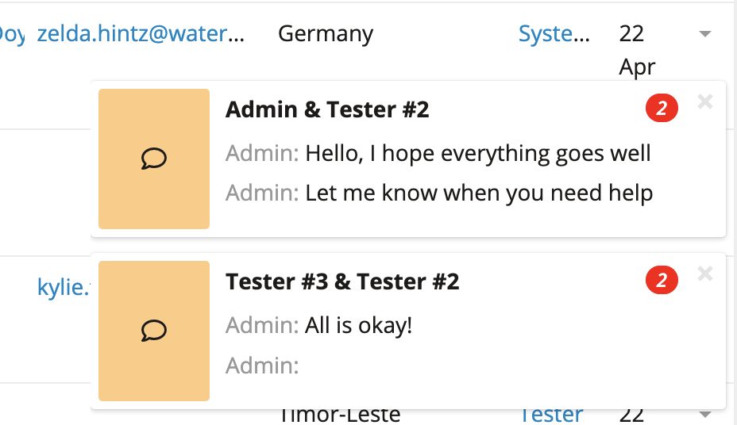
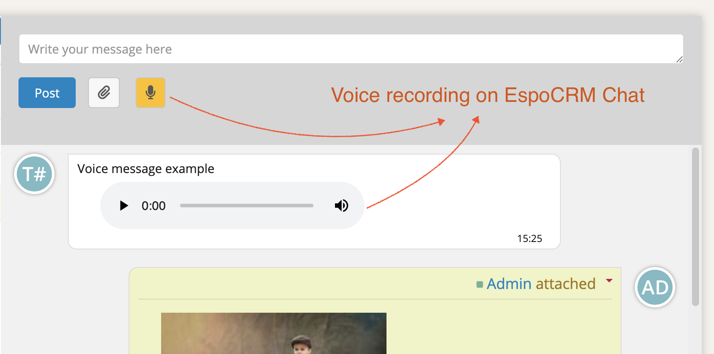
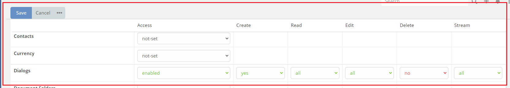

# Ebla Chat  

## Overview

**Ebla Chat** is an internal chat between users in EspoCRM. It allows users to communicate with each other in real-time.

<iframe width="560" height="315" src="https://www.youtube.com/embed/pq1S3DeC3ME" title="Espocrm | Ebla Chat Extension" frameborder="0" allow="accelerometer; autoplay; clipboard-write; encrypted-media; gyroscope; picture-in-picture; web-share" allowfullscreen></iframe>

## Features

### Stream Posts: 
Ebla Chat uses the same stream posts as EspoCRM. Users can post messages, images, and files, this is good for performance and compatibility with other EspoCRM features.

### Refresh-Time:
If WebSockets are not available, Ebla Chat will refresh the chat every 15 seconds.

!!! note
    To change the refresh time, you can set the new value to `popupNotificationsCheckInterval` parameter in the `config.php` file.
    Default is 15 seconds.

### Notifications:
In addition to EspoCRM notifications, Ebla Chat will notify users with grouped popup notifications. See the picture below.

### Voice Messages:
Users can send voice messages to each other. This also enable voice message attaching to any record stream post in EspoCRM.

### Permissions:
Ebla Chat uses EspoCRM permissions. Users can only chat with users they have permission to see.

## Change Log

