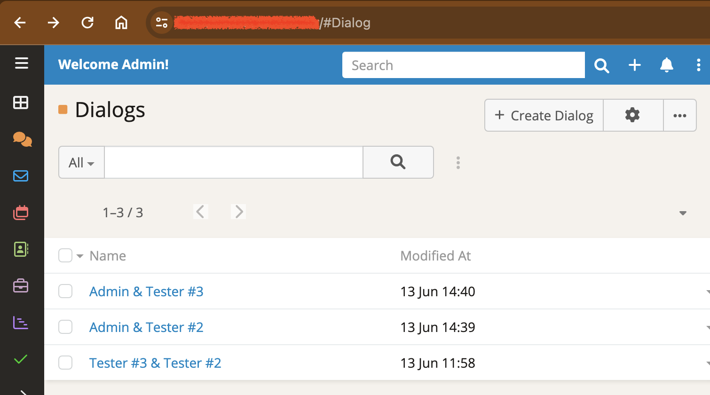

# Ebla Chat  <a href="https://www.eblasoft.com.tr/espocrm-extension-page/espocrm-chat" target="_blank" id="ext-version" data-id = "63495a03a58d3019b"></a>

<!-- DOC:OVERVIEW START -->

## Overview

**Ebla Chat** is an internal real-time chat system for EspoCRM users. It enables instant communication between team members with support for text messages, file attachments, voice messages, and real-time notifications.

<iframe width="560" height="315" src="https://www.youtube.com/embed/pq1S3DeC3ME" title="Espocrm | Ebla Chat Extension" frameborder="0" allow="accelerometer; autoplay; clipboard-write; encrypted-media; gyroscope; picture-in-picture; web-share" allowfullscreen></iframe>

!!! note
    You can access chats as a standard list view from `#Dialog`. Add it to your menu for quick access.
    
    

<!-- DOC:OVERVIEW END -->

<!-- DOC:FEATURES START -->

## Key Features

- **Real-Time Updates**: Instant message delivery via WebSocket when enabled, with polling fallback every 15 seconds when WebSocket is disabled.

- **Contextual Side Panel Integration** : Automatically display the chat interface within the side panel of specific records. By linking an entity to the Dialog, conversations are tied directly to that record for focused collaboration.

- **Stream Integration**: Uses EspoCRM's native stream post system for messages, ensuring full compatibility with existing features and excellent performance.

- **Popup Notifications**: Automatic desktop-style popup notifications when new messages arrive, even when you're working in other areas of EspoCRM.

- **Bell Icon Notifications**: Unread message count appears in the notification bell, keeping you aware of new messages without interrupting your workflow.

- **Voice Messages**: Record and send voice messages directly in the chat, also enabling voice message attachments on any record's stream.

- **File Attachments**: Share files, images, and documents seamlessly within conversations.

- **Permissions & Access Control**: Leverages EspoCRM's role-based permissions - users can only chat with users they have permission to see.

- **Quick Chat Access**: Start a chat directly from any record detail view with assigned users via the chat button field.

- **Confirmation Dialogs**: Built-in confirmation when opening chat from record detail views to prevent accidental navigation.

<!-- DOC:FEATURES END -->

## How It Works

### Contextual & Side Panel Access
**New!** The extension allows for context-aware conversations. When a specific entity (e.g., a Case, Opportunity, or Task) is linked via the Parent relationship to a Dialog:

The specific Chat Dialog will appear automatically in the Side Panel of that entity's Detail View.

This links the conversation directly to the record, ensuring all discussions related to that entity are easily accessible while viewing the record itself.


### Real-Time Communication

Ebla Chat supports two modes of real-time communication:

**With WebSocket Enabled:**
- Messages appear instantly (< 1 second delivery)
- Popup notifications trigger immediately
- Bell badge updates in real-time
- No polling required, reducing server load

**With WebSocket Disabled:**
- Automatic polling every 15 seconds (configurable)
- Popup notifications check on interval
- Still provides near-real-time experience
- Works reliably in all network environments

### Notification System

The extension provides multiple notification types:

1. **Popup Notifications**: Desktop-style alerts that appear in the bottom-right corner showing:
   - Dialog name
   - Number of unread messages
   - Click to open the conversation
   - Auto-dismiss when you open the chat

2. **Bell Icon Badge**: Shows total unread message count across all dialogs

3. **In-App Indicators**: Unread message badges in dialog list view


### Voice Messages

Record and send voice messages with a single click:

- Click the microphone icon to start recording
- Click stop when finished
- Voice message appears as an audio player in the chat
- Recipients can play messages directly in the conversation
- Voice messages can also be attached to any record stream post


### Permissions & Security

Chat respects all EspoCRM access control settings:

- Users can only chat with users they have permission to view
- Team-based access control supported
- Admin users have full visibility
- Portal users can participate in chats (if not disabled)


## Configuration

### Side Panel Integration Setup
To enable the chat panel to appear inside a specific entity (like Case, Task, etc.), you must define the relationship:

1. Navigate to Administration → Entity Manager.
2. Select Dialog.
3. Click on Relationships.
4. Create or ensure a relationship exists with your target entity (e.g., linking Dialog to Case).
5. Once the relationship is established, chats linked to that parent record will automatically render in the side panel.

### WebSocket Setup

For optimal real-time performance, enable WebSocket in EspoCRM:

1. Navigate to **Administration** → **Settings**
2. Enable **Use WebSocket** option
3. Configure your WebSocket server settings
4. Clear cache and refresh the page

### Notification Interval

To adjust the polling interval when WebSocket is disabled:

Edit `data/config.php` and add:

```php
'popupNotificationsCheckInterval' => 15, // seconds
```

Default is 15 seconds.

### Chat Button Field

This creates a button on detail views that opens a chat with the assigned user when clicked.

---

## Support and Feedback

For support, feature requests, or bug reports, please contact:

- **Email**: support@eblasoft.com.tr
- **Website**: [eblasoft.com.tr](https://www.eblasoft.com.tr)

---

## Change Log

<div class="change-log-wrapper" data-id="63495a03a58d3019b"></div>