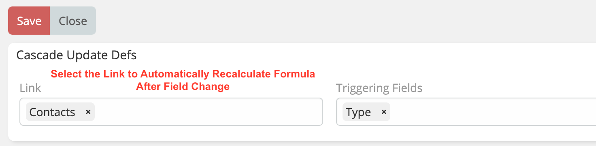

> Automatically recalculate formula after field change in EspoCRM is available
> in [Ebla Dynamic Logic Plus](https://www.eblasoft.com.tr/espocrm-extension-page/dynamic-logic-plus).

---

1. Go to **Administration** -> **Entity Manager** -> **{Entity Type}** -> **Fields Operations**.
2. Select the **Link**.
3. Select the **Triggering Fields**.

 

 

###  [ChangeLog](changelog.md) 
