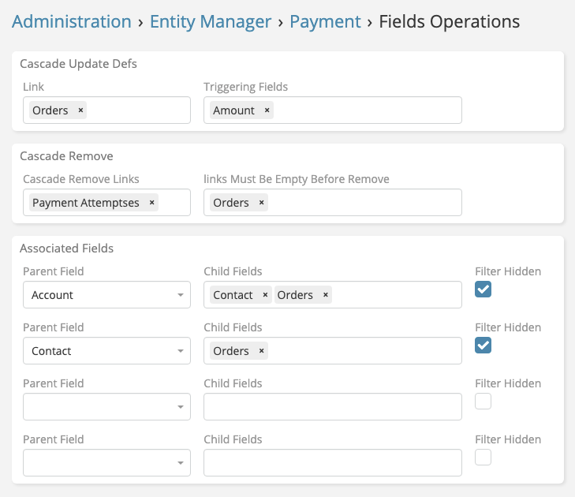

---
hide:
  - toc
---

# Dynamic Logic Plus Example

## Overview

{ align=right width=400 }

Screenshot is of the configuration page for entity "Payment" that has the following links & fields:

- `Orders`
- `Payment Attempts`
- `Account`
- `Contact`
- `Amount`

### Cascade Updaters

We have a formula on orders that calculate the paid amount of the order. We need to trigger the formula calculation when the amount of a payment is changed.
As in the screenshot, you can see that we selected the `Amount` field in triggering fields and `Orders` in the target links.
Only if the `Amount` field is changed, the formula on the `Orders` entity will be recalculated.

### Cascade Remove

When a payment is deleted, we want to delete the related `Payment Attempts` records automatically.

### Links Must Be Empty Before Remove

We want to prevent the deletion of a payment if it has related `Orders` records.
This means that the user must first delete the related `Orders` records before deleting the payment.
Useful for maintaining data integrity and preventing accidental deletion of important records.

### Associated Links

We need to make `Account` and `Contact` fields dependent on each other.
When an `Contact` is selected, the `Account` field will be automatically filled in.
When an `Account` is selected, the `Contact` autocomplete and modal select will be filtered by the selected `Account`.
Same we did with `Orders`, we need them to be dependent on `Account` and `Contact`.

