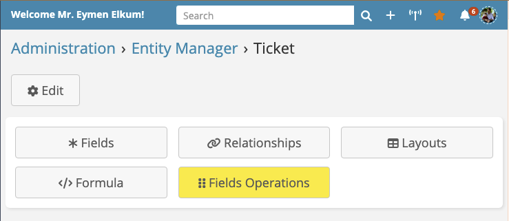
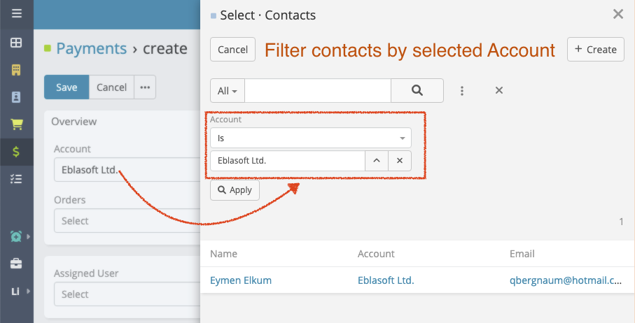
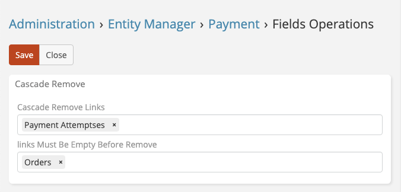
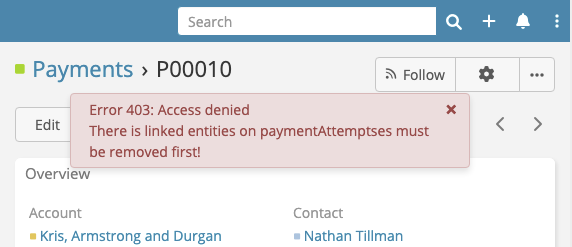
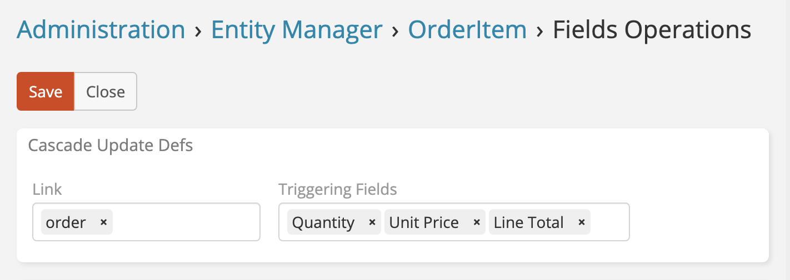

# Ebla Dynamic Logic Plus Documentation   

## Overview

**Ebla Dynamic Logic Plus** is a powerful extension for EspoCRM designed to enhance your EspoCRM experience by making data input more easy and efficient.

- **[Associated Links](#associated-links)**
- **[Cascade Remove](#cascade-remove)**
- **[Cascade Updaters](#cascade-updaters)**
- **[Links Must Be Empty Before Remove](#links-must-be-empty-before-remove)**

<iframe width="560" height="315" src="https://www.youtube.com/embed/5ilvA1BPRok?si=zDZlAAa2jVbZGc-3" title="YouTube video player" frameborder="0" allow="accelerometer; autoplay; clipboard-write; encrypted-media; gyroscope; picture-in-picture; web-share" referrerpolicy="strict-origin-when-cross-origin" allowfullscreen></iframe>

## Installation & Setup

Refer to [the installation guide](../../getting-started/installation-guide.md) for Ebla extensions.

Here is a screenshot of the new button on entity manager which leads to the configuration page of the extension:

### Example
See this [example](./dynamic-logic-plus-example.md) for a detailed explanation of how to configure the extension.

## Features

### 1. Associated Links

With Ebla Dynamic Logic Plus, you can define relation conditions for links between entities. For example, you can establish a relationship between Contacts and Accounts so that
selecting a contact automatically fills in the associated account. Additionally, you have the option to hide these filters for a seamless user experience.

!!! note "Note"
    You can make those filters hidden for a seamless user experience.

### 2. Cascade Remove

This feature allows you to automatically remove linked items when the parent entity is deleted. For instance, suppose you have a parent entity "Project" with linked child
entities "Tasks." Enabling cascade remove ensures that when a project is deleted, all associated tasks are also removed, preventing orphaned data.

### 3. Links Must Be Empty Before Remove

This feature prevents the deletion of specific records if they have linked items from designated relationships. For instance, if you don't want to delete an Account that has
associated Contacts, you can enforce that the Contacts must be removed manually before the Account can be deleted. This ensures data integrity and prevents accidental deletion of
important records.

### 4. Cascade Updaters

Cascade Updaters are invaluable for recalculating linked entities based on changes in child entities. 

For example, imagine you have an entity called "Order" with a calculated field `Total` that sums linked items in the "Order Item" entity. 

If Quantity, Unit Price or Line Total are modified => Recalculate the Order entity formula.

## ChangeLog

## Support

As always, we appreciate your feedback and are here to help with any questions or issues you may encounter. Please reach out to us on our [portal](https://portal.eblasoft.com.tr/).
You can log a ticket, or email us at support@eblasoft.com.tr.
