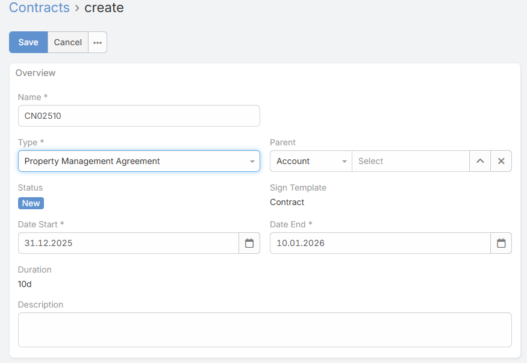
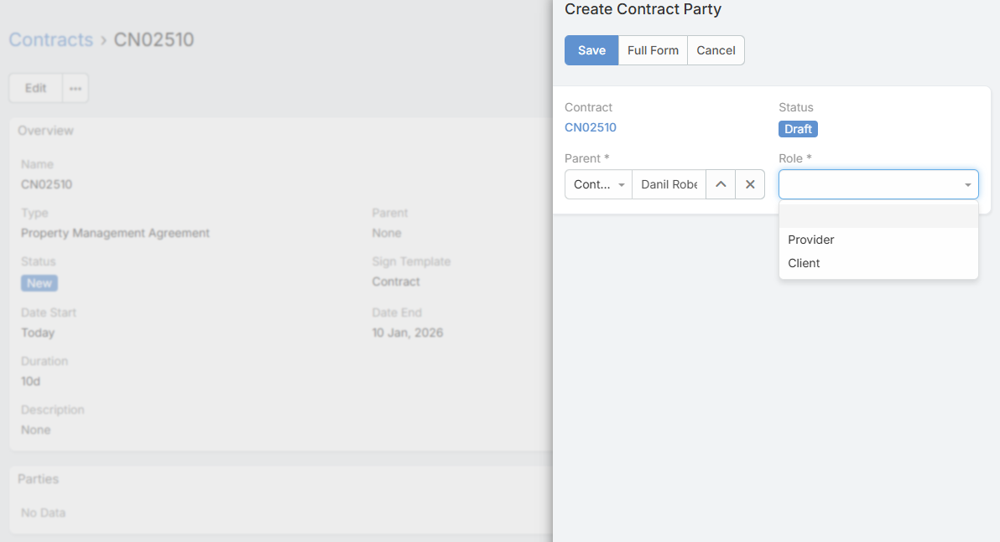
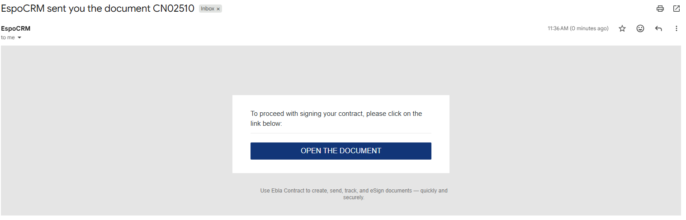

# Ebla Contract <a href="https://www.eblasoft.com.tr/espocrm-extension-page/ebla-contract" target="_blank" id="ext-version" data-id="6708e4d44dc00c037"></a>

## Overview

**Ebla Contract** is a comprehensive contract management extension for EspoCRM that streamlines the entire contract lifecycle
from creation to signing. It provides powerful e-signature capabilities, contract tracking, and multi-party signing workflows.

With support for both built-in signing and PandaDoc integration, Ebla Contract offers flexible solutions for businesses of
all sizes to digitize their contract processes.

---

## Extension Video

<!-- TODO: Add video when available -->
<!-- <iframe width="560" height="315" src="https://www.youtube.com/embed/VIDEO_ID" title="Ebla Contract for EspoCRM" frameborder="0" allow="accelerometer; autoplay; clipboard-write; encrypted-media; gyroscope; picture-in-picture; web-share" referrerpolicy="strict-origin-when-cross-origin" allowfullscreen></iframe> -->

---

## Key Features

- **Digital Signature Pad**: Advanced signature capture with customizable pen color, dot size, and background settings.
  Create professional-looking signatures directly in your browser.

- **Multi-Party Signing**: Support for multiple signers per contract with role-based assignments. Track signing status
  for each party independently.

- **Public Signing Pages**: Generate secure public links and QR codes for contract parties to sign documents without
  needing CRM access. Perfect for external stakeholders.

- **Template System**: Create contract templates with dynamic placeholders for signatures, dates, names, and party
  information. Reuse templates across multiple contracts.

- **E-Signature Providers**: Pluggable provider architecture with built-in Ebla provider and optional PandaDoc integration
  for advanced features.

- **Audit Trail**: Comprehensive tracking of signature events including IP address logging, signing timestamps, and
  status changes for compliance and security.

- **Calendar Integration**: Contracts appear in the EspoCRM calendar with activity tracking and status-based filtering.

- **Document Management**: Attach contract documents, generate PDFs from templates, and manage contract versions with
  full document lifecycle support.

- **Contract Types**: Pre-configured contract types including Lease Agreement, Sales Agreement, Service Contract,
  Maintenance Contract, and more. Fully customizable.

- **Status Workflow**: Automated status transitions from New → Ready for Send → Pending → Completed with customizable
  workflows.

---

## Use Cases

### 1. **Real Estate Contracts**
Manage property lease agreements, sales contracts, and maintenance agreements with multiple parties. Generate QR codes
for easy mobile signing during property viewings.

### 2. **Service Agreements**
Create and send service contracts to clients with automatic reminders. Track contract renewals and maintain a complete
history of all agreements.

### 3. **Employment Contracts**
Onboard new employees by sending employment contracts with signature requirements. Capture signatures with IP address
logging for compliance.

### 4. **Sales Proposals**
Convert opportunities into contracts and send to prospects for digital signature. Track proposal status in real-time.

### 5. **NDA and Legal Agreements**
Manage non-disclosure agreements, partnership agreements, and other legal documents with audit trails and secure signing.

---

## Quick Start Guide

### Step 1: Create a Contract Template

1. Navigate to **Administration** → **Templates**.
2. Click **Create Template** and select **EblaContract** as the entity type.
3. Design your contract using the rich text editor.
4. Add template placeholders for dynamic content:
   - `{{contractSign "Signer"}}` - Signature placeholder
   - `{{contractSignName "Signer"}}` - Signer name
   - `{{contractSignDate "Signer"}}` - Signing date
   - `{{contractSignParty "Signer" "Field"}}` - Party Filed 


### Step 2: Create a Contract

1. Navigate to **Contracts** (or **EblaContract** in the menu).
2. Click **Create Contract**.
3. Fill in the contract details:
   - **Name**: Contract title
   - **Type**: Select contract type (Lease, Sales, Service, etc.)
   - **Status**: Set to "New"
   - **Date Start/End**: Contract period
   - **Sign Template**: Select the template created in Step 1
   - **Parent**: Link to related entity (Account, Opportunity, etc.)



### Step 3: Add Contract Parties

1. In the **Parties** panel, click **Create** to add signers.
2. Assign roles (e.g., "Landlord", "Tenant", "Client", "Vendor").
3. Link each party to a Contact, Lead, or User.
4. Save the party record.



### Step 4: Create and Send Document

1. On the contract detail view, click **Create Document**.
2. The system generates the document from your template.
3. Preview the document to verify all placeholders are filled.
4. Click **Send Document** to distribute signing links to all parties.


### Step 5: Sign the Contract

1. Parties receive an email with a unique signing link or QR code.
2. They open the link (no login required).
3. Review the contract and use the signature pad to sign.
4. System captures IP address and timestamp automatically.




---

## Configuration

### General Settings

Navigate to **Administration** → **Settings** → **Contract Settings**.

#### Default E-Signature Provider

- **defaultContractsProvider** (default: `Ebla`): Choose between built-in Ebla provider or PandaDoc integration.
  
  Options:
  - `Ebla` - Built-in signature provider (no external dependencies)
  - `PandaDoc` - Integration with PandaDoc service (requires separate extension)

---

## Signature Field Configuration

The signature field offers extensive customization options to match your branding and document requirements.

### Field Parameters

Access these settings via **Administration** → **Entity Manager** → **EblaContractParty** → **Fields** → **Sign**.

#### Pen Color

Customize the signature ink color using the color picker.

- **Parameter**: `color`
- **Type**: Color Picker
- **Default**: `#000000` (Black)
- **Use Case**: Brand consistency, document requirements

#### Dot Size

Control the thickness of signature strokes for better legibility and appearance.

- **Parameter**: `dotSize`
- **Type**: Float (0.5 - 5.0)
- **Default**: `1.0`
- **Use Case**: High-resolution displays, print quality optimization
- **Tip**: Higher values create bolder signatures; lower values provide finer detail

#### Background Color

Set a background color for the signature canvas area.

- **Parameter**: `backgroundColor`
- **Type**: Color Picker
- **Default**: None (transparent)
- **Use Case**: Contrast enhancement, document design requirements

#### Read Only Options

- **readOnly** (default: `false`): Prevent signature modification
- **readOnlyAfterCreate** (default: `false`): Lock signature after initial creation

---

## Template Helpers

Template helpers allow you to embed dynamic contract data and signatures into PDF documents.

### Available Helpers

#### 1. Signature Image

Embeds the signature as an inline image in the document.

**Syntax:**
```handlebars
{{signatureImage sign width="200" height="100"}}
```

**Parameters:**
- `sign` - The signature field data
- `width` - Image width in pixels
- `height` - Image height in pixels

**Example:**
```handlebars
Signature: {{signatureImage contractParty.sign width="250" height="80"}}
```

#### 2. Contract Sign

Displays the signature for a specific role.

**Syntax:**
```handlebars
{{contractSign "Signer"}}
```

**Parameters:**
- `role` - The party role (must match a role in contract parties)

**Example:**
```handlebars
Landlord Signature: {{contractSign "Landlord"}}
Tenant Signature: {{contractSign "Tenant"}}
```

#### 3. Contract Sign Name

Displays the name of the person who signed for a specific role.

**Syntax:**
```handlebars
{{contractSignName "Signer"}}
```

**Example:**
```handlebars
Signed by: {{contractSignName "Client"}}
```

#### 4. Contract Sign Date

Displays the date when the contract was signed for a specific role.

**Syntax:**
```handlebars
{{contractSignDate "Signer"}}
```

**Example:**
```handlebars
Date Signed: {{contractSignDate "Vendor"}}
```

#### 5. Contract Sign Party

Displays detailed party information including name, role, and signing details.

**Syntax:**
```handlebars
{{contractSignParty "Signer" "fieldName"}}
```

**Example Template:**

```html
<h2>Service Agreement</h2>

<p>This agreement is entered into on {{dateStart}} between:</p>

<div style="margin: 20px 0;">
  <strong>Service Provider:</strong><br>
    Name : {{contractSignName "Provider"}}
    Email Address : {{contractSignParty "Provider" "emailAddress"}}
</div>

<div style="margin: 20px 0;">
  <strong>Client:</strong><br>
    Name : {{contractSignName "Client"}}
    Email Address : {{contractSignParty "Client" "emailAddress"}}
</div>

<div style="margin-top: 40px;">
  <table width="100%">
    <tr>
      <td width="50%">
        <strong>Provider Signature:</strong><br>
        {{contractSign "Provider"}}<br>
        Name: {{contractSignName "Provider"}}<br>
        Date: {{contractSignDate "Provider"}}
      </td>
      <td width="50%">
        <strong>Client Signature:</strong><br>
        {{contractSign "Client"}}<br>
        Name: {{contractSignName "Client"}}<br>
        Date: {{contractSignDate "Client"}}
      </td>
    </tr>
  </table>
</div>
```

## Contract Workflow

### Contract Statuses

The contract lifecycle follows these statuses:

1. **New**: Initial state when contract is created
2. **Ready for Send**: Document created from template and ready for distribution
3. **Pending**: Document sent to parties, awaiting signatures
4. **Completed**: All parties have signed the contract
5. **Canceled**: Contract was canceled before completion

Additional statuses for calendar integration:
- **Planned**: Scheduled for future execution
- **Held**: Contract meeting/event completed
- **Not Held**: Scheduled event did not occur

### Party Statuses

Contract parties progress through these statuses:

1. **Draft**: Party added but document not created
2. **Sent**: Signing link sent to party
3. **Signed**: Party completed signature

### Automated Status Transitions

The system automatically updates statuses based on actions:

- Creating document: Contract → "Ready for Send"
- Sending document: Contract → "Pending", All ready parties → "Sent"
- Signing: Party → "Signed"
- All parties signed: Contract → "Completed"
- Removing signature: Party → "Sent", Contract → "Pending"

---

## Public Signing

### How It Works

Public signing allows external parties to sign contracts without CRM access through secure, tokenized URLs.

1. System generates a unique session ID for each contract party
2. Public URL is created: `https://your-crm.com/?entryPoint=EContract&id={sessionId}`
3. QR code is automatically generated for mobile-friendly access
4. Link can be sent via email or shared directly

### Security Features

- **No Authentication Required**: Parties sign without creating CRM accounts
- **Unique Session Tokens**: Each signing link is unique and non-transferable
- **IP Address Logging**: System captures signer's IP for audit trail
- **Timestamp Recording**: Exact signing time is recorded
- **Preview Mode**: Option to preview contracts without signing capability

### Accessing Public Signing Page

**For Contract Parties:**

1. Check the **QR Code** field on the party record
2. Scan with mobile device or click the generated link
3. Review the contract document
4. Use signature pad to sign
5. Click **Confirm Signature**

**Entry Point URL Structure:**
```
https://your-crm.com/?entryPoint=EContract&id={sessionId}
https://your-crm.com/?entryPoint=EContract&id={sessionId}&preview=true
```

---

## Advanced Features

### Signature Preservation

The signature field intelligently handles existing signatures:

- **Initial Signature**: Loaded automatically when editing a party record
- **New Strokes**: System tracks when new signature strokes are added
- **Hybrid Mode**: Combines existing signature with new strokes seamlessly
- **Canvas Resizing**: Preserves signature content during window resize
- **Undo Support**: Remove last stroke without losing entire signature

### IP Address Tracking

Every signature event captures the signer's IP address automatically:

- **Field**: `ipAddress` on EblaContractParty
- **Capture Time**: When signature is confirmed
- **Use Cases**: Compliance, fraud prevention, audit trails
- **Display**: Visible in party detail view for authorized users

### Remove Signature

Authorized users can remove signatures when needed:

1. Open the Contract Party record
2. Click **Remove Signature** action in the dropdown menu
3. Confirm the action
4. System resets:
   - Signature field cleared
   - Status changed back to "Sent"
   - Signed timestamp removed
   - IP address retained for audit
   - Contract status reverted to "Pending"

!!! warning
    Removing a signature is a sensitive action. Ensure proper permissions are configured via ACL settings.

### Calendar Integration

Contracts integrate seamlessly with EspoCRM calendar:

- **Activity View**: Contracts appear as calendar events
- **Date Range**: Based on Date Start and Date End fields
- **Color Coding**: Status-based color indicators
- **Filtering**: Filter by contract status in calendar view

---

## PandaDoc Integration

### Overview

The PandaDoc provider (available as separate extension **Ebla PandaDoc**) enables advanced e-signature features through
PandaDoc's platform.

### Features

- OAuth 2.0 authentication with automatic token refresh
- Template synchronization from PandaDoc workspace
- Role mapping between EspoCRM and PandaDoc
- Document creation in PandaDoc from EspoCRM templates
- Webhook support for real-time status updates
- Embedded PandaDoc editor
- QR code generation with PandaDoc signing links

### Installation

1. Install **Ebla Contract** extension first
2. Install **Ebla PandaDoc** extension
3. Navigate to **Administration** → **Integrations** → **PandaDoc**
4. Configure OAuth credentials:
   - **Client ID**: From PandaDoc developer portal
   - **Client Secret**: From PandaDoc developer portal
   - **Callback URL**: Automatically populated
5. Click **Connect** to authorize
6. Set **Default Contracts Provider** to "PandaDoc" in settings


### Webhook Configuration

Configure webhooks in PandaDoc dashboard to receive real-time updates:

**Webhook URL:**
```
https://your-crm.com/api/v1/ESign/webhook/PandaDoc
```

**Events to Subscribe:**
- `document_state_changed`
- `recipient_completed`
- `document_completed`

---

## Support and Feedback

For any inquiries, support, or feedback regarding the **Ebla Contract** extension, please reach out through our portal and
create a ticket. We are committed to ensuring a seamless experience and are here to assist you with any questions or
concerns.

**Support Portal:** [https://portal.eblasoft.com.tr](https://portal.eblasoft.com.tr)

---

## Changelog

<div class="change-log-wrapper" data-id="6708e4d44dc00c037"></div>
