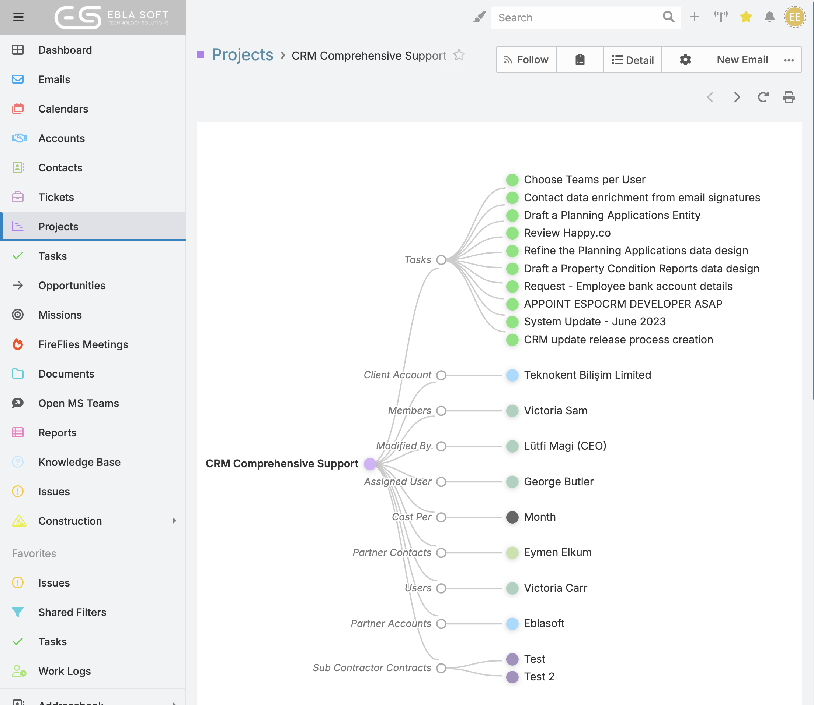
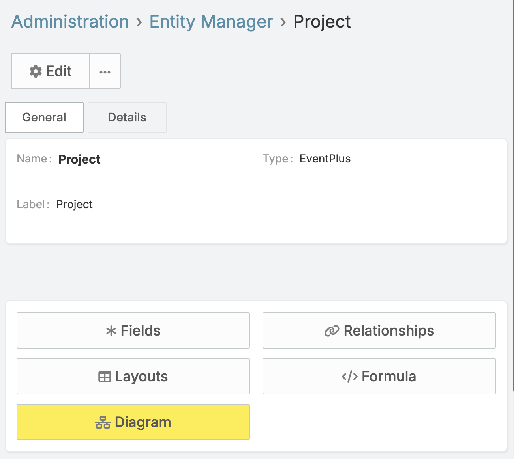
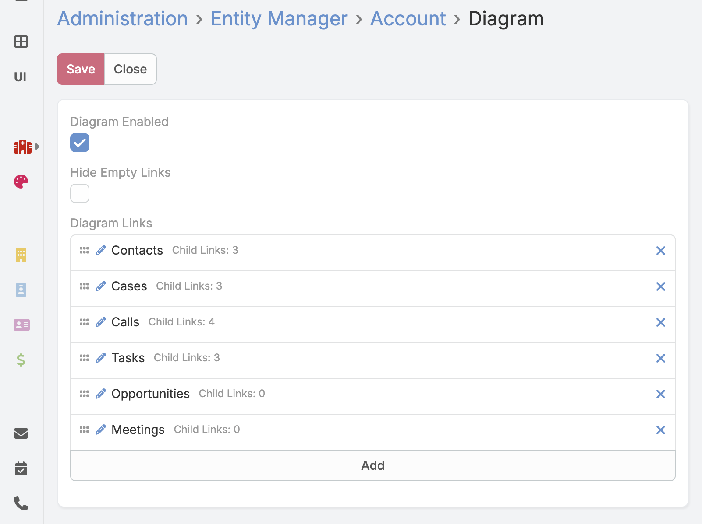

# Ebla Diagram  

## Overview

**Ebla Diagram** adds a Diagram mode to record detail pages so users can understand configured relationship paths visually.

From a record, users can switch between **Detail** and **Diagram** and review a pre-expanded relationship tree defined by the administrator.

---

## What users can do

- Open relationship diagrams from supported record detail views.
- See only the relationship paths configured by the administrator.
- Review all configured branches already expanded when the diagram opens.
- Pan and zoom the diagram.
- Change layout direction, including radial mode, for readability.
- Open related data directly from diagram nodes.
- Print the current diagram.

---

## Quick Start

1. Go to **Administration → Entity Manager → {Entity} → Diagram**.
2. Enable diagram mode for the entity and save.
3. Open a record and click **Diagram** in the top-right actions.

---

## Configure Diagram

### Open the settings page

1. Go to **Administration → Entity Manager**.
2. Open the entity you want to configure.
3. Click **Diagram**.

### Settings

#### Diagram Enabled

Turn this on to allow Diagram mode for the entity.

#### Diagram Links

Choose the exact relationship paths to show in the diagram.

Examples:

- `Company → Offices → Employees`
- `Company → Owners`

Only the selected links are rendered. Administrators can choose whether empty links are hidden or shown as `(empty)` placeholders.

### Recommended setup

1. Enable diagram mode for key entities first.
2. Start with a small set of meaningful relationship paths.
3. Add second- and third-level links only where they help analysis.
4. Save and test with real records.

### Permission note

Only administrators can save Diagram settings from Entity Manager.

---

## Use Diagram View

### Open Diagram mode

1. Open a record where diagram mode is enabled.
2. Click **Diagram** from record actions.
3. Click **Detail** any time to return to standard detail view.

### Understanding the diagram

The diagram renders as a hierarchical tree starting from the current record:

- **Coloured circles** — record nodes (an actual entity record)
- **Hollow circles** — relationship nodes (a link to a set of related records)
- **Curved lines** — show the direction of relationships

The default direction is **left-to-right (LR)**.

For `LR`, `RL`, `TB`, and `BT`, spacing follows a deterministic tree layout so level gaps stay consistent across direction changes.

Your last selected direction is remembered per entity in your browser, so for example **Account** and **Contact** can keep different preferred directions.

Node actions:

- Clicking a **record node** opens that record in a modal detail view.
- Clicking a **link node** opens a modal related-list for that relationship.
- Empty link placeholders use a dashed outline for quick visual identification.

Visual style (node colours and text sizing) stays consistent across all directions.

### Pan and zoom

- **Drag** the background to pan around.
- **Scroll** (or pinch on touch) to zoom in and out.

### Toolbar actions

#### Change Direction

Cycle through five orientations to improve readability:

| Direction | Description |
|-----------|-------------|
| LR (default) | Left → Right |
| RL | Right → Left |
| TB | Top → Bottom |
| BT | Bottom → Top |
| RADIAL | Circular radial tree |

#### Print

Print the current diagram state as an image snapshot.

### Tips

- Start with records that have meaningful related data.
- If the graph is too dense, ask your admin to reduce the configured link paths.
- Use direction switching (including **RADIAL**) when labels overlap.
- Return to Detail mode for editing fields.

---

## FAQ and Limitations

### Why do I not see the Diagram button?

Diagram mode is likely disabled for that entity. Ask an administrator to enable it in **Entity Manager → Diagram**.

### Why are some links missing from the graph?

Only the links explicitly configured in Diagram settings are shown.

### Why is the graph crowded?

Ask your administrator to reduce the configured relationship paths or remove unnecessary deeper levels.

### Can users edit settings?

No. Diagram settings are managed by administrators.

### Does it work for every relation type?

The diagram supports configured links based on supported entity relationships. `notes` and `emails` are always hidden by design.

---

## Changelog

