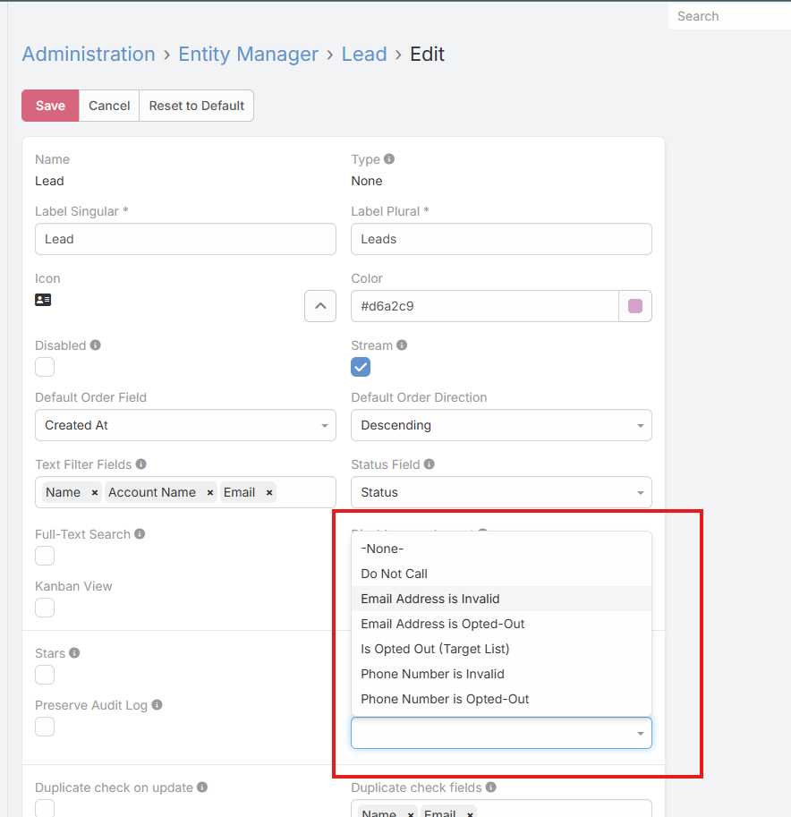

# Ebla Lock 

> Smart record locking for EspoCRM based on a Boolean field.  
> Automatically switch records to **Read-Only mode** when a defined condition is met.

---

## Overview

**Ebla Lock** is a lightweight extension that adds record-level locking functionality to EspoCRM using an existing **Boolean field**.

Instead of creating complex workflows or custom logic, administrators can simply select a Boolean field from the Entity settings to control whether a record should be editable or locked.

When the defined condition is met, the entire record becomes read-only for users while remaining fully visible.

This extension works with:

- Standard entities (Accounts, Contacts, Leads, Opportunities, etc.)
- Custom entities

---

## How It Works

1. Create (or use) an existing **Boolean field** in your entity.
2. Go to **Administration > Entity Manager**.
3. Open the desired entity.
4. In 'Record Locked Field Name' Select the Boolean field that will act as the lock controller.
5. Save and rebuild the system.

### Locking Logic

- If the selected Boolean field = `false` → The record becomes **Read-Only**.
- If the selected Boolean field = `true` → The record remains **Editable**.

The Boolean field can be controlled manually or automatically using workflows, formulas, or other automation tools.

---

## Use Cases

- Lock approved records.
- Prevent editing of closed deals.
- Protect finalized financial data.
- Freeze contracts after confirmation.
- Restrict modifications after managerial validation.
- Preserve historical data integrity.

---

## Features

- Boolean-based record locking.
- Full record read-only protection.
- Simple entity-level configuration.
- Supports both standard and custom entities.
- No workflow required.
- Lightweight and performance friendly.

---

## Installation

1. Navigate to **Administration > Extensions**.
2. Upload the Ebla Lock package.
3. Install the extension.
4. Rebuild the system.

---

**Ebla Lock** helps maintain data integrity and control editing permissions in a clean, simple, and efficient way.

---

*Copyright (c) Eblasoft Bilişim Ltd.*
