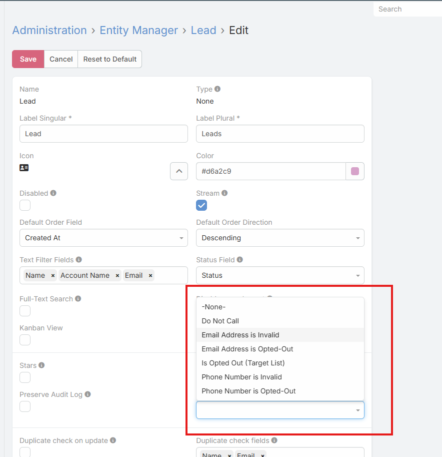
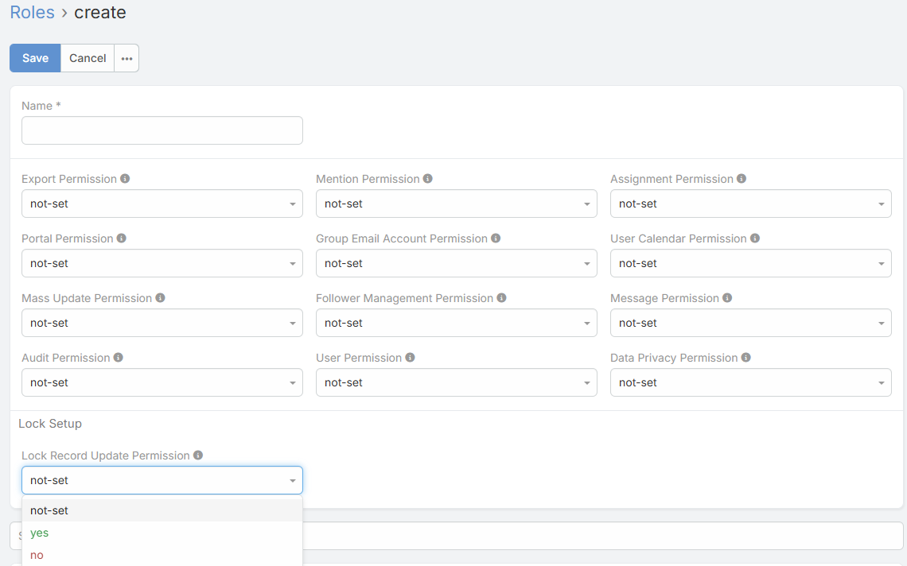
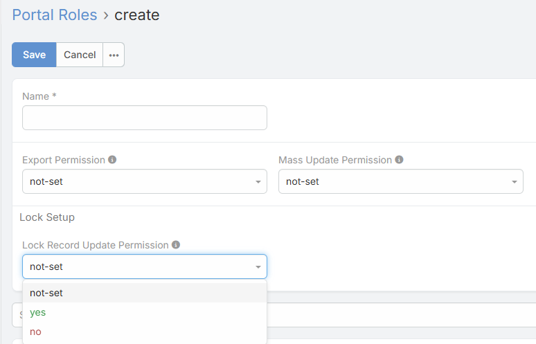

# Ebla Lock 

> Smart record locking for EspoCRM based on a Boolean field.  
> Automatically switch records to **Read-Only mode** when a defined condition is met.

---

## Overview

**Ebla Lock** is a lightweight extension that adds record-level locking functionality to EspoCRM using an existing **Boolean field**.

Instead of creating complex workflows or custom logic, administrators can simply select a Boolean field from the Entity settings to control whether a record should remain editable or become locked.

When a record is locked, users can still open and view it, but editing is blocked unless they have a specific override permission.

This extension works with:

- Standard entities such as Accounts, Contacts, Leads, Opportunities, and Cases
- Custom entities

---

## How It Works

1. Create or use an existing **Boolean** field in your entity.
2. Go to **Administration > Entity Manager**.
3. Open the desired entity.
4. In **Record Locked Field Name**, select the Boolean field that should control the lock state.
5. Save the entity configuration.
6. Rebuild the system if needed.

Only Boolean fields are available in the **Record Locked Field Name** dropdown.

If the selected Boolean field is enabled on a record, that record becomes locked for regular users.

### Locking Logic

- If the selected Boolean field = `true` -> The record becomes **Read-Only** for users without override permission
- If the selected Boolean field = `false` -> The record remains **Editable** under normal ACL rules

The Boolean field can be controlled manually or automatically using workflows, formulas, BPM, or other automation tools.

---

## Permission Override

Ebla Lock adds a new permission called **Lock Record Update Permission** to:

- **Roles**
- **Portal Roles**

Permission behavior:

- `Yes` -> The user can edit locked records
- `No` -> The user cannot edit locked records
- `Not Set` -> Treated as no access unless another assigned role grants `Yes`

Administrators always bypass the lock and can edit records normally.

After installation, the extension attempts to add this permission field to the **Role** and **Portal Role** detail layouts automatically. If you do not see it, add **Lock Record Update Permission** manually in Layout Manager.

---

## What Users Experience

When a record is locked:

- The record remains visible
- The user cannot switch it into edit mode unless they have override permission
- A direct save attempt is also blocked on the backend
- The user receives the message: **Locked record cannot be modified**

This means the extension protects records both in the interface and during save operations.

The selected lock field also does not need to be placed on every layout for the lock check to work correctly.

---

## Configuration Notes

- The lock controller field must be a **Boolean** field
- Each entity can use its own Boolean field as the lock trigger
- You can change the selected lock field later from **Entity Manager**
- The extension is suitable for both manual locking and automation-driven locking
- The feature locks the whole record for editing; it is not a field-level permission tool

---

## Use Cases

- Lock approved records
- Prevent editing of closed deals
- Protect finalized financial data
- Freeze contracts after confirmation
- Restrict modifications after managerial validation
- Preserve historical data integrity

---

## Features

- Boolean-based record locking
- Simple entity-level configuration
- Works with standard and custom entities
- Role-based override permission
- Portal role support
- Admin bypass for locked records
- Frontend and backend protection
- Compatible with workflow and automation-driven lock flags
- Lightweight and performance-friendly

---

## Installation

1. Navigate to **Administration > Extensions**.
2. Upload the Ebla Lock package.
3. Install the extension.
4. Check **Roles** or **Portal Roles** if you need override access for specific users.
5. Configure **Record Locked Field Name** in **Administration > Entity Manager** for each entity you want to protect.
6. Rebuild the system if needed.

---

**Ebla Lock** helps maintain data integrity and control editing permissions in a clean, simple, and efficient way.

---

*Copyright (c) Eblasoft Bilişim Ltd.*
