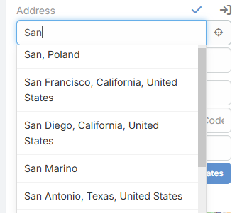
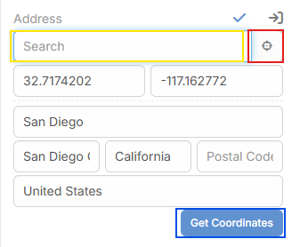
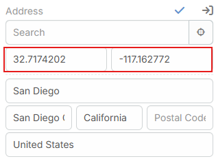
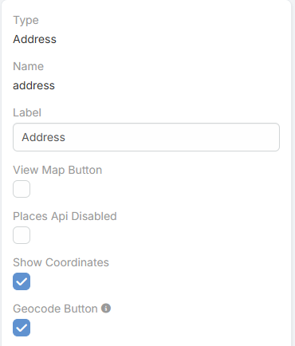

# Address Field Features

The extension enhances standard EspoCRM **address** fields with address search, current-position lookup, coordinates, and automatic geocoding.

---
## Extension video

<iframe width="560" height="315" src="https://www.youtube.com/embed/el8ii8bN9pY" title="Eblasoft | AI Module for Espocrm" frameborder="0" allow="accelerometer; autoplay; clipboard-write; encrypted-media; gyroscope; picture-in-picture; web-share" referrerpolicy="strict-origin-when-cross-origin" allowfullscreen></iframe>

---

## What Is Added to Address Fields

### Added actions

- **Search**
  Type in the search box and select a Photon result to fill street, city, state, country, postal code, latitude, and longitude.

- **Locate Current Position**
  Uses browser geolocation and Photon reverse lookup to fill the address from the user's current location.
- **Get Coordinates**
  Uses the current typed address to fetch coordinates and address data.
- **Automatic Geocoding on Save**
  When the address changes and the provider is `OpenStreetMap`, the extension can fill coordinates automatically before the record is saved.

### Added address field parameters

| Parameter             | Description |
|-----------------------| --- |
| `Show Coordinates`    | Shows the latitude and longitude inputs in edit mode and read mode. |
| `Geocode Button`      | Shows the **Get Coordinates** button in edit mode. |
| `Places Api Disabled` | Extension-defined parameter added to the address field metadata. |

## How Search Works

- The search box appears in edit mode.
- Suggestions are shown while typing.
- Selecting a result fills the address values and coordinates.
- The selected result is also stored in the field data.

## How Automatic Geocoding Works

- It runs only when the selected provider is `OpenStreetMap`.
- It checks changed address fields before save.
- It builds the address from country, city, state, and street.
- It requests matching data from Nominatim.
- The result is also stored in the field data.

## See Also

- [Address Map Features](address-map.md)
- [Settings](index.md#settings)
