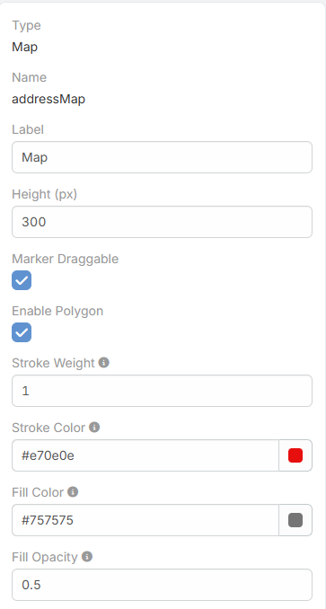
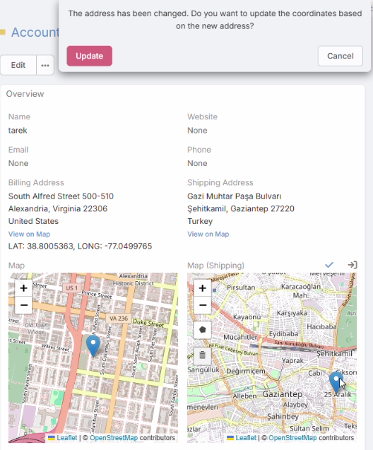
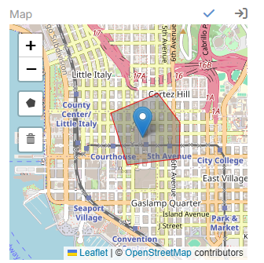

# Address Map Features

The extension also enhances the **Map** field that belongs to an address field.

## Important

The draggable marker and polygon options are configured on the address field's companion **Map** field, not on the address field itself.

Example:

- Address field: `billingAddress`
- Related map field: `billingAddressMap`

## What the Address Map Can Do

- **Show the saved address on an OpenStreetMap map**
- **Drag the marker** and update latitude and longitude
- **Check the dragged position** and offer to update street, city, and state
- **Draw polygons**
- **Delete polygons**

## Added Map Parameters

| Parameter | Description |
| --- | --- |
| `markerDraggable` | Allows the marker to be dragged in edit mode. |
| `enablePolygon` | Enables polygon drawing on the map. |
| `strokeWeight` | Sets the polygon border width. |
| `strokeColor` | Sets the polygon border color. |
| `fillColor` | Sets the polygon fill color. |
| `fillOpacity` | Sets the polygon fill opacity. |

## How to Enable These Features

1. Open **Administration -> Entity Manager**.
2. Open the target entity.
3. Go to **Fields**.
4. Open the related map field, for example `billingAddressMap`.
5. Enable **Marker Draggable** and or **Enable Polygon** as needed.
6. If polygon is enabled, configure the style parameters.
7. Save.

When **Enable Polygon** is turned on, the polygon style fields become visible.

## How Marker Dragging Works

- The user drags the marker in edit mode.
- The extension updates latitude and longitude.
- It reverse-checks the new position through Photon.
- If street, city, or state changed but the country is still the same, the user can confirm the address update.

## How Polygon Drawing Works

- The user draws polygons on the map in edit mode.
- Polygon coordinates and style options are stored in the address field's `drawData`.
- Deleted polygons are also removed from the stored map data.

## See Also

- [Address Field Features](address-field.md)
- [Map View](map-view.md)
