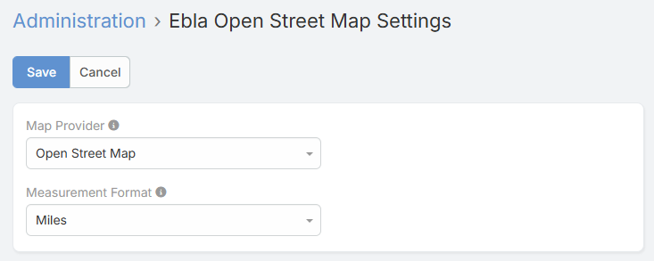
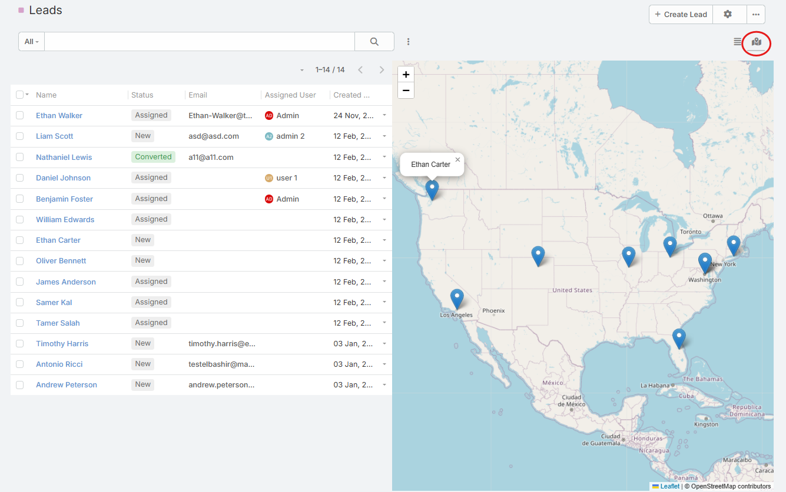

# Ebla Open Street Map 

## Overview

**Ebla Open Street Map** enables OpenStreetMap integration as a free, open-source alternative to Google Maps in EspoCRM. Built on Leaflet.js, this extension provides advanced mapping features including polygon drawing, draggable markers, automatic geocoding, and map-based list views.

Unlike Google Maps which requires API keys and has usage limits, OpenStreetMap is completely free and open-source, making it ideal for organizations that need unlimited mapping without licensing costs.

## Key Features

- **OpenStreetMap Integration**: Complete replacement for Google Maps using Leaflet.js library, no API key required.
- **Automatic Geocoding**: Auto-fetch latitude/longitude from addresses using free Nominatim API on record save.
- **Polygon Drawing**: Draw and customize polygons on maps for highlighting areas, territories, or zones with customizable colors and opacity.
- **Draggable Markers**: Drag markers on map to update location coordinates instantly without typing.
- **Map List View**: Display entity records as interactive markers on a map with click-to-navigate and hover popups.
- **Custom Styling**: Configure map appearance with customizable stroke weight, colors, and fill opacity for polygons.

## Configuration

### Setting Default Map Provider

After installation, configure OpenStreetMap as your default map provider:

1. Navigate to **Administration** → **Ebla Map Plus Settings**
2. Under **Map Provider**, select **OpenStreetMap**
3. Click **Save**

All address fields will now use OpenStreetMap instead of Google Maps.

### Enable Map List View for Entities

To display entity records on a map:

1. Navigate to **Administration** → **Entity Manager**
2. Select your entity (e.g., Account, Contact, Lead)
3. Enable **Map List View**
4. Select **Map Address Field** (which address field to use for markers)
5. Select **Map Layout** (which layout to use for list display)
6. Click **Save**

Users can now toggle to Map View when viewing the entity list.

### Configure Map Field Parameters

When editing a Map field in **Field Manager**:

**Basic Options:**

- **Marker Draggable**: Allow dragging marker to update coordinates (default: false)
- **Enable Polygon**: Allow drawing polygons on map (default: false)

**Polygon Styling** (when polygons enabled):

- **Stroke Weight**: Border thickness in pixels (e.g., 3)
- **Stroke Color**: Border color (color picker)
- **Fill Color**: Interior color (color picker)
- **Fill Opacity**: Transparency from 0.0 (transparent) to 1.0 (opaque)

## Usage

### Viewing a Map

When viewing a record with an address field:

1. The address displays with an embedded OpenStreetMap
2. A marker shows the geocoded location
3. Previously saved polygons (if any) are displayed
4. Map includes OpenStreetMap attribution

### Automatic Geocoding

When creating or editing records with addresses:

1. Fill in address fields (Country, City, State, Street)
2. Click **Save**
3. The extension automatically:
   - Calls Nominatim API with the full address
   - Populates latitude and longitude fields
   - Stores full geocoding data for reference

!!! tip "Geocoding Behavior"
    Geocoding only triggers when address fields are modified. No API calls are made for unchanged addresses.

### Drawing Polygons

If polygon drawing is enabled on the map field:

1. Enter **Edit** mode on the record
2. Click the **Polygon** tool in the map toolbar (bottom-left)
3. Click points on the map to define polygon corners
4. Double-click to complete the polygon
5. The polygon appears with your configured colors and opacity
6. Click **Save** to persist the polygon data

To delete polygons:

1. Enter **Edit** mode
2. Click the **Delete** tool (trash icon)
3. Click on the polygon to remove
4. Click **Save**

### Dragging Markers

If marker dragging is enabled:

1. Enter **Edit** mode on the record
2. Click and drag the marker to a new location
3. Latitude and longitude fields update automatically
4. Click **Save** to persist the new coordinates

### Using Map List View

If map list view is enabled for an entity:

1. Navigate to the entity list (e.g., **Leads**)
2. Toggle view mode to **Map** (icon in top-right)
3. All records with valid coordinates appear as markers
4. Hover over a marker to see the record name
5. Click a marker to navigate to that record's detail view
6. Map auto-zooms to fit all visible markers

## Comparison: Google Maps vs OpenStreetMap

| Feature | Google Maps                    | OpenStreetMap |
|---------|--------------------------------|---------------|
| **Cost** | Requires API key, usage limits | Free, no API key |
| **Geocoding** | Google Geocoding API           | Nominatim API |
| **Map Tiles** | Google                         | OSM contributors |
| **Polygon Drawing** | Yes                            | Yes |
| **Marker Dragging** | No                             | Yes |
| **Map List View** | Yes                            | Yes |
| **Privacy** | Data sent to Google            | Data sent to OSM |
| **Customization** | Limited                        | Fully customizable (open-source) |
| **Global Coverage** | Excellent                      | Excellent |

## Support and Feedback

For inquiries, support, or feedback regarding **Ebla Open Street Map**, please contact us through our portal or create a support ticket. We're committed to ensuring a seamless experience and are here to assist you.

---

## Changelog

