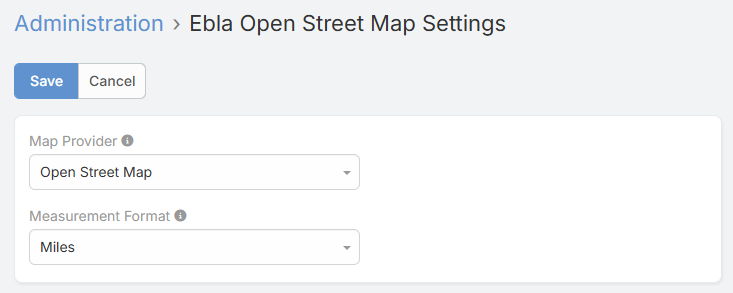

# Ebla Open Street Map 

## Overview

**Ebla Open Street Map** adds an OpenStreetMap-based map provider to EspoCRM. It replaces Google Maps usage with Leaflet and OpenStreetMap tools and adds address search, coordinate filling, draggable markers, polygon drawing, map list view, and route calculation.

## Extension video

<iframe width="560" height="315" src="https://www.youtube.com/embed/OgxLuARS5U4" title="Eblasoft | AI Module for Espocrm" frameborder="0" allow="accelerometer; autoplay; clipboard-write; encrypted-media; gyroscope; picture-in-picture; web-share" referrerpolicy="strict-origin-when-cross-origin" allowfullscreen></iframe>

## Main Features

- **OpenStreetMap Provider**: Switch EspoCRM to `OpenStreetMap` from the settings page.
- **Address Search and Geolocation**: Search addresses, detect the current position, and fill address values and coordinates.
- **Automatic Geocoding**: Save a changed address and automatically fill latitude, longitude, and raw geocoding data.
- **Address Map Features**: Drag the marker and draw polygons on the address map.
- **Map List View**: Show records on a map in list view.
- **Map Route Field**: Add a route field that can calculate distance and duration between multiple points.

## How to Activate the Extension

After installation, the most important first step is to activate the provider:

1. Open **Administration -> Ebla Extensions -> Ebla Open Street Map Settings**.
2. Set **Map Provider** to `OpenStreetMap`.
3. Optionally choose **Measurement Format**.
4. Save.

## Settings

| Setting              | Description |
|----------------------| --- |
| `Map Provider`       | Selects the active map provider. For this extension, choose `OpenStreetMap`. |
| `Measurement Format` | Controls how route distance is displayed: `Kilometers` or `Miles`. |

## Documentation

### [Address Field Features](address-field.md)

How address search, current location, coordinates, and automatic geocoding work.

### [Address Map Features](address-map.md)

How to enable draggable markers and polygons, and where those options are configured.

### [Map View](map-view.md)

How to enable map list view from Entity Manager.

### [Map Route](map-route.md)

How to add a route field, configure its parameters, and use it.

## Support and Feedback

For inquiries, support, or feedback regarding **Ebla Open Street Map**, please contact us through our portal or create a support ticket.

## Changelog

