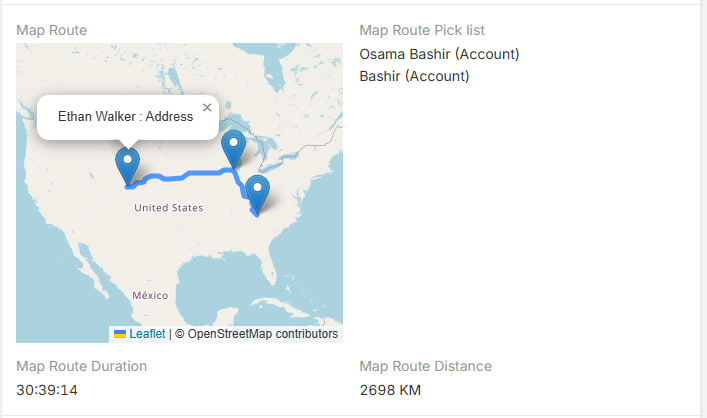
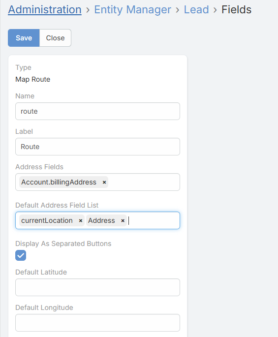

# Map Route

The extension adds a **Map Route** field type that builds a route from multiple points and stores distance and duration on the record.

## How to Add a Route Field

1. Open **Administration -> Entity Manager**.
2. Open the entity where you want the route.
3. Go to **Fields**.
4. Click **Add Field**.
5. Set the field type to **Map Route**.
6. Configure the field parameters.
7. Save the field.
8. Add the route field to the layout.

## Generated Route Fields

When a route field is created, it also creates related fields:

| Field | Description |
| --- | --- |
| `distance` | Stores the route distance. |
| `duration` | Stores the route duration. |
| `pickList` | Stores manually selected route points. |

## Route Field Parameters

| Parameter | Description |
| --- | --- |
| `addressFields` | Defines which address fields from other entities can be added manually to the route. |
| `defaultAddressFieldList` | Adds local address fields from the current record to the route automatically. It also supports `currentLocation`. |
| `displayAsSeparatedButtons` | Shows separate add buttons for each configured source. |
| `defaultLatitude` | Adds a fixed latitude point to the route. |
| `defaultLongitude` | Adds a fixed longitude point to the route. |

## What Each Parameter Does

- `addressFields`
  Lets the user open a record selector and add address points from other entity types.
- `defaultAddressFieldList`
  Automatically includes local address fields from the current record in the route.
- `currentLocation`
  Can be included in `defaultAddressFieldList` so the route starts from the user's current device location.
- `displayAsSeparatedButtons`
  Shows one button per configured address source instead of a single generic add button.
- `defaultLatitude` and `defaultLongitude`
  Add a fixed point to the route even if it does not come from an address field.

## How the Route Is Built

The route can include:

- the user's **current location**
- a **fixed default point**
- one or more **address fields from the current record**
- manually selected **address fields from other records**

The extension builds the final list of valid points and then requests the route.

## How It Works in the Record

- The route is shown on an OpenStreetMap map.
- Markers are added for the start, stops, and end.
- Distance and duration are updated automatically when route points change.
- The generated `distance` and `duration` fields are read-only display fields.

## Technical Notes

- The route is drawn with OpenStreetMap and Leaflet.
- Route calculation uses the public OSRM service.
- Distance display follows the global `measurementFormat` setting.

## See Also

- [Settings](settings.md)
- [Address Field Features](address-field.md)
