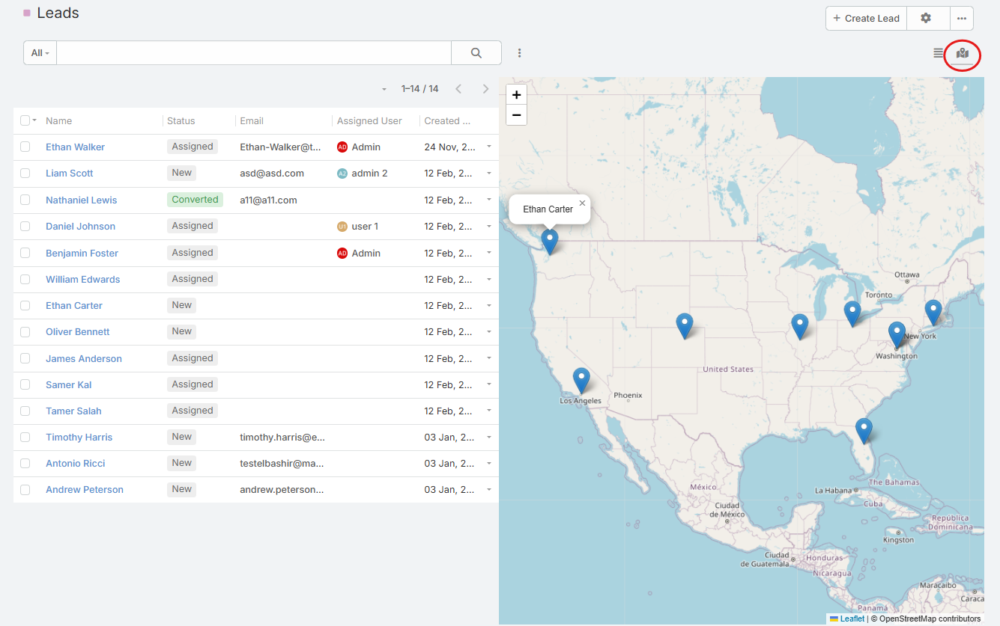
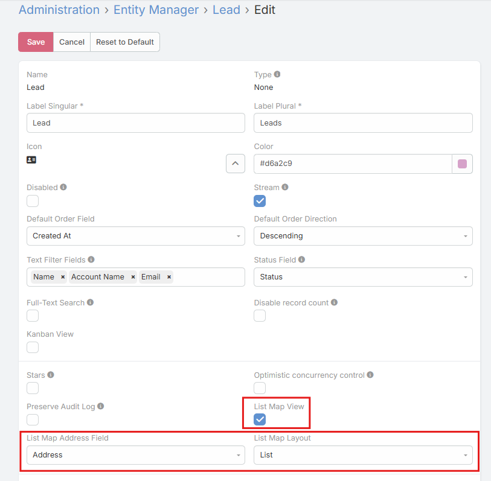

# Map View

The extension adds a **Map** view mode to entity list views.

## Added Entity Parameters

| Parameter | Description |
| --- | --- |
| `listMapViewEnabled` | Enables the map view mode for the entity. |
| `listMapAddressField` | Selects which address field is used to place markers. |
| `listMapLayout` | Selects which list layout is used with the map view. |

## How to Enable Map View

1. Open **Administration -> Entity Manager**.
2. Open the entity you want to configure.
3. Turn on **List Map View**.
4. Choose **List Map Address Field**.
5. Choose **List Map Layout**.
6. Save.

When **List Map View** is turned on, the other two settings become visible.

## How It Works

- The entity list gets a new **Map** view mode.
- Records with latitude and longitude on the selected address field are shown as markers.
- Clicking a marker opens the record.
- Hovering a marker shows the record name.
- The map automatically fits the visible markers.

## Practical Notes

- If the selected address field does not have coordinates, the record will not appear on the map.
- The view uses OpenStreetMap tiles through Leaflet.

## See Also

- [Address Field Features](address-field.md)
- [Address Map Features](address-map.md)
