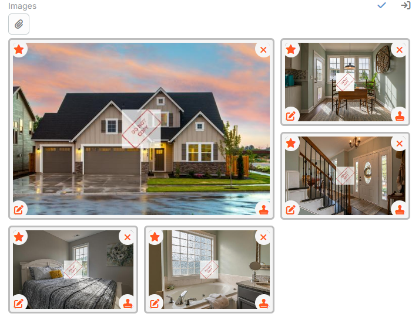
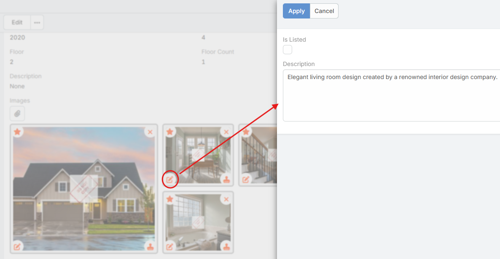

# Ebla Real Estate Extension for EspoCRM

## Introduction

The **Ebla Real Estate** extension enhances the standard EspoCRM Real
Estate module with powerful tools for property management, image
handling, and advanced customization.\
It is designed to streamline agent workflows, improve data consistency,
and provide rich visual experiences across property listings.

---

## Key Features

### 1. Advanced Image Management

The extension introduces a full-featured image management system for
properties:

-   **Drag-and-Drop Reordering**\
    Easily reorder images in the property image Field.

-   **Main Image Selection**\
    One-click *Star* icon to mark an image as the main image used in
    card views and lists.

-   **Watermarking System**

    -   **Manual**: A *Stamp* button on each image allows manual
        watermark application.
    -   **Bulk Action**: A global **Add Watermark** button on the
        Property Detail view applies the watermark to all property
        images.
    -   **Configuration**:
        -   Global watermark image via Administration.
        -   Portal-specific watermark override.

-   **Image Grid Layout**\
    Clean grid view with automatic handling of large galleries (shows
    *+more* indicator when more than 4 images exist).

-   **Image Description & Metadata**

    -   A *fa-edit* icon appears on each image.

    -   Clicking opens a modal to edit image information.

    -   Besides the default description, administrators may define
        **custom fields** to appear inside this modal.

    -   Custom fields are registered through metadata path:

            app > propertyImagesDataDefs > fieldsDefs

---

### 2. Property Card View

A specialized **Card View** mode for property lists:

-   Displays:

    -   Main Image\
    -   Price\
    -   Status\
    -   Assigned Agent / Agency

-   **Configurable Card Body** The card body content is controlled via
    metadata:

        cardBodyTemplate

-   ⚠️ **Dependency**\
    This feature requires the **Ebla List Pro** extension.\
    Documentation:  https://docs.eblasoft.com.tr/espocrm-extensions/list-pro/?h=list

---

### 3. Unique Property Codes

Each property receives an automatically generated unique code.

**Format**

    [UserShortCode][SequenceNumber]
    Example: JON00042

-   User Short Code generated from user name (John Doe → JON)
-   If reassigned, prefix updates automatically while numeric sequence
    remains unchanged.

---

### 4. Flexible "Available" Filters

Administrators can define what "Available" means.

Navigate to:

    Administration > Ebla Real Estate Settings

Configure: - Property Available Status List - Request Available Status
List

Built-in **Available** filter appears in list views.

---

### 6. Public Image Sharing (WebAsset Entry Point)

Allows serving selected property images publicly without authentication.

Example:

    http://your-crm-domain/?entryPoint=WebAsset&id=IMAGE_ID

Activation: - Add boolean field **isListed** to Property. - Set property
**isListed = true** - Set image **isListed = true** from image modal.

Only listed images of listed properties are accessible.

---

## Configuration

Navigate to:

    Administration > Ebla Real Estate Settings

Configure: - Global Watermark Image - Property Available Status List -
Request Available Status List - Default Mortgage Interest Rate
