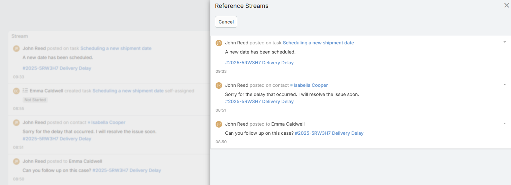

# Ebla References 

> Create custom auto-generated reference numbers for any entity and link them automatically when mentioned.

<!-- DOC:OVERVIEW START -->
The **Ebla References Numbers** extension allows you to generate unique, readable reference codes (e.g., `PRJ-1234`) for any entity in EspoCRM.

Those references can be tagged into the stream. When a reference number is mentioned in a post (e.g., "Regarding #PRJ-1234"), it is automatically converted into a link to the related record.
<!-- DOC:OVERVIEW END -->

---

## Extension Video

<!-- TODO: Add video when available -->
<iframe width="560" height="315" src="https://www.youtube.com/embed/acb5MjPdz8Y?si=Oltfm61MxDpfLyCY" title="Ebla References for EspoCRM" frameborder="0" allow="accelerometer; autoplay; clipboard-write; encrypted-media; gyroscope; picture-in-picture; web-share" referrerpolicy="strict-origin-when-cross-origin" allowfullscreen></iframe>

---

<!-- DOC:USE-CASES START -->
## Use Cases

1. **Support Tickets** – Generate ticket IDs (e.g., `TKT-001`) to easily reference customer issues in emails and chats.
2. **Project IDs** – Assign unique project codes for better communication among team members tasks tracking.
3. **Internal Documents** – Tag documents with unique IDs to cross-reference them in notes and discussions.
4. **Event Registrations** – Assign registration codes to attendees for easy check-in and follow-up.
5. **Marketing Campaigns** – Track campaign elements with unique codes for better organization.
6. **Custom Workflows** – Use reference numbers in custom workflows to link related records seamlessly.
<!-- DOC:USE-CASES END -->

<!-- DOC:FEATURES START -->
## Key Features

- **New Field (Number Plus)**: Adds a new `NumberPlus` field type to Entity Manager, can be added to any entity.
- **Flexible Formatting**: Configure prefix, length, and character patterns (Digits, Letters, or Mixed).
- **Autocomplete**: Type `#` in Stream to search and insert reference numbers.
  
- **Show Related Posts**: Click on a reference number in the stream to view all posts mentioning it.
  

<!-- DOC:FEATURES END -->

<!-- DOC:CONFIGURATION START -->
## Configuration

To start using reference numbers, you need to add `NumberPlus` field to an entity in field manager. Codes will be generated automatically when a new record is created. Then you can mention those references in stream posts.

### Adding a Reference Field

1. Go to **Administration** > **Entity Manager**.
2. Select the entity you want to add a reference to (e.g., *Case* or *Project*).
3. Click **Fields** and then **Add Field**.
4. Select `NumberPlus` as the type.
5. Configure the field parameters:
    - **Prefix**: The string to appear before the number (e.g., `ABC-`).
    - **Pad Length**: The number of characters for the random part (e.g., `4` results in `0123`).
    - **Pattern**: Choose the character set for the random part:
        - `0-9` (Digits only)
        - `A-Z` (Letters only)
    - **Copy to clipboard**: Enable to show a copy button next to the field value.
6. Click **Save**.
7. Add the new field to the entity's **Layouts** (Detail and List views).

### Using References

- **Generation**: A unique number is automatically generated when a new record is saved.
- **Mentioning**: In a Stream Post, type `#` followed by the prefix or number to search references.
- **Linking**: Posting a comment containing a reference number will automatically link that post to the referenced record.
- **Viewing Related Posts**: Click on any reference number in the stream (e.g. `[#REF-1234]`) to open a modal showing all stream posts mentioning that reference.

<!-- DOC:CONFIGURATION END -->

---

## Support

If you need help with this extension, please contact Eblasoft Support.

## Changelog

