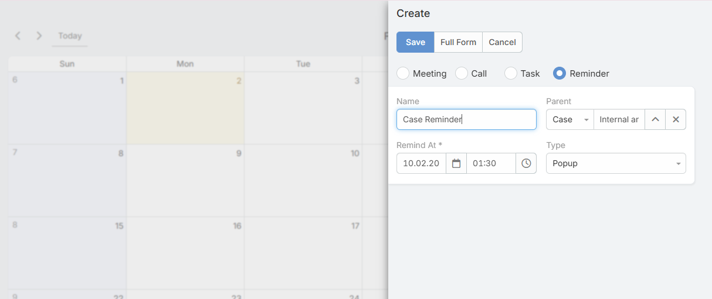
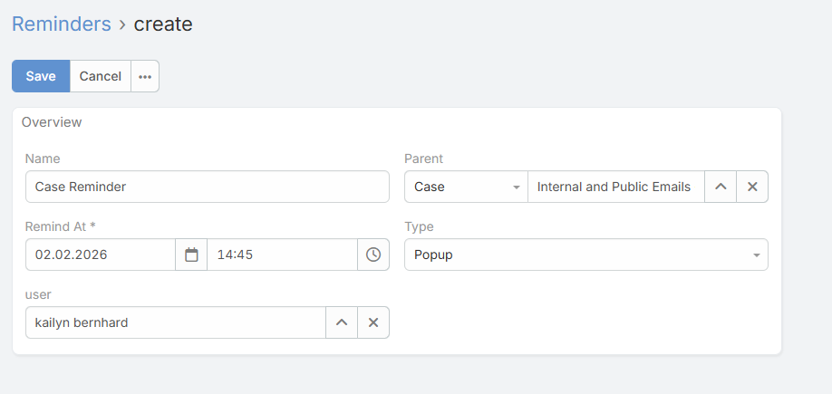

# Ebla Reminder Extension 

> Ebla Reminder extension enhances EspoCRM by introducing a powerful reminder system fully integrated with the **Calendar** and **Activity Panel**, allowing users to easily create, manage, and track reminders linked to records such as Tasks, Cases, and other entities.

---

## Overview
Ebla Reminder extension adds a dedicated **Reminder entity** and deep integration with the EspoCRM Calendar and Activities.
Users can create reminders directly from the Calendar or from the Reminder entity itself, associate them with specific records, and define who should receive notifications.

Reminders can trigger popup and/or email notifications, making sure important actions are never missed.
This extension simplifies reminder creation and provides a centralized and intuitive way to manage all reminders across the system.

---

## Options & Features
* **Calendar Integration**: Create and view reminders directly inside the Calendar.
* **Activity Panel Integration**: Reminders linked to a record appear automatically in its Activity panel.
* **Direct Reminder Creation**:
  * Create reminders from the Calendar.
  * Create reminders from the Reminder entity.
* **Entity Linking**: Associate reminders with entities such as Task, Case, Account, Contact, or any custom entity.
* **User Assignment**: Select the user who should receive the reminder notification.
* **Smart User Fallback**: If no user is selected, the system automatically assigns the creator as the target user.
* **Notification Channels**:
  * Popup notification.
  * Email notification.
* **Date & Time Selection**: Define exact reminder date and time.
* **Centralized Management**: View and manage all reminders from a single place.

---

## Configuration
After installation, the Reminder entity and Calendar integration become available automatically.

### Reminder Field Parameters
* **Name / Subject**: Reminder title.
* **Related Entity**: The entity the reminder is linked to (Task, Case, etc.).
* **Related Record**: Specific record reference.
* **Reminder Date & Time**: When the reminder should trigger.
* **User**: User who will receive the notification.
* **Popup Notification**: Enable/Disable popup alert.
* **Email Notification**: Enable/Disable email sending.

---

## Usage

### Create Reminder from Calendar
1. Open the **Calendar**.
2. Click on the desired date and time.
3. Choose **Create Reminder**.
4. Set subject, related entity, related record, and user.
5. Save.

### Create Reminder from Reminder Entity
1. Go to **Reminders** module.
2. Click **Create**.
3. Fill reminder details.
4. Save.

### View Reminders in Activity Panel
1. Open any entity record (e.g., Case).
2. Navigate to the **Activity Panel**.
3. View all reminders linked to this record.

---

Copyright (c) Eblasoft Bilişim Ltd.
