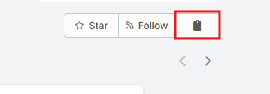
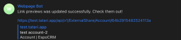
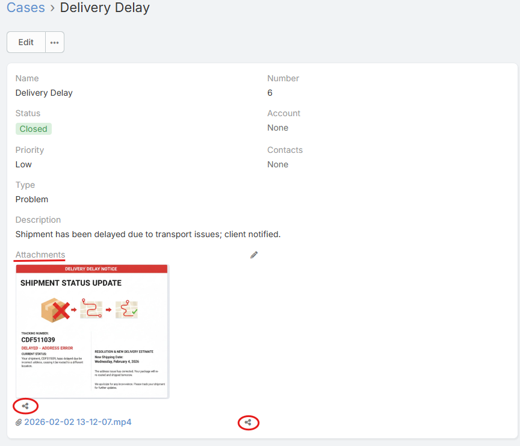
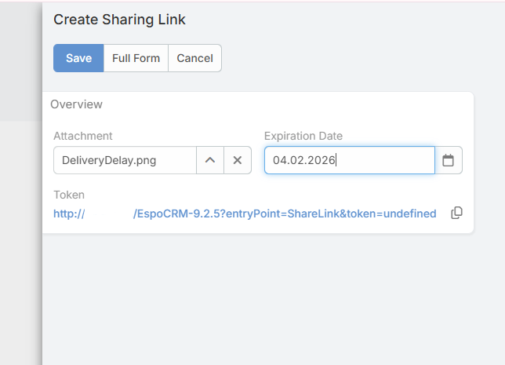

# Ebla Share Extension

## Overview
The **Ebla Share** extension for EspoCRM provides enhanced sharing capabilities for your CRM records and files. It enables rich social media previews for shared links and offers a secure way to share files publicly with expiration dates and access logging.

## Features

### 1. Smart Sharing Links (Social Previews)
When you share a record link (e.g., a Lead, Contact, or Task) on platforms like WhatsApp, Slack, Microsoft Teams, or LinkedIn, it often appears as a plain URL or a generic login page.

**Ebla Share** solves this by providing a **Copy Link** action available in two places:
- From the **record detail view** (Actions dropdown – top-right).
- From the **row actions menu** in list views.

This action generates a special wrapper link. When shared, this link:
- Displays a **Rich Preview** card with the record's **Name**, **Type**, and **Description** (Open Graph tags).
- Automatically redirects users to the actual record in EspoCRM when clicked.
- Maintains security: Users must still log in to EspoCRM to view the actual record data.

**How to use:**
1. Open any record **OR** locate it in a list view.
2. In the record detail view, click **Actions → Copy Link**  
   **OR** from the list view, click the row action **Copy Link**.
3. Paste the generated link into your chat or email.

When shared, the link will display a rich preview like this:

---

### 2. Public File Sharing
Securely share documents and attachments with people outside your CRM without creating user accounts for them.

**Features:**
- **Public Access**: Recipients can download the file without logging in.
- **Expiration Dates**: Set a date when the link automatically expires.
- **One-Click Sharing**: Generate a public link directly from file or image fields.
- **Secure Tokens**: Uses unique, hard-to-guess tokens for access.

**How to use:**
1. Open a record that contains an**Attachments Multiple **, **Image**, or **File** field.
2. Click the **Share** button displayed below the file or image.
3. A modal window opens to create a new **Sharing Link**.
4. (Optional) Set an **Expiration Date**.
5. Save the Sharing Link.
6. The public URL is generated and can be copied to the clipboard.

---

### 3. Access Logging
Track engagement with your shared files. The extension automatically logs every time a public file link is accessed.

- **Access Logs**: A subpanel on the *Sharing Link* record shows a history of downloads.
- **Data Captured**:
    - Timestamp of access.
    - IP Address of the downloader.

