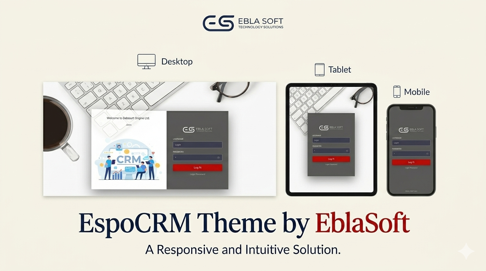
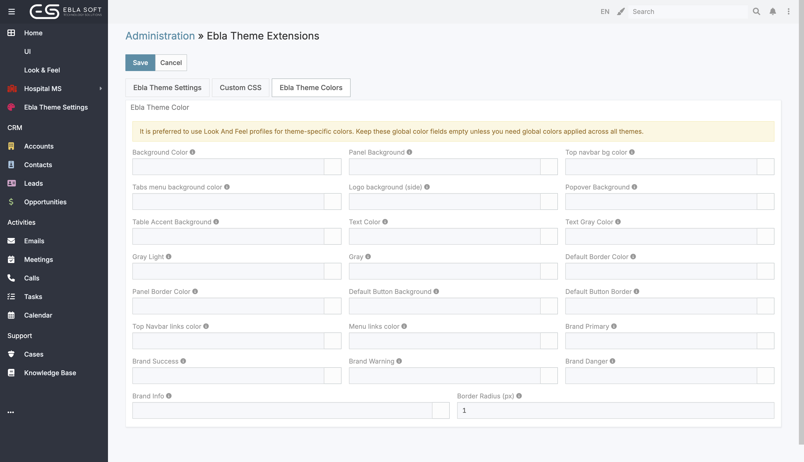
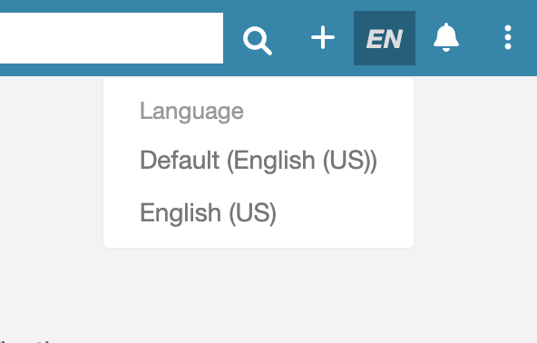
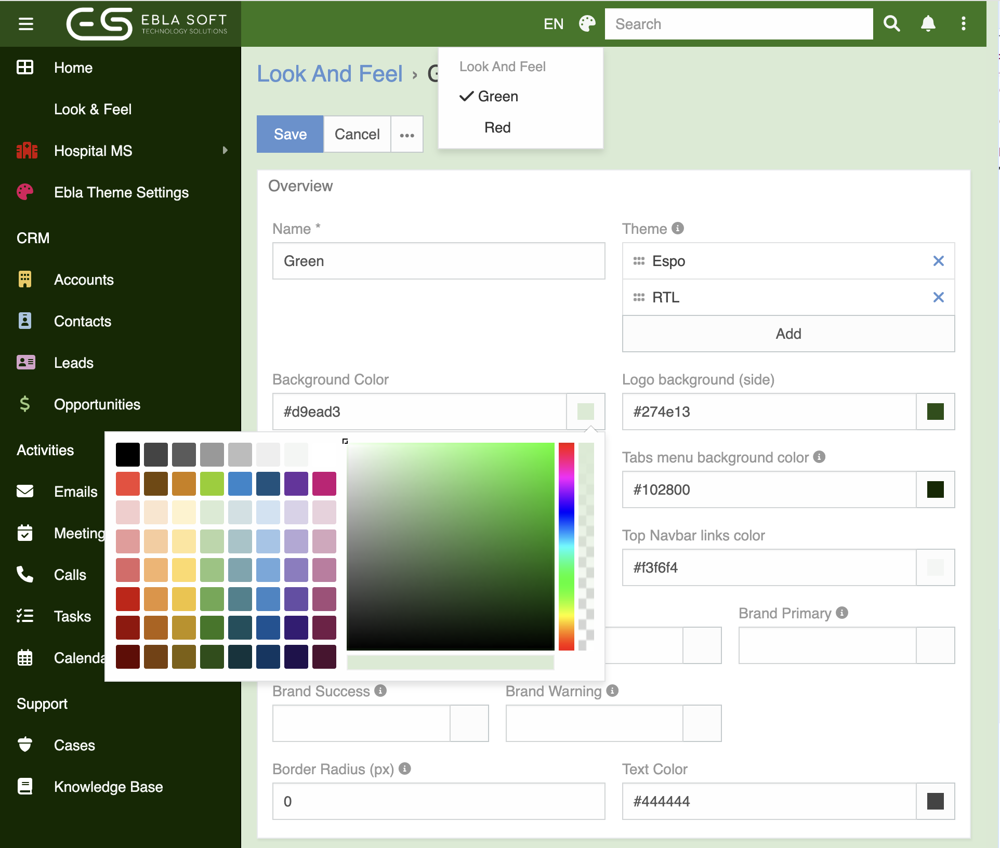

# Ebla Theme 

## Overview

**Ebla Theme** gives your EspoCRM a fresh, professional look with full control over colors, branding, and visual styles. You can customize the interface to match your company identity without touching any code.

> Go to **Administration** → **Ebla Theme** to get started.

<iframe width="650" height="315" src="https://www.youtube.com/embed/UJX262flBZw" frameborder="0" allow="accelerometer; autoplay; clipboard-write; encrypted-media; gyroscope; picture-in-picture" allowfullscreen></iframe>
---

## Key Features

### 1. Login Page Branding

Ebla Theme provides a modern **split login layout**:

- a **left side panel** for branded visuals,
- a **right side panel** for the login form.

You can configure all key login branding elements from settings:

- **Login Background Image** (full screen background)
- **Login Side Panel Image** (default Ebla side image)
- **Login Side Overlay Color** (supports RGBA/alpha)
- **Login Form Panel Background** (supports RGBA/alpha)
- **Login Side Welcome Text** (WYSIWYG)

The left panel uses a two-block layout: a top message area and a side image area that fills the remaining height.

The login side welcome message supports placeholders:

- `{applicationName}`
- `{currentYear}`

Default message: **Welcome to {applicationName}**.

Responsive behavior:

- On screens below **1024px**, the side image panel is hidden automatically.
- On small screens (mobile), the login container expands to full width for better usability.

You can still add a **footer** to the login page for extra information or links.

### 2. Favicon

Upload a custom favicon (browser tab icon) in both standard and large sizes. The favicon is displayed in the browser tab and bookmarks, keeping your brand consistent everywhere.

- Standard size: **32x32 px**
- Large size: **196x196 px**

### 3. Color Customization

Take full control of the interface colors without any design tools. Each color is applied instantly across the entire system.

You can customize:

- **Top navbar background color**
- **Tabs menu background color**
- **Logo background (side menu)**
- **Top navbar link color**
- **Text color**
- **Background color**
- **Brand Primary** - buttons, links, highlights
- **Brand Success / Danger / Warning / Info** - status and alert colors

Color fields support alpha values using 8-digit HEXA format: `#RRGGBBAA`.

### 4. Border Radius

Control the roundness of buttons, panels, dropdowns, and other UI elements using a single **Border Radius** setting. Set it to `0` for sharp corners or increase it for a softer, modern look.

### 5. Custom CSS

Add your own CSS rules directly from the settings panel for advanced visual customizations. Useful for fine-tuning spacing, fonts, or layout without modifying core files.

Portal-specific CSS is also supported - apply custom styles exclusively to portal pages without affecting the main application.

### 6. Side Menu Hover Open

Enable the side menu to open on hover instead of click. This keeps the interface compact while still giving quick access to navigation items.

### 7. Icon Set

Choose between the standard **Font Awesome** icon set and **Font Awesome Pro** for a wider and more refined icon library across the interface.

> Font Awesome Pro requires a separate license from [fontawesome.com](https://fontawesome.com).

### 8. Language Switcher

Enable a language switcher in the top navigation bar so users can change their interface language directly without going into preferences.

### 9. Admin LTE Elements

Ebla Theme includes styling support for Admin LTE elements such as info boxes, stat cards, and chat widgets. This is useful when building custom dashlets or portal pages that rely on Admin LTE components.

### 10. Site Meta Tags

Set custom site meta tags from the settings panel. This controls how your CRM appears in browser tabs, search engines, and link previews.

---

## Look and Feel Profiles

The **Look and Feel** feature lets you create multiple style profiles and assign them to specific themes.

- Create a profile with custom colors and assign it to one or more themes.
- Set a **default profile per theme** from **Administration → User Interface**.
- Users can switch between available profiles using the **palette icon** in the top navigation.
- If only one profile is available for the active theme, the switcher is hidden automatically.
- Profiles with no theme assigned apply to **all themes**.

The system resolves profile names from their IDs at runtime, so renaming a profile is always reflected correctly without any manual updates.

---

## Change Log

