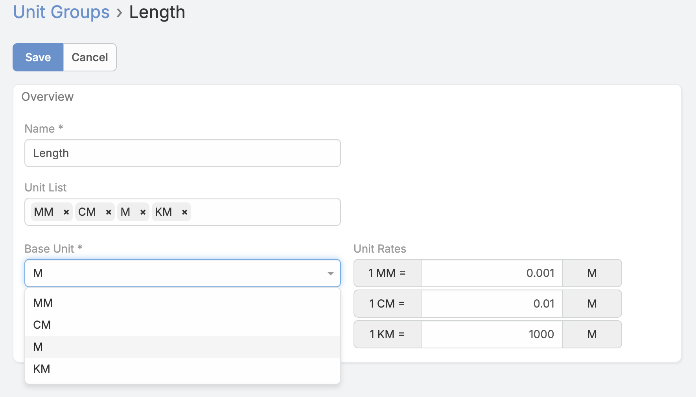
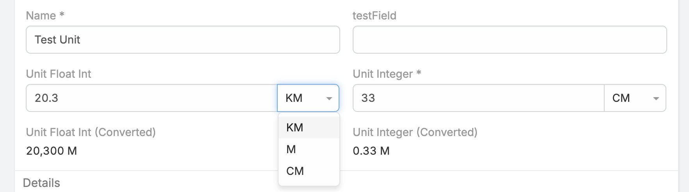

# Ebla Units Field 

> Ebla Units helps you store values in different units while also keeping a normalized value for easy comparison and reporting.

---

<!-- DOC:OVERVIEW START -->

## Overview

Ebla Units adds two custom field types to EspoCRM:

- `unitInt` for whole-number quantities with a unit code.
- `unitFloat` for decimal quantities with a unit code.

It also provides a simple **Unit Group** area where admins can define which units belong together, such as length, weight, time, or volume.

<!-- DOC:OVERVIEW END -->

---

<!-- DOC:FEATURES START -->

## What the extension provides

- Two custom field types: `unitInt` and `unitFloat`.
- An automatic converted value in the base unit.
- A Unit Group area for managing available units and conversion rates.
- Seeded default unit groups after installation.
- Easy comparison of values even when records use different units.

<!-- DOC:FEATURES END -->

---

<!-- DOC:INSTALLATION START -->

## Installation and first setup

After installing the extension, default Unit Groups are created automatically.

Seeded groups include:

| Group | Base Unit | Included Units |
|---|---|---|
| Length | `M` | `MM`, `CM`, `M`, `KM`, `IN`, `FT` |
| Weight | `KG` | `MG`, `G`, `KG`, `T`, `OZ`, `LB` |
| Time | `SEC` | `SEC`, `MIN`, `HR`, `DAY` |
| Volume | `L` | `ML`, `L`, `M3`, `GAL` |

You can review or extend these groups from:

- **Administration > Ebla Extensions > Ebla Unit Group**
- or directly from the `EUnitGroup` tab if it is visible in your environment.

<!-- DOC:INSTALLATION END -->

---

<!-- DOC:FIELD-TYPES START -->

## Field Types

### `unitInt`
Use this field when the value must stay a whole number, such as boxes, rooms, packages, or item counts.

- Stores the source value as an integer.
- Rejects decimal input.
- Lets the user choose a unit from the selected Unit Group.
- Automatically calculates the value in the base unit.

### `unitFloat`
Use this field when the value can include decimals, such as length, weight, duration, or volume.

- Stores the source value as a decimal number.
- Supports precise measurements.
- Lets the user choose a unit from the selected Unit Group.
- Automatically calculates the value in the base unit.

<!-- DOC:FIELD-TYPES END -->

---

<!-- DOC:CONVERTED-VALUE START -->

## Automatic converted value

Each unit field also creates an automatic converted value.

Example:

- If the base unit is `M` and a record stores `3 KM`, the converted value becomes `3000 M`.
- If another record stores `250 CM`, the converted value becomes `2.5 M`.

This makes it much easier to compare records that use different units.

## Why use the converted value

The converted value is useful when you want to:

- compare records fairly even if users entered different units,
- build reports using one consistent measurement,
- show both the entered value and the normalized value on screen.

For most users, the main field is used for data entry, while the converted value is useful for review, reporting, and comparison.

<!-- DOC:CONVERTED-VALUE END -->

---

<!-- DOC:UNIT-GROUPS START -->

## Managing Unit Groups

Unit Groups define which units belong together and what the base unit is.

Each Unit Group lets you define:

- the group name,
- the list of allowed units,
- the base unit,
- the conversion rates.

### `unitList`
This is the list of units users can choose from.

Examples:

- `MM`, `CM`, `M`, `KM`, `IN`, `FT`
- `MG`, `G`, `KG`, `T`, `OZ`, `LB`

### `baseUnit`
The reference unit used for conversion and normalized storage.

Important:

- The base unit must be one of the units included in `unitList`.

### `unitRates`
This tells the system how each unit converts to the base unit.

The UI format is:

- `1 <unit> = X <baseUnit>`

Examples for a Length group with base unit `M`:

- `1 KM = 1000 M`
- `1 CM = 0.01 M`
- `1 MM = 0.001 M`
- `1 IN = 0.0254 M`

<!-- DOC:UNIT-GROUPS END -->

---

<!-- DOC:SETUP START -->

## Recommended setup flow

1. Open **Administration > Ebla Extensions > Ebla Unit Group**.
2. Review existing default groups or create a new group.
3. Fill `unitList` with all unit codes you want to allow.
4. Pick the `baseUnit`.
5. Enter `unitRates` using the format `1 unit = X baseUnit`.
6. Save the group.
7. Open **Administration > Entity Manager**.
8. Add a new field of type `unitInt` or `unitFloat`.
9. Select the required `unitGroup`.
10. Add the main field to layouts.
11. Optionally add the converted value to layouts if you want easier comparison.

<!-- DOC:SETUP END -->

---

<!-- DOC:USAGE START -->

## Usage

### Example 1: Package quantity

Use `unitInt` when values must remain whole numbers.

- Field: `packageSize`
- Type: `unitInt`
- Unit Group: custom packaging group
- Possible units: `BOX`, `CARTON`, `PALLET`

Users enter an integer quantity and select its unit.

### Example 2: Product length

Use `unitFloat` when decimal precision is required.

- Field: `productLength`
- Type: `unitFloat`
- Unit Group: `Length`
- Decimal Places: `2`

Users can enter values like `2.75 M` or `125 CM`, while the system also keeps a normalized value in the base unit.

### Example 3: Normalized reporting

If you store a dimension, weight, or duration field in mixed units, add the converted value to list views or reports so users can compare records in one unit system.

<!-- DOC:USAGE END -->

---

<!-- DOC:NOTES START -->

## Notes

- Source values remain typed according to the selected field type.
- Unit options are loaded dynamically from the defined Unit Groups.
- Changing the selected Unit Group changes the available unit options for the field.
- If either the value or unit is missing, the converted value is cleared.
- Unit Groups are intended for admin configuration; end users typically interact only with the generated unit fields on records.

<!-- DOC:NOTES END -->

---

<!-- DOC:CHANGELOG START -->

## Changelog

<!-- DOC:CHANGELOG END -->

---

<!-- DOC:SUPPORT START -->

## Support and Feedback

- Open a ticket through the Eblasoft support portal if you need installation or configuration help.
- Contact the support team for assistance with unit setup or best practices.

<!-- DOC:SUPPORT END -->

---
*Copyright (c) Eblasoft Bilişim Ltd.*

