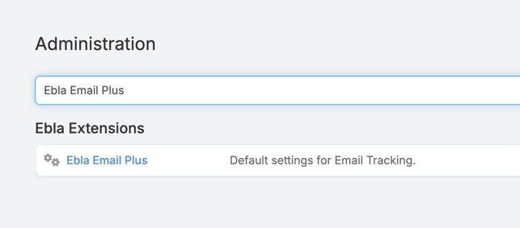
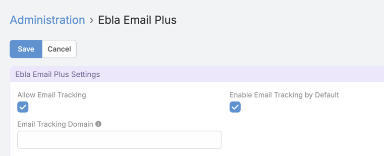
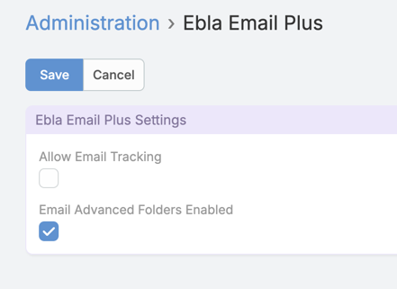
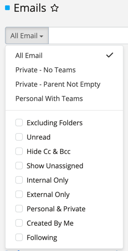
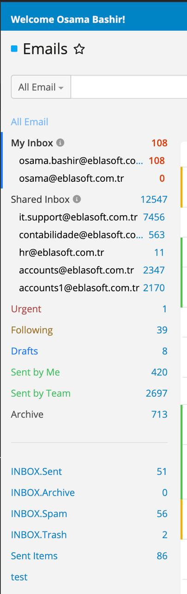
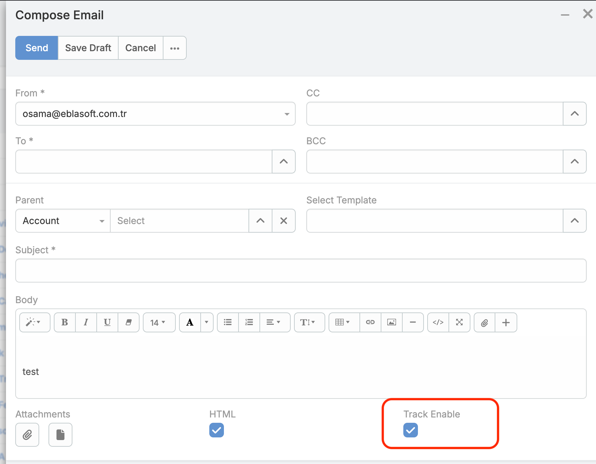
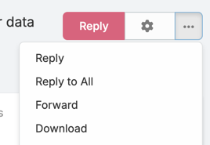

# Ebla Email Plus

## Overview

**Ebla Email Plus** for EspoCRM enhances email functionality with advanced filtering, folder management, and tracking capabilities.

## Key Features

1. ### Email Open Tracking
    - Track when recipients open your emails
    - Mark emails as read when opened by recipients
    - Enable tracking by default or on a per-email basis
    - Custom tracking domain -when CRM behind VPN- 

2. ### Header & Footer Email Templates
   - Add headers and footers templates to all outgoing emails
   - Configure templates for both regular and mass emails

3. ### Enhanced Email Bool Filters
   - **Excluding Folders**: Exclude emails from specific folders
   - **External Only**: Show only emails from outside your CRM
   - **Hide Cc**: Hide all CC emails
   - **Internal Only**: Show only emails sent within your CRM
   - **Personal And Private**: Display emails with no teams or parent
   - **Show Unassigned**: View unassigned emails
   - **Unread**: Show only unread emails

4. ### Advanced Email Folder Management
   - **My Inbox**: Displays emails sent to your personal email account
   - **Shared Inbox**: Shows emails sent to your teams
   - **Urgent**: Displays important emails
   - **Following**: Shows emails you're following
   - **Draft**: Contains draft emails
   - **Sent by Me**: Shows emails you've sent
   - **Sent by Team**: Displays emails sent by your team members
   - **Archive**: Contains archived emails

5. ### Additional Email Tools
    - Download emails as EML files

## Use Cases

1. **Team Email Collaboration**  
   Improve team coordination with shared folders and better email organization.

2. **Email Marketing Performance**  
   Track open rates and engagement with tracking features.

3. **Customer Communication Management**  
   Filter and organize external communications more effectively.

4. **Lead Generation**  
   Convert email recipients to contacts and add them to target lists.

## Configuration

### Email Tracking Configuration

### Enhanced Folders Configuration

## How To Use

### Using Advanced Email Filters

1. Go to **Emails** list view
2. Use the filter dropdown to select specialized filters like:
   - "Internal Only" to see only internal emails
   - "External Only" to see emails from outside your organization
   - "Unread" to view only unread messages
3. Save the filter as a preset for quick access

### Navigating Enhanced Folders

1. In the email sidebar, locate the enhanced folders section
2. Click on folders like "My Inbox," "Shared Inbox," or "Urgent" to quickly access relevant emails
3. Use the "Sent by Team" folder to monitor all outgoing team communications

### Enabling Email Tracking

1. When composing a new email, check the "Track Enable" option
2. After sending, view the email in your "Sent" folder
3. The tracking information will show when the recipient opened the email

### Downloading Email as EML

1. Open an email in detail view
2. Look for the "Download" option in the dropdown menu
3. Click to download the email in EML format, which can be opened in most email clients

## Support and Feedback

For any inquiries, support, or feedback regarding the "Ebla Email Plus" extension, please reach out to our portal to create a ticket. We are committed to ensuring a seamless experience and are here to assist you with any questions or concerns you may have.

## Conclusion

With the "Ebla Email Plus" extension, EspoCRM users can enhance their email management capabilities, improve team collaboration, and gain insights into email communications. This extension streamlines email workflows and helps you stay organized with advanced filtering and folder management features.

## Change Log

