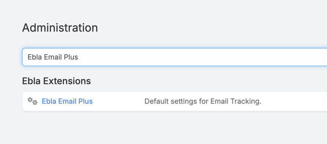
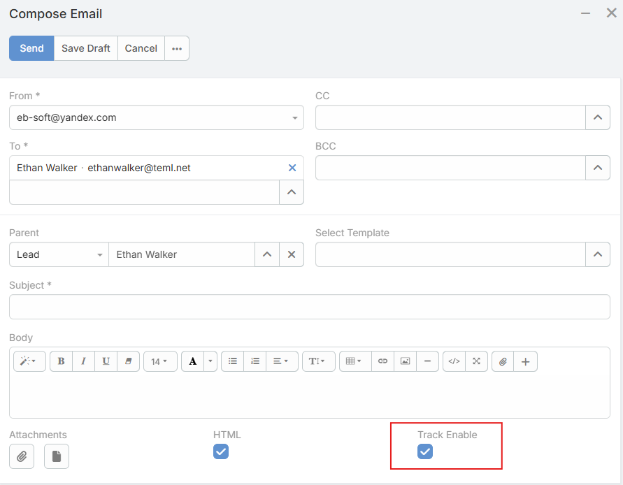
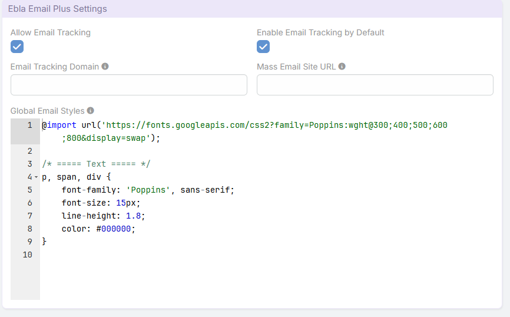
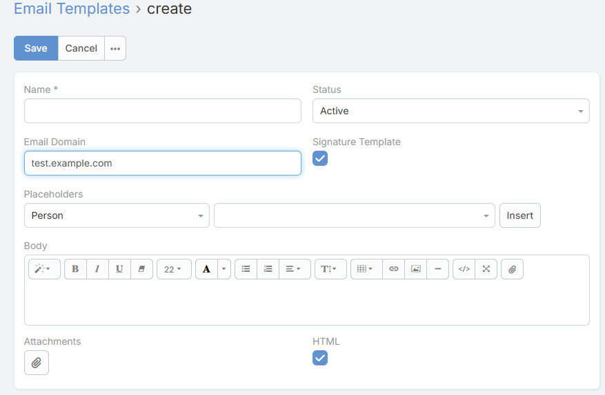
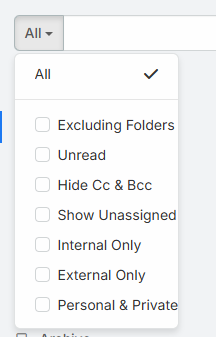
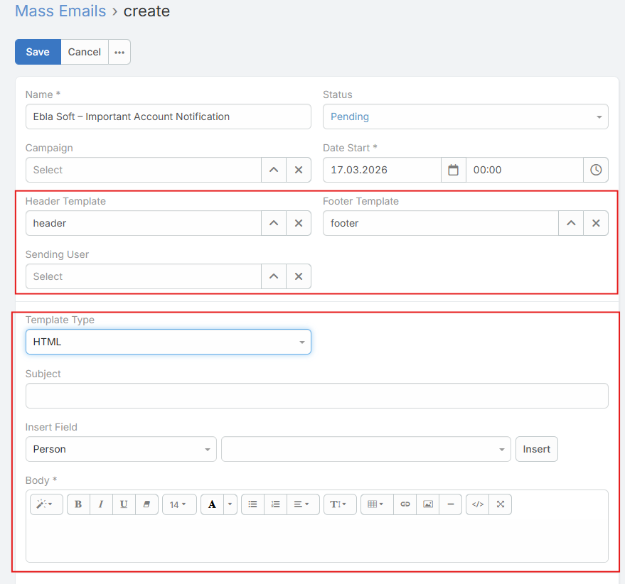
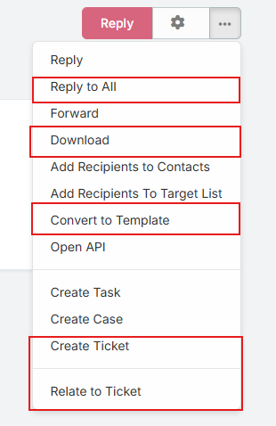
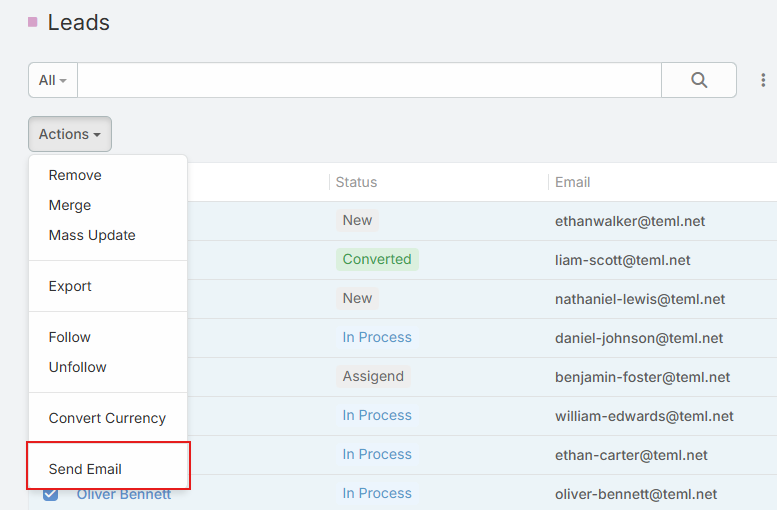
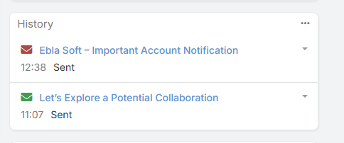
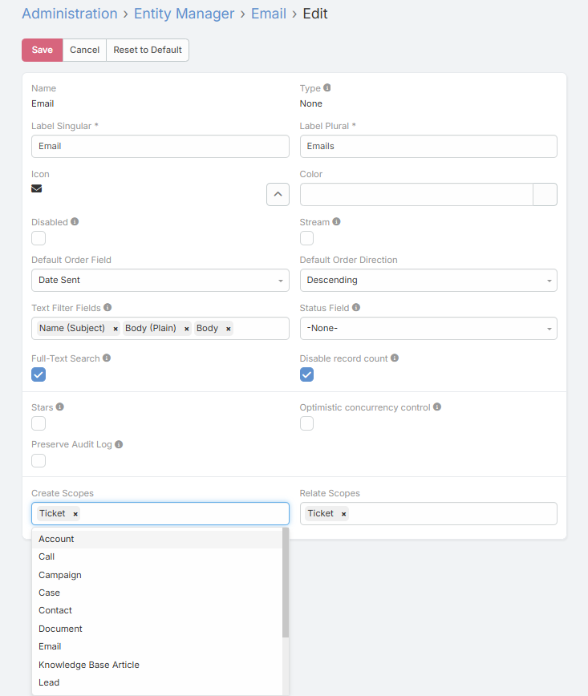

# Ebla Email Plus

## Overview

**Ebla Email Plus** supercharges EspoCRM's native email capabilities with open tracking, global styling, signature templates, advanced filtering, enhanced mass email, and a suite of productivity tools — all configurable from a dedicated admin panel.

## Key Features

1. ### Email Open Tracking
   - Embed a tracking pixel in outgoing HTML emails to detect when recipients open them
   - Enable tracking globally by default or toggle it per email at compose time
   - Configure a custom tracking domain for CRM instances behind a VPN or proxy

<iframe width="650" height="315" src="https://www.youtube.com/embed/5qyo3SOMqag" frameborder="0" allow="accelerometer; autoplay; clipboard-write; encrypted-media; gyroscope; picture-in-picture" allowfullscreen></iframe>

---

2. ### Global Email Styles
   - Define CSS styles that are automatically injected into every outgoing HTML email (regular and mass)
   - Ensure consistent branding and formatting across all email communications

3. ### Signature Templates
   - Create reusable email templates marked as **Signature Templates**
   - Optionally bind a signature template to a specific sender domain so it is applied automatically based on the "From" address
   - Signature content and attachments are appended to outgoing emails during send

4. ### Enhanced Email Filters (Bool Filters)
   - **Excluding Folders** — exclude emails belonging to specific folders
   - **Unread** — show only unread emails
   - **Hide Cc & Bcc** — hide emails where you are only in CC or BCC
   - **Show Unassigned** — display emails with no assigned user
   - **Internal Only** — show emails exchanged within the CRM
   - **External Only** — show emails from external addresses only
   - **Personal & Private** — display emails with no teams or parent record

5. ### Enhanced Mass Email
   - **Header & Footer Templates** — select Email Templates to be automatically injected at the beginning (**Header**) and end (**Footer**) of the mass email content
   - **Sending User** — a link field to a User record that defines who the email is sent from and is used to resolve template placeholders
   - **Template Types** — choose how to compose the mass email using the `templateType` field:
      - **Email Template (`emailTemplate`)** — select an existing Email Template via a link field; the template defines the subject and body
      - **HTML (`html`)** — compose the email manually using HTML with:
         - Subject field
         - HTML body editor
         - Insert Placeholder functionality (same as Email Templates) to quickly populate fields without creating a template
      - **Plain Text (`plain`)** — same as HTML mode, but the body is plain text instead of HTML

6. ### Email Productivity Tools
   - **Download as EML** — export any email as a standard `.eml` file that can be opened in any email client
   - **Convert Email to Template** — instantly create a reusable Email Template from any existing email
   - **Create Contacts from Recipients** — auto-generate Contact records for unknown email addresses found in an email's From, To, CC, and BCC fields
   - **Reply to All** — a dedicated "Reply to All" button on the email detail view that includes full original-message metadata (From, Date, Subject, To, CC)

7. ### Configurable Entity Actions from Email
   - **Create Scopes** — configure which entity types (e.g., Contact, Lead, Account) can be created directly from an email via the Entity Manager
   - **Relate Scopes** — configure which entity types an email can be related to via the Entity Manager
   - Both settings are managed through the standard EspoCRM Entity Manager for the Email entity

8. ### Mass Send Email Action
   - A **Send Email** mass action available on any entity list view that has an email address field
   - Select multiple records and compose a single email to all selected recipients

9. ### Enhanced Activity History
   - The email history panel on entity detail views displays an icon indicating the open status of each email — red if the email has not been opened, and green if it has been opened — alongside date, status, and attachment indicators

## Admin Configuration

All extension settings are accessible via **Administration → Ebla Extensions → Ebla Email Plus**.

| Setting | Description |
|---|---|
| **Allow Email Tracking** | Enable or disable email open tracking globally |
| **Enable Email Tracking by Default** | Automatically enable tracking on every new email compose (visible only when tracking is allowed) |
| **Email Tracking Domain** | Custom domain for tracking pixel URLs (e.g., `track.example.com`) |
| **Mass Email Site URL** | Base URL used in mass email opt-out and tracking links |
| **Global Email Styles** | CSS styles injected into all outgoing HTML emails |

### Entity Manager Configuration

Navigate to **Administration → Entity Manager → Email** to configure:

- **Create Scopes** — entity types available in the "Create" dropdown on email detail view
- **Relate Scopes** — entity types available in the "Relate to" dropdown on email detail view

## Use Cases

1. **Email Marketing Performance**
   Track open rates with per-email and campaign-level open tracking. Use header/footer templates for consistent branding across mass emails.

2. **Team Email Collaboration**
   Filter emails by internal/external origin, unread status, or assignment. Use the folder sidebar to quickly navigate shared and personal inboxes.

3. **Lead Generation & CRM Enrichment**
   Convert unknown email recipients into Contact records with a single click. Add recognized recipients to target lists for future campaigns.

4. **Customer Communication Management**
   Relate emails to any entity type, download emails as EML for archival, and convert frequently-used emails into reusable templates.

5. **Consistent Email Branding**
   Apply global CSS styles and domain-specific signature templates to ensure every outgoing email matches your brand guidelines.

## Support and Feedback

For inquiries, support, or feedback regarding the "Ebla Email Plus" extension, please reach out through our portal to create a support ticket.

## Change Log

