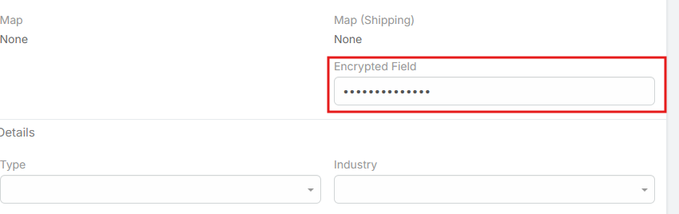
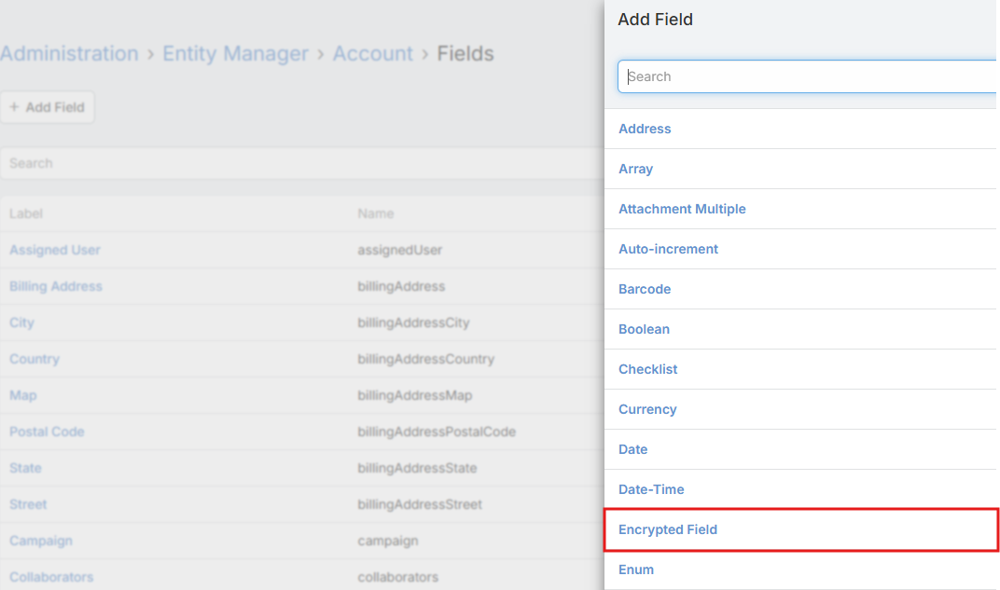

# Encrypted Fields Extension

## Overview
The **Encrypted Fields** extension adds a new field type `encrypted` to EspoCRM. This allows you to securely store sensitive information (such as API keys, secrets, or personal identification numbers) in the database using reversible encryption.

Unlike the standard `password` field which uses one-way hashing, the `encrypted` field allows the system to decrypt and retrieve the original value when needed (e.g., for integrations or processing), while keeping it secure in the database.

## Features
*   **AES-256-CBC Encryption**: Uses industry-standard strong encryption.
*   **Automatic Key Management**: Automatically generates a secure 256-bit encryption key (`extendedEncryptionKey`) upon first use if not already present.
*   **Unique IV per Value**: Generates a random Initialization Vector (IV) for every record to ensure that identical values produce different encrypted strings.
*   **Secure Storage**: The encrypted value and its IV are stored in separate columns in the database.
*   **UI Security**: Fields behave like password fields in the user interface (masked input, masked display), preventing casual viewing of sensitive data.



## Configuration
The extension uses a global encryption key stored in your EspoCRM configuration.

1.  **Key Generation**: The first time you save a record with an encrypted field, the extension checks for `extendedEncryptionKey` in your configuration. If missing, it generates a secure 32-byte hex key and saves it to `data/config.php`.
2.  **Manual Configuration**: You can optionally define the key manually in `data/config.php`:
    ```php
    'extendedEncryptionKey' => 'YOUR_32_BYTE_HEX_KEY',
    ```

> **Warning**: Do not lose this key! If the `extendedEncryptionKey` is lost or changed, all previously encrypted data will become unreadable.

## Usage

### Adding an Encrypted Field
1.  Go to **Administration > Entity Manager**.
2.  Select the entity where you want to add the field.
3.  Click **Fields** and then **Add Field**.
4.  Select **Encrypted** from the Type dropdown.
5.  Configure the field label and name, then click **Save**.



### Developer Usage
To decrypt values programmatically (e.g., in a custom hook or service), use the `DecryptUtil` class provided by the extension.

```php
use Espo\Modules\EncryptedFields\Utils\DecryptUtil;

// ... inside your class method where $entity and $config are available

$fieldName = 'mySecretField';
$encryptedValue = $entity->get($fieldName);
$iv = $entity->get($fieldName . 'Iv'); // The IV is stored in a field with 'Iv' suffix

// Decrypt the value
$decryptedValue = DecryptUtil::from($encryptedValue, $iv, $config);

if ($decryptedValue !== false) {
    // Use the decrypted value
}
```

## Database Structure
For a field named `bank_account_number`, the extension creates:
*   `bank_account_number`: Stores the encrypted string (ciphertext).
*   `bank_account_number_iv`: Stores the base64-encoded Initialization Vector.

Both columns are required to decrypt the data.
