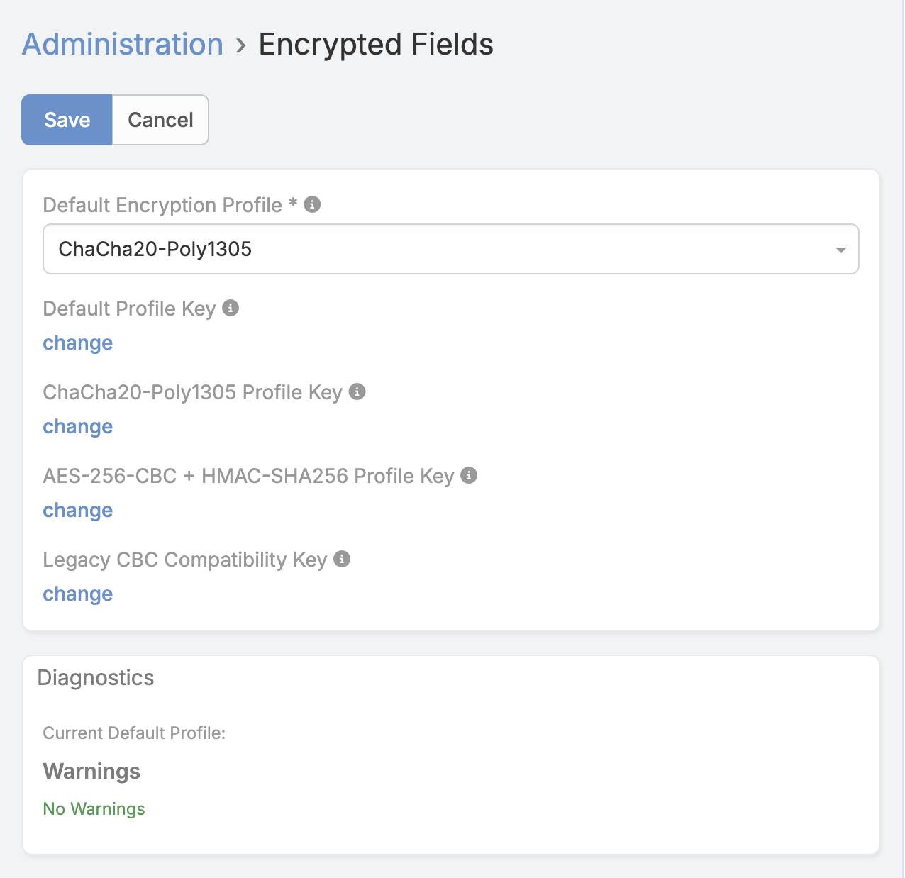
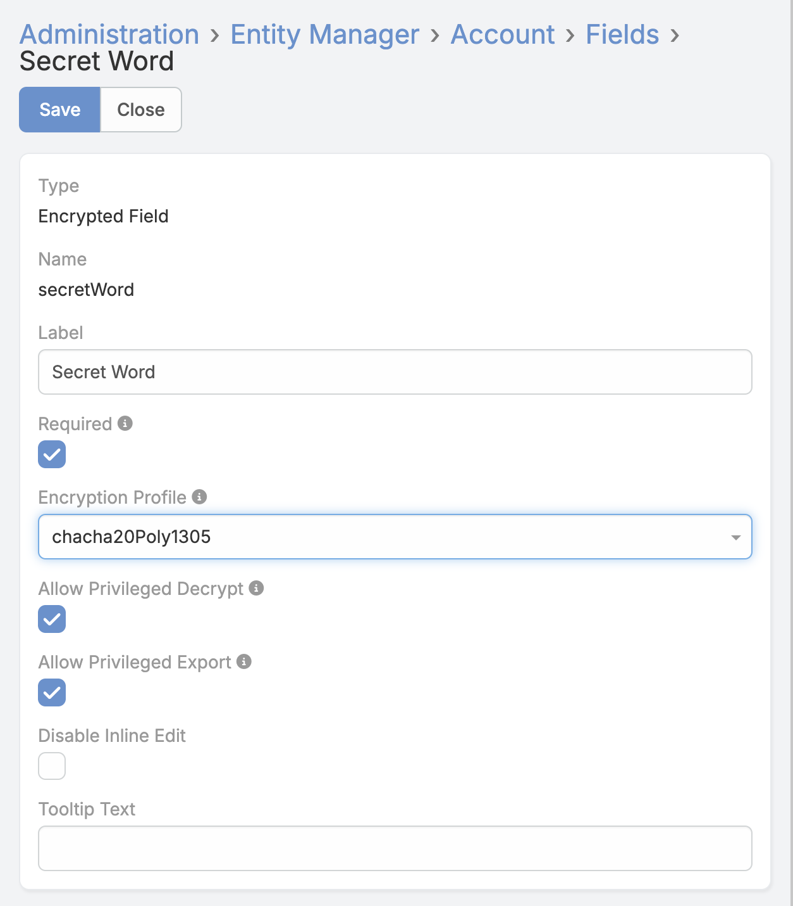
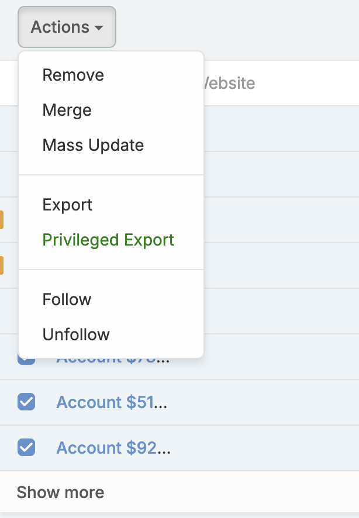

# Encrypted Fields 

## Overview

**Encrypted Fields** adds an **Encrypted** field type to EspoCRM for storing sensitive text safely.

It is designed for values that should not appear in normal record views, API reads, or standard exports.

By default:

- users can set or change the value,
- the value is shown as masked in the interface,
- normal record reads do not reveal plaintext,
- standard export does not include the encrypted value.

## What This Extension Helps With

Use **Encrypted Fields** when you need to store information such as:

- API keys,
- passwords or access tokens,
- secure internal notes,
- private identifiers,
- any other text that should stay hidden in normal day-to-day use.

## Installation

1. Obtain the extension package from the Eblasoft customer portal.
2. Go to **Administration → Extensions**.
3. Upload and install the package.
4. Rebuild the application after installation.

## Administration Setup

After installation, open:

`Administration → Encrypted Fields`

### Default Encryption Profile

This is the default encryption option used when a field does not choose a specific profile.

In most cases, you only need to choose the default once and keep using it.

### Encryption Methods

The extension includes multiple encryption methods. For most clients, the practical difference is about environment preference, not day-to-day usage.

- **Default (AES-256-GCM)**
  - Recommended for most clients.
  - Modern, widely supported, and secure for new encrypted values.

- **ChaCha20-Poly1305**
  - Also modern and secure.
  - Can be a good alternative profile when you want a non-AES method.

- **AES-256-CBC + HMAC-SHA256**
  - Secure when combined with HMAC integrity protection.
  - Useful mainly for compatibility requirements in some environments.

In short: use **Default (AES-256-GCM)** unless you have a specific reason to select another supported profile.

### Encryption Keys

The extension manages encryption keys from the same administration page.

Each available encryption profile has its own key field.

!!! warning
    Changing an existing key without a controlled migration can make previously saved values unreadable.

### Diagnostics Panel

The administration page includes a diagnostics panel to help administrators confirm that each encryption profile is ready to use.

It shows:

- whether a profile is ready,
- whether its key is available,
- whether it can be used for encryption and decryption,
- any warnings that require administrator attention.

If no default profile is explicitly selected yet, the extension uses **Default (AES-256-GCM)** as the effective default.

## Creating an Encrypted Field

1. Navigate to **Administration → Entity Manager**.
2. Open the target entity.
3. Go to **Fields**.
4. Create a field with type **Encrypted**.
5. Configure the options you need.

### Field Options

#### Required

Makes the field mandatory.

#### Encryption Profile

Optional.

- Leave it empty to use the default encryption profile.
- Choose a specific profile only when that field needs a different encryption setup.

#### Allow Privileged Decrypt

When enabled, authorized users can click **Decrypt** on the record detail view.

#### Allow Privileged Export

When enabled, authorized users can export the field value using the dedicated privileged export action.

## How It Works for Users

### Detail View

- Encrypted values are shown as masked.
- If allowed, users see a **Decrypt** link.
- If allowed, users also see an **Export** link for that field.

### Edit View

- Existing values stay hidden.
- Users can set a new value or replace the current one.

### List View

- Users with the correct permission see a **Privileged Export** mass action.
- This action can export decrypted values only for fields that explicitly allow it.

## Permissions

### Privileged Decrypt

To use **Decrypt**, all of the following must be true:

1. The field is an **Encrypted** field.
2. **Allow Privileged Decrypt** is enabled for that field.
3. The user has **Encrypted Field Decrypt Permission** in their role.
4. The user has read access to the record.
5. The user has read access to the field.

### Privileged Export

To use privileged export, all of the following must be true:

1. The user has normal EspoCRM **export** permission.
2. The user has **Encrypted Field Export Permission** in their role.
3. The user can read the target records.
4. The user can read the target field.
5. **Allow Privileged Export** is enabled for that field.

## Important Notes

- Normal export does not reveal encrypted values.
- Normal record reads do not reveal plaintext values.
- Decrypt and export access are always controlled by role permission and field settings.
- If you plan to change encryption keys, do so carefully and with a migration plan.
- If you are unsure which encryption method to choose, keep **Default (AES-256-GCM)**.
- This first release does not include a legacy compatibility profile.

## Change Log

