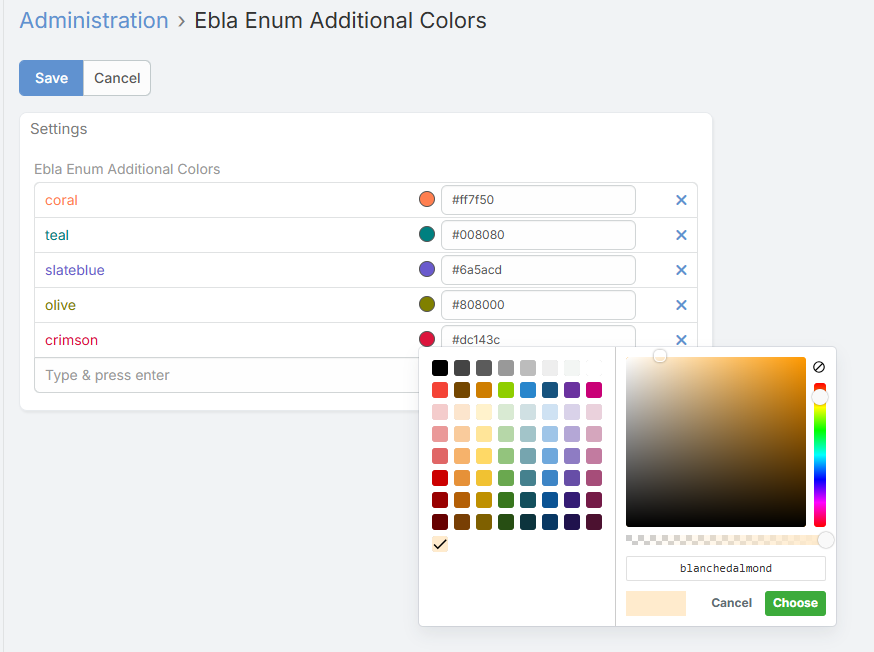
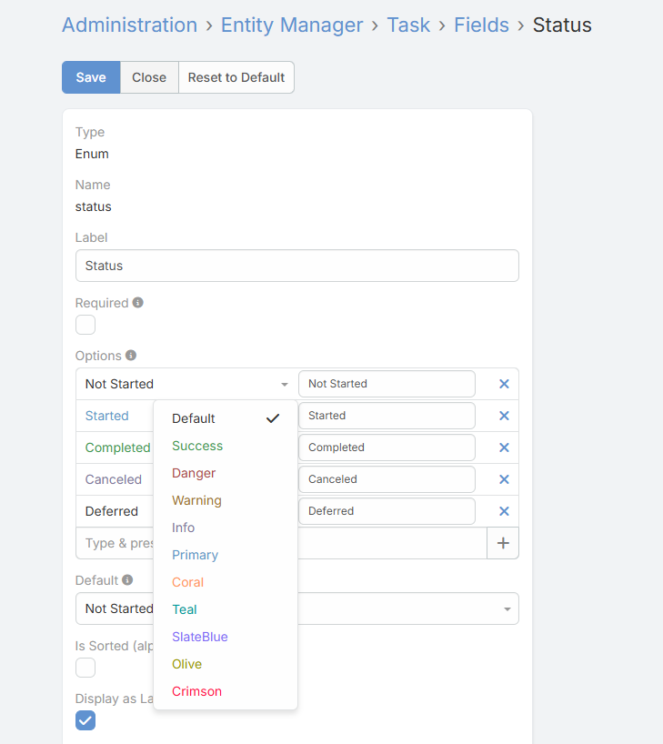

# Additional Enum Colors (Global Color Palette)

Define and manage additional colors globally to be reused across Enum and Multi-Enum fields.

* **Access:** Go to `Administration` > `Ebla Enum Additional Colors`.
* **Functionality:**
  Add custom colors using an intuitive **color picker** or by manually entering the **HEX color code**.
  Each entry represents a reusable color option stored centrally.
* **Integration:**
  The defined colors automatically appear as selectable color options when configuring **Enum** and **Multi-Enum** fields.
* **Benefits:**
  Ensures color consistency across the system, speeds up configuration.

---

