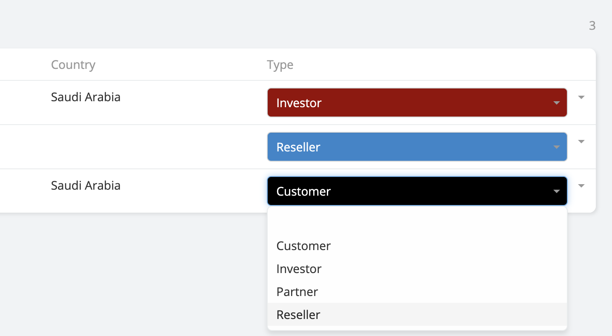
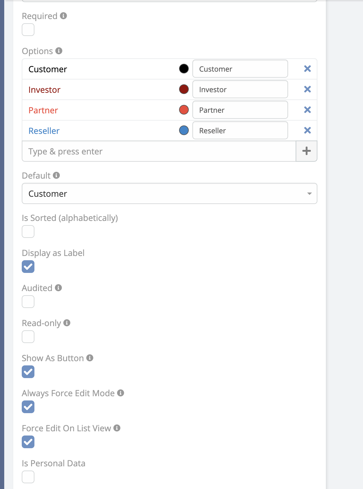

# Force Edit on List View

**Edit Enum and Multi-Enum fields directly from the List View without opening the record.**

This feature allows you to update field values inline by transforming the List View cells into interactive controls, significantly improving speed and productivity when working with large datasets.

* **Availability** : Included in Ebla Enum Plus.

* **Supported Fields** : Enum & Multi-Enum.

* **Behavior**:
    The field becomes editable directly in the List View, allowing quick selection of options with a single click.

*  **Use Case**:
    Ideal for bulk status updates, priority changes, or workflow-driven data where frequent edits are required.

**Enable Force Edit on List View**

Go to **Administration → Entity Manager → {Entity Type} → Fields**.

Select the desired **Enum** or **Multi-Enum** field.

Enable the **Force Edit on List View** option.

Save the field settings.

Once enabled, the field will be editable directly from the List View.

---

### Force Edit on List View is available

---

### Enable Force Edit on List View

**-** Go to **Administration** -> **Entity Manager** -> **{Entity Type}** -> **Fields** .

