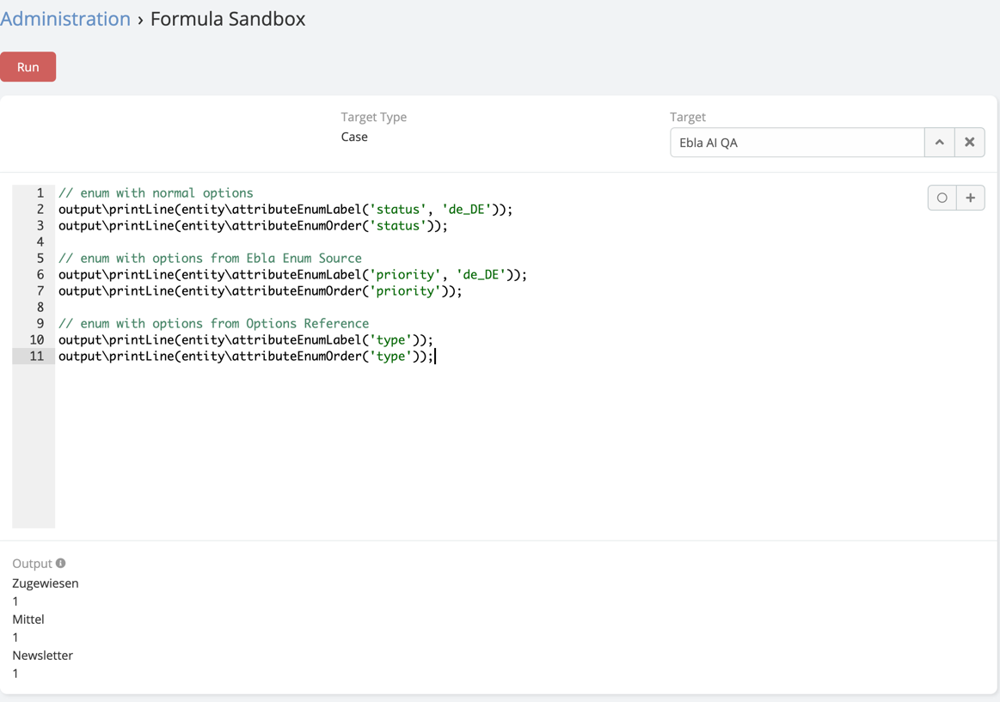

# Formula Functions

This feature introduces support for new formula functions that allow you to retrieve the label and order of Enum options. These functions can be used with normal Enum options, options from Ebla Enum Source, and options from Options Reference.

## Usage

- `entity\attributeEnumLabel(attribute, locale)`: This function retrieves the label of the specified Enum attribute. If a locale is provided, it retrieves the label in that locale. If no locale is provided, it retrieves the default EspoCRM local.

- `entity\attributeEnumOrder(attribute)`: This function retrieves the order of the specified Enum attribute. The order is determined by the position of the option in the Enum option list.


## Examples

### Enum with Normal Options

```javascript
// To get the label of the Enum option
entity\attributeEnumLabel('status', 'de_DE');

// To get the order of the Enum option
entity\attributeEnumOrder('status');
```

### Enum with Options from Ebla Enum Source

```javascript
// To get the label of the Enum option
entity\attributeEnumLabel('priority', 'de_DE');

// To get the order of the Enum option
entity\attributeEnumOrder('priority');
```

### Enum with Options from Options Reference

```javascript
// To get the label of the Enum option
entity\attributeEnumLabel('type');

// To get the order of the Enum option
entity\attributeEnumOrder('type');
```