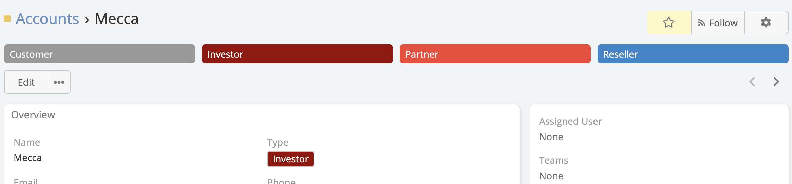
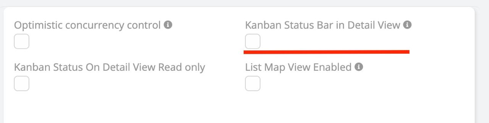

# Enum Plus <a href="https://www.eblasoft.com.tr/espocrm-extension-page/espocrm-enum-plus" target="_blank" id="ext-version" data-id="638999ce6d3bbcd76"></a>

## Overview
**Ebla Enum Plus** is an advanced extension for EspoCRM that enhances the functionality and visual presentation of **Enum** and **Multi-Enum** fields. It introduces a global color palette, inline editing capabilities, status bars, button group displays, row coloring based on enum values, and new formula functions to improve usability and data visualization.

<iframe width="650" height="315" src="https://www.youtube.com/embed/2AnzIkMbtJY" frameborder="0" allow="accelerometer; autoplay; clipboard-write; encrypted-media; gyroscope; picture-in-picture" allowfullscreen></iframe>

## Features

- [Additional Enum Colors (Global Color Palette)](#additional-enum-colors-global-color-palette)
- [Force Edit on List View](#force-edit-on-list-view)
- [Kanban Status Bar in Detail View](#kanban-status-bar-in-detail-view)
- [Show As Button (Button Group)](#show-as-button-button-group)
- [Formula Functions](#formula-functions)
- [Row Coloring Based on Enum Field](#row-coloring-based-on-enum-field)

## Additional Enum Colors (Global Color Palette)

Define and manage additional colors globally to be reused across Enum and Multi-Enum fields.

* **Access:** Go to `Administration` > `Ebla Enum Additional Colors`.
* **Functionality:**
  Add custom colors using an intuitive **color picker** or by manually entering the **HEX color code**.
  Each entry represents a reusable color option stored centrally.
* **Integration:**
  The defined colors automatically appear as selectable color options when configuring **Enum** and **Multi-Enum** fields.
* **Benefits:**
  Ensures color consistency across the system, speeds up configuration.

---


## Force Edit on List View

**Edit Enum and Multi-Enum fields directly from the List View without opening the record.**

This feature allows you to update field values inline by transforming the List View cells into interactive controls, significantly improving speed and productivity when working with large datasets.

* **Availability** : Included in Ebla Enum Plus.

* **Supported Fields** : Enum & Multi-Enum.

* **Behavior**:
  The field becomes editable directly in the List View, allowing quick selection of options with a single click.

*  **Use Case**:
   Ideal for bulk status updates, priority changes, or workflow-driven data where frequent edits are required.

**Enable Force Edit on List View**

Go to **Administration → Entity Manager → {Entity Type} → Fields**.

Select the desired **Enum** or **Multi-Enum** field.

Enable the **Force Edit on List View** option.

Save the field settings.

Once enabled, the field will be editable directly from the List View.

---

### Force Edit on List View is available


---

### Enable Force Edit on List View

**-** Go to **Administration** -> **Entity Manager** -> **{Entity Type}** -> **Fields** .


## Kanban Status Bar in Detail View

Visualize the progress of a record (like a sales stage or support ticket status) directly in the Detail View.

- **Display:** Renders the Enum field (typically "Status" or "Stage") as a chevron-style process bar.

- **Configuration:** Enable in `Entity Manager` > `{Entity}` > `Edit` (Entity definitions).

- **Interaction:** Users can clearly see the current stage and the progression flow.


---



---

### Enable Kanban Status Bar in Detail View

**-** Go to **Administration** -> **Entity Manager** -> **{Entity Type}** -> **Edit** .





## Show As Button (Button Group)

Render Enum options as an interactive button group instead of a standard dropdown.

- **Display:** Options are displayed as a horizontal row of buttons.

- **Always Force Edit Mode:** Option to keep the buttons interactive even in the read-only Detail View, allowing for one-click updates.

---

## Show As Button

Enable the toggle buttons group even on the view mode.


<br>

---

**-** Go to **Administration** -> **Entity Manager** -> **{Entity Type}** -> **Fields** .

<br>


!!! note

    Enum as buttons merged from the deprecated extension "Espocrm Plus".

## Formula Functions

This feature introduces support for new formula functions that allow you to retrieve the label and order of Enum options. These functions can be used with normal Enum options, options from Ebla Enum Source, and options from Options Reference.

- `entity\attributeEnumLabel(attribute, locale)`: This function retrieves the label of the specified Enum attribute. If a locale is provided, it retrieves the label in that locale. If no locale is provided, it retrieves the default EspoCRM local.

- `entity\attributeEnumOrder(attribute)`: This function retrieves the order of the specified Enum attribute. The order is determined by the position of the option in the Enum option list.


## Examples

### Enum with Normal Options

```javascript
// To get the label of the Enum option
entity\attributeEnumLabel('status', 'de_DE');

// To get the order of the Enum option
entity\attributeEnumOrder('status');
```

### Enum with Options from Ebla Enum Source

```javascript
// To get the label of the Enum option
entity\attributeEnumLabel('priority', 'de_DE');

// To get the order of the Enum option
entity\attributeEnumOrder('priority');
```

### Enum with Options from Options Reference

```javascript
// To get the label of the Enum option
entity\attributeEnumLabel('type');

// To get the order of the Enum option
entity\attributeEnumOrder('type');
```

### Row Coloring Based on Enum Field

Automatically color List View rows based on the selected Enum field values.

This feature allows administrators to choose a specific Enum field from the entity settings. The List View rows will then be dynamically colored according to the colors defined for the options of that Enum field.

**Configuration** :

In the Entity Settings, select an Enum field to be used as the row color source.

**Behavior** :

Each row in the List View inherits the color of the selected Enum option value for that record.

**Consistency** :

Uses the same color definitions applied across Enum fields, ensuring a unified visual experience.

**Use Case** :

Quickly identify record status, priority, or category directly from the List View without opening records.


---


## ChangeLog

<div class="change-log-wrapper" data-id="638999ce6d3bbcd76"></div>
