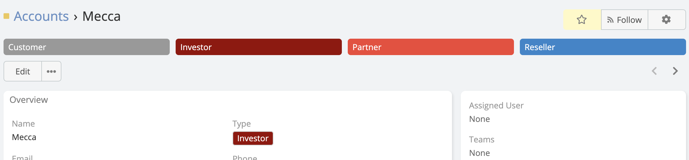
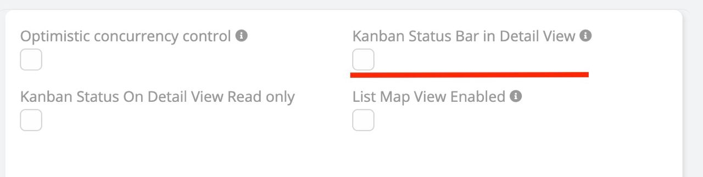

### Kanban Status Bar in Detail View

Visualize the progress of a record (like a sales stage or support ticket status) directly in the Detail View.

- **Display:** Renders the Enum field (typically "Status" or "Stage") as a chevron-style process bar.

- **Configuration:** Enable in `Entity Manager` > `{Entity}` > `Edit` (Entity definitions).

- **Interaction:** Users can clearly see the current stage and the progression flow.

---

---

### Enable Kanban Status Bar in Detail View

 

**-** Go to **Administration** -> **Entity Manager** -> **{Entity Type}** -> **Edit** .

 

