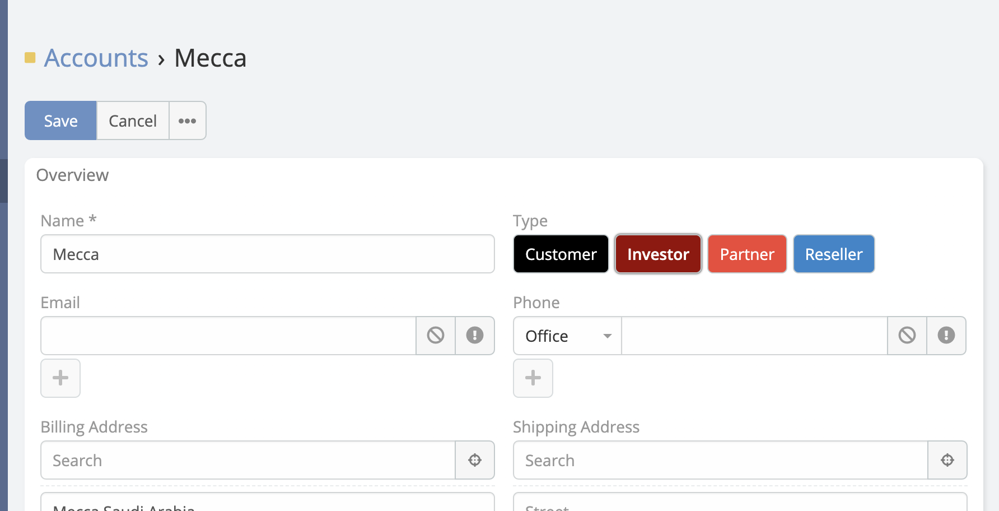

### Show As Button (Button Group)

Render Enum options as an interactive button group instead of a standard dropdown.

- **Display:** Options are displayed as a horizontal row of buttons.

- **Always Force Edit Mode:** Option to keep the buttons interactive even in the read-only Detail View, allowing for one-click updates.

---

### Show As Button

Enable the toggle buttons group even on the view mode.

 

---

**-** Go to **Administration** -> **Entity Manager** -> **{Entity Type}** -> **Fields** .

 

!!! note

    Enum as buttons merged from the deprecated extension "Espocrm Plus".
