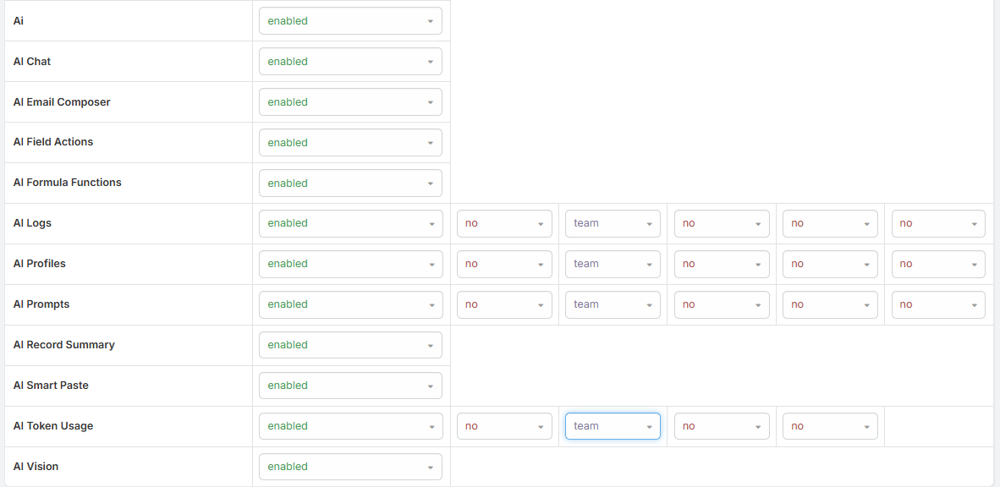

# Access Control

Ebla AI uses EspoCRM's built-in **Roles** system together with normal entity permissions. In practice, users need:

- The relevant **AI scope** enabled in their Role
- The normal **read / create / edit** permission for the affected entity

By default, regular and portal users do not have access to AI features until an Administrator enables them.

!!! info

    Navigate to **Administration → Roles** and enable the required AI scopes for the relevant Role.

## Available AI Permission Scopes

Each AI feature has its own permission scope:

| Scope | Controls |
|-------|----------|
| `Ai` | Base AI access. Required for all AI-powered features. |
| `AiChat` | Record-level AI Chat panel and Admin Assistant chat access |
| `AiEmailComposer` | AI actions in email compose, reply, and email template body editing |
| `AiFieldAction` | AI actions on text, varchar, wysiwyg, and stream comment content |
| `AiFormula` | AI formula functions such as `eblaAi\textGenerate`, `eblaAi\runPrompt`, `eblaAi\analyzeImage`, `eblaAi\generateImage`, and `eblaAi\generateSpeech` |
| `AiRecordSummary` | AI Summary panel on record detail views |
| `AiSmartPaste` | Smart Paste on list views, relationship panels, and new-record forms |
| `AiVision` | Image analysis and AI image generation |

## How Feature Access Is Evaluated

The AI scope alone is not enough. The user also needs the standard entity permission required by the feature.

Examples:

- **AI Chat** requires `Ai` + `AiChat` and read access to the current record
- **AI Summary** requires `AiRecordSummary` and read access to the current record
- **Smart Paste** requires `Ai` + `AiSmartPaste` and create or edit access to the target entity
- **AI Create** requires `Ai` and create access to the target entity
- **Email Translation** requires `Ai` and read access to Email
- **Image Analysis / Generation** requires `Ai` + `AiVision`

!!! note "Administrators"

    Administrators can access the admin-facing Ebla AI pages, but normal record permissions still matter when a feature reads or writes CRM data.

## Roles Configuration Tips

Recommended patterns:

- Grant `Ai` as the base permission first
- Add only the feature scopes the role should use
- Keep `AiChat`, `AiRecordSummary`, and `AiSmartPaste` separate so usage can be controlled more precisely
- Grant `AiVision` only to users who should analyze or generate images

## Token Usage Limits

In addition to scope-based access control, Ebla AI supports token usage limits.

### Per-User Override

1. Navigate to **Administration → Users**.
2. Open the user record.
3. Set **AI Monthly Token Limit**.

Even though the field name says **Monthly**, it acts as the user's personal token-limit override for the currently configured system period:

- **Daily**
- **Weekly**
- **Monthly**

Set it to `0` to fall back to the global default limit.

### What Happens at the Limit

When the effective limit is reached:

- New AI requests are blocked
- The user receives an error explaining that their token limit has been reached
- Administrators are not blocked by token limits

See [Token Usage Statistics](token-usage.md) for details.
