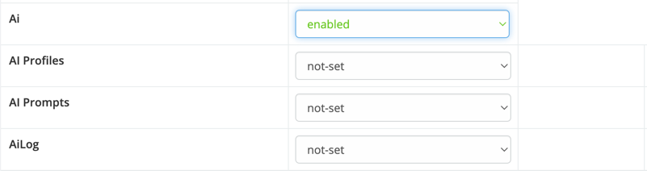

# Access Control

Ebla AI uses EspoCRM’s built-in **Roles** system to control which users can access each AI feature. By default, regular and portal users have no access to any AI feature. An Administrator must explicitly grant access in Roles.

!!! info

    By default, regular and portal users don’t have access to AI features. An Administrator needs to enable access in **Administration → Roles**.

## Available Permission Scopes

Each AI feature has its own permission scope that can be toggled on/off per Role:

| Scope | Controls |
|-------|----------|
| `Ai` | Base AI access — required for all AI features |
| `AiEmailComposer` | AI toolbar in email compose window (Draft, Polish, Grammar, Tone) |
| `AiFieldAction` | AI dropdown on text/varchar fields (Improve, Shorter, Translate, Generate) |
| `AiSmartPaste` | Smart Paste clipboard feature on record edit forms |
| `AiFormula` | Formula functions (`eblaAi\textGenerate`, `eblaAi\runPrompt`, `eblaAi\analyzeImage`) |
| `AiVision` | Image & attachment analysis (vision AI) |

!!! tip "Granting access"

    Go to **Administration → Roles**, open or create a Role, and enable the desired AI scopes. Assign the Role to the relevant users or teams.

!!! note "Admin users"

    Administrators always have full access to all AI features regardless of Role settings. The AI Sandbox is available to admin users only.

## Token Usage Limits

In addition to scope-based access control, you can set a **monthly token limit** per user.

- Go to **Administration → Users**, open a user record, and set **AI Monthly Token Limit** (integer).
- `0` means unlimited.
- When the limit is reached, all AI features return a permission error for that user until the next calendar month.
- Administrators are never blocked by token limits.

See [Token Usage Statistics](token-usage.md) for more details.
