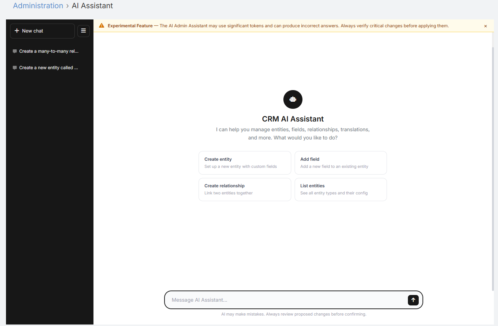

# AI Admin Assistant

The AI Admin Assistant provides a full-page conversational workspace for EspoCRM administrators. It is designed for administrative and configuration tasks such as reviewing metadata, planning changes, helping with formulas, and assisting with entity or layout updates.

Unlike the record-level **AI Chat** panel, this feature runs in **admin mode** and uses a broader tool set intended for CRM administration.

!!! note

    Experimental Feature — The AI Admin Assistant may use significant tokens and can produce incorrect answers. Always verify critical changes before applying them. Use it in a Sandbox environment only.

## Where to Find It

1. Navigate to **Administration**.
2. Open the **Ebla AI Administration** section.
3. Click **AI Assistant**.

## Requirements

- The user must be an **Administrator**.
- The user must have access to AI chat features.
- A default AI provider must be configured in **Administration → AI Settings**.
- You can optionally assign a dedicated profile using **AI Admin Assistant Default Profile** in **Administration → AI Settings → AI Features**.

## What It Can Help With

Typical use cases include:

- Explaining how a CRM area works
- Creating new entity & relationship 
- Reviewing entity fields and layouts
- Suggesting formula logic
- Drafting translation labels
- Helping plan changes before implementation
- Assisting with admin-oriented CRM questions

!!! note

    The Admin Assistant is intended for administrators. It uses a broader tool set than record chat and should be treated as an administrative helper, not an unattended automation engine.

## Interface Overview

The page includes:

- A main conversation area
- A message input with multi-line support
- Suggested starter prompts
- A sidebar with saved conversations
- A **New Chat** action
- Per-message **Copy** buttons

## Conversation Persistence

The Admin Assistant keeps conversation history in two places:

- **Browser-side conversation list** for quick switching between recent chats
- **Server-side persisted history** so the active chat can continue across refreshes

Current behavior:

- Up to 30 recent conversations are kept in the browser list
- Older browser-side conversations are trimmed automatically
- Conversations older than 7 days are removed from the local sidebar list
- The active server-side conversation is stored per admin conversation ID

## Using the Assistant

1. Open **Administration → AI Assistant**.
2. Type your request in the message box.
3. Press **Enter** to send, or use **Shift+Enter** for a new line.
4. Review the response.
5. Start a new conversation when you want a separate context.

Examples:

- "Explain how EspoCRM layouts work."
- "Help me design fields for a custom Project entity."
- "Draft a before-save formula that builds a reference number."
- "What should I check before adding a many-to-many relationship?"

## Best Practices

- Be specific about the entity, field, or layout you are asking about.
- Use separate chats for unrelated admin topics.
- Review any suggested configuration carefully before applying it.
- Use the AI Sandbox if you want to test prompts against a record context first.

## Related Features

- [AI Sandbox](sandbox.md) - Test prompts and record-aware instructions
- [AI Profiles](ai-profiles.md) - Assign a dedicated profile to the assistant
- [AI Chat Panel](ai-chat.md) - Record-level AI assistant for end users
- [Admin Settings](admin-settings.md) - Configure the default profile used by the assistant
