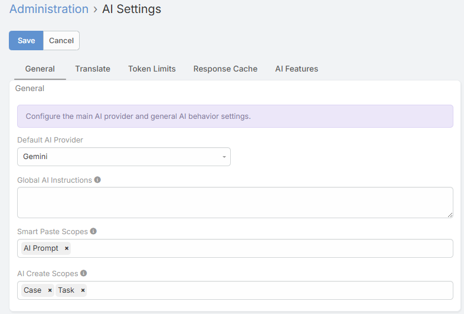
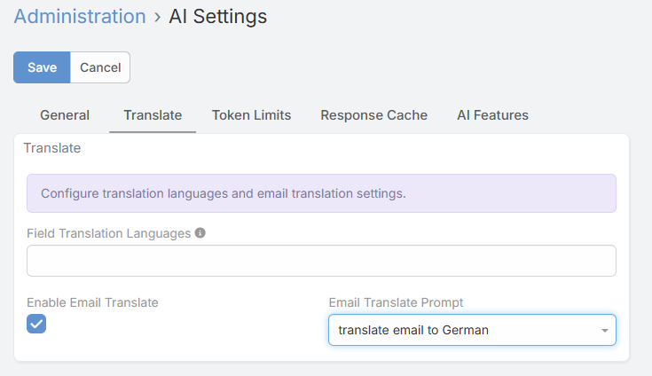
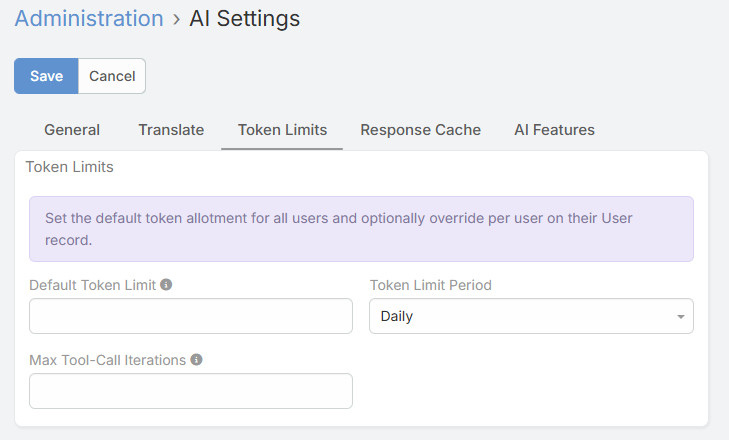
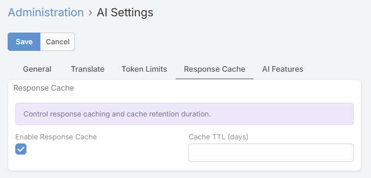
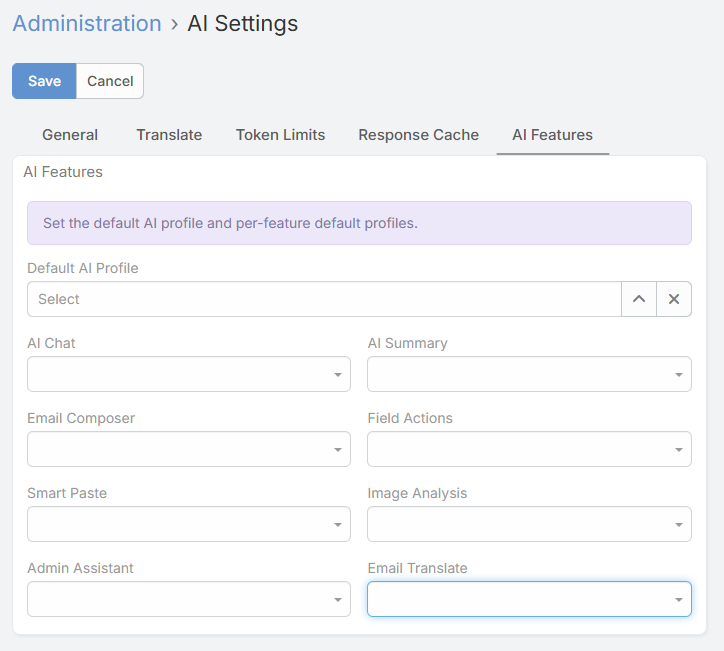

# Admin Settings

Global AI settings are managed from **Administration → AI Settings**. These settings control provider selection, feature defaults, token limits, response caching, translation behavior, Smart Paste visibility, and Create with AI visibility.

## General Tab

The **General** tab contains the core extension-wide settings.

### Default AI Provider

The **Default AI Provider** setting determines which configured provider is used when a feature does not explicitly resolve another provider from an AI Profile.

Most UI-based AI actions also expect a default provider to be set before their buttons become visible.

### Default AI Profile

The **Default AI Profile** is the fallback profile used when a feature does not have:

- An entity-specific profile
- A feature-specific default profile
- A prompt-linked profile

### Global AI Instructions

The **Global AI Instructions** field lets you define text that is prepended to every AI request across the extension.

Use this for:

- Company-wide response rules
- Tone and formatting guidance
- Language instructions
- Restrictions or compliance reminders

!!! note

    Global AI Instructions are combined with the selected AI Profile context and the feature-specific prompt. The global instructions are applied first.

### Variable Substitution

Global AI Instructions and AI Profile context fields support `{varName}` placeholders.

**Always available:**

| Variable | Replaced with |
|----------|---------------|
| `{userName}` | Current user's full name |
| `{userRole}` | `Administrator` or `User` |
| `{companyName}` | Company name from Settings |
| `{today}` | Current date in `YYYY-MM-DD` format |
| `{language}` | Current user's language code |

**Available when a feature runs against a record context:**

| Variable | Replaced with |
|----------|---------------|
| `{entityType}` | Entity type, such as `Contact` or `Opportunity` |
| `{entityName}` | The record name |
| `{entityId}` | The record ID |

Unknown placeholders are left unchanged.

## Translate Tab

The **Translate** tab contains language and email-translation settings.

### AI Translate Languages

It controls the language list shown by translation actions in text fields, varchar fields, WYSIWYG fields, and stream comments.

Behavior:

- If one language is configured, the UI shows a single **Translate** action
- If multiple languages are configured, the UI shows a **Translate To** sub-menu

### Enable Email Translate

Enable **Email Translate** to show the **Translate** button on Email detail views.

### AI Email Translate Default Profile

Set a dedicated profile if you want email translations to use a different model or context than the global default.

### AI Email Translate Default Prompt

Set the prompt used for the email translation request.

!!! important

    Email translation expects a translation prompt to be configured. For reliable use, set **AI Email Translate Default Prompt** explicitly.

## Token Limits Tab

### Default Token Limit

The **Default Token Limit** sets the fallback system-wide token quota for non-admin users.

- `0` means unlimited
- Applies only when the user does not have a personal override

### Token Limit Period

The **Token Limit Period** defines the enforcement window:

- **Daily**
- **Weekly**
- **Monthly**

### Per-User Override

Each user record has an **AI Monthly Token Limit** field. Even though the label says *Monthly*, the value acts as that user's personal override for the currently configured period.

### Max Tool-Call Iterations

It limits how many consecutive tool-call rounds the AI Chat engine can perform in one request.

Use cases:

- Lower values reduce cost and keep tool usage tight
- Higher values help with more complex multi-step chat tasks

## Response Cache Tab

The response cache reuses identical AI responses for selected features.

### Settings

- **Response Cache**
- **Cache TTL** in days

### What Is Cached

The current implementation uses response caching for several feature APIs, including:

- Email composer actions
- Email template generation
- PDF template generation
- Field text actions

Some AI interactions are intentionally excluded, especially tool-using chat flows.

### Cache Notes

- Cached responses return faster
- Cached responses do not consume new tokens on the cache-hit request
- Cache hits are visible in **AI Log**

## AI Features Tab

This tab lets you assign default profiles per feature.

| Setting | Used By |
|---------|---------|
| **Default AI Profile** | Global fallback for all features |
| **AI Chat Default Profile** | Record-level AI Chat |
| **AI Summary Default Profile** | AI Summary |
| **AI Email Composer Default Profile** | Draft, reply, polish, grammar, tone |
| **AI Field Action Default Profile** | Text field and stream comment AI actions |
| **AI Smart Paste Default Profile** | Smart Paste |
| **AI Vision Default Profile** | Image analysis |
| **AI Image Generation Default Profile** | AI image generation |
| **AI Speech Generation Default Profile** | Speech generation |
| **AI Admin Assistant Default Profile** | Admin Assistant |
| **AI Email Translate Default Profile** | Email translation |

## Smart Paste Scopes

The **Smart Paste Scopes** field controls where Smart Paste buttons appear.

Recommended configuration:

1. Open **Administration → AI Settings → General**.
2. Select the entity types you want to support.
3. Save.

!!! tip

    Explicitly selecting the scopes gives the most predictable button visibility across main list views, relationship panels, and new-record forms.

## AI Create Scopes

The **AI Create Scopes** field controls where **Create with AI** appears.

1. Open **Administration → AI Settings → General**.
2. Select the entity types that should show **Create with AI**.
3. Save.

The button then appears:

- In the main list view header
- In supported relationship panel lists

## Related Features

- [AI Profiles](ai-profiles.md)
- [AI Prompts](ai-prompts.md)
- [AI Smart Paste](smart-paste.md)
- [AI Create from List View](ai-create.md)
- [Token Usage & Limits](token-usage.md)
