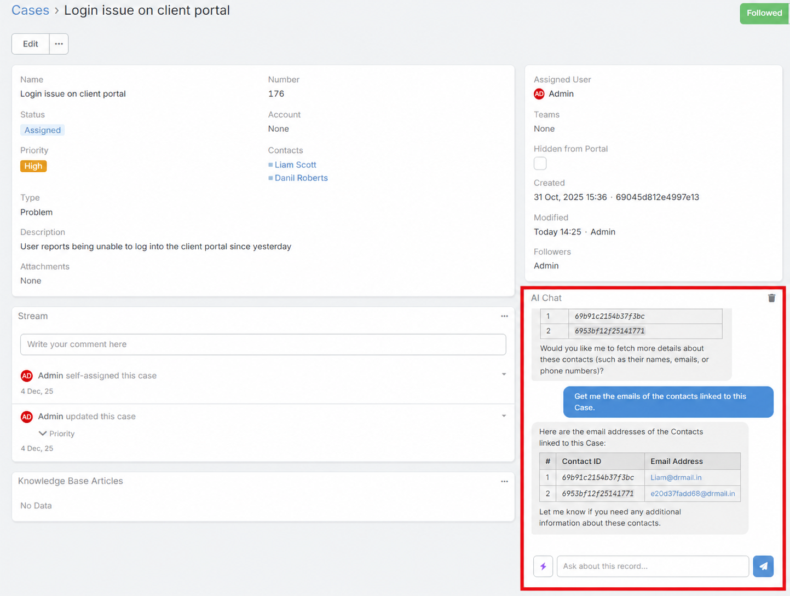
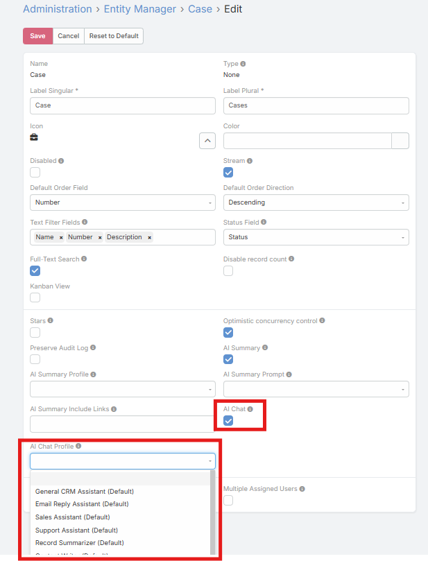
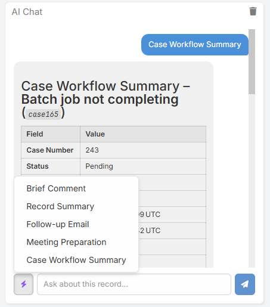

# AI Chat Panel

The AI Chat Panel adds a conversational assistant to supported record detail views. It lets users ask questions about the current record, related records, and CRM data without leaving the page.

The chat can use AI tools, persist conversation history per user and record, and continue across refreshes.

## Requirements

Users need:

- `Ai` access
- `AiChat` access
- Read access to the current record
- A configured default AI provider

## Enabling AI Chat for an Entity

1. Navigate to **Administration → Entity Manager**.
2. Open the entity you want to configure.
3. Enable **AI Chat**.
4. Optionally set **AI Chat Profile**.
5. Save.

## Using the AI Chat Panel

1. Open a record detail view for an entity with AI Chat enabled.
2. Find the **AI Chat** side panel.
3. Type your message.
4. Press **Enter** to send, or **Shift+Enter** for a new line.
5. Review the response.

## Current Record Context

When the panel is used on a record, the AI automatically receives the current record context, including:

- Entity type
- Record ID
- Record name

This lets the user ask questions such as:

- "What is the current stage of this opportunity?"
- "How many open tasks are related to this account?"
- "Summarize the recent activity on this contact."

## Prompt Shortcuts

If AI Prompts exist for the current entity or as global prompts, the chat panel shows a prompt shortcut button.

The prompt menu combines:

- Global prompts
- Entity-specific prompts for the current record type

Selecting one inserts and sends that prompt immediately.

## Conversation Persistence

Conversation history is stored per:

- User
- Entity type
- Record

This means:

- Different users have separate chat history on the same record
- Refreshing the page reloads the existing conversation
- The **Clear** button deletes the stored conversation for that record and user

## Long Conversation Compression

When a conversation becomes long, older messages are automatically compressed into a summary so the chat can continue without carrying the entire raw history forever.

Current behavior:

- Compression starts after long multi-turn history
- A summary of earlier messages is kept
- The most recent raw messages remain available in full

This reduces token usage while preserving the main context of the conversation.

## Tool Access and AI Profile Tier

The chat panel can use internal tools to answer CRM-aware questions.

Tool availability depends on the **Formula Tier** of the resolved AI Profile:

- **read** - Query CRM data
- **write** - Read and write supported CRM data
- **admin** - Administrative tools

For normal record chat, `read` is the typical and safest choice.

## Common Use Cases

- Asking about the current record status
- Reviewing related items
- Counting related records
- Exploring entity metadata
- Asking for next-step guidance based on the visible CRM context

## Notes

- The AI uses the configured chat profile if one is assigned to the entity
- If no entity-specific profile is set, the feature falls back to the **AI Chat Default Profile**, then the global default profile
- Assistant messages can be copied directly from the panel

## Related Features

- [AI Summary Panel](ai-summary.md)
- [AI Prompts](ai-prompts.md)
- [AI Profiles](ai-profiles.md)
- [AI Admin Assistant](admin-assistant.md)
