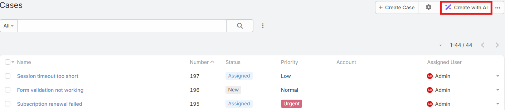
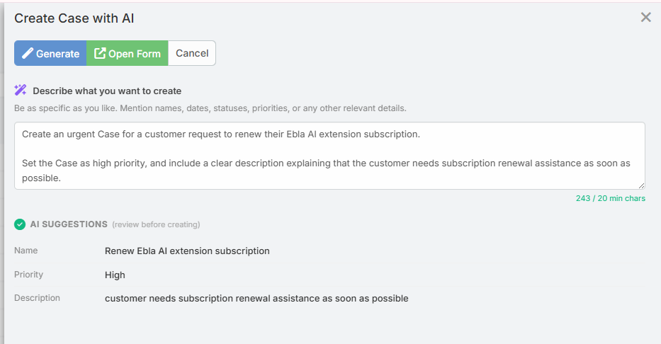

# AI Create

AI Create lets users describe a new CRM record in plain language and open the normal EspoCRM create form with suggested values already filled in.

The feature is designed for fast first-pass record creation. Nothing is saved automatically until the user reviews the generated values in the standard form and clicks **Save**.

## Requirements

Users need:

- `Ai` access
- Create access to the target entity
- A configured default AI provider

Administrators also need to enable the entity in **Administration -> AI Settings -> General -> AI Create Scopes**.

## Where the Button Appears

When an entity is selected in **AI Create Scopes**, the **Create with AI** button appears:

- In the main list view header
- In supported relationship panel lists



## Using AI Create

1. Open the list view for a supported entity.
2. Click **Create with AI**.
3. Enter a plain-language description of the record you want to create.
4. Click **Generate**.
5. Review the AI suggestions shown in the preview area.
6. Click **Open Form** to open the regular create form with the generated attributes.
7. Review the values, make any changes you want, and save the record normally.



## Description Rules

- The description must contain at least `20` characters
- A live counter is shown in the modal
- The description is preserved when you click **Regenerate**

Example:

```text
A new contact named Sarah Johnson, senior buyer at Acme Corp in New York, interested in our enterprise plan. Met at the trade show last week.
```

## What the Preview Shows

The preview lists the field labels and the values extracted by the AI.

If the AI cannot confidently map the description to specific fields, the modal still lets the user open the create form and complete the record manually.

## Notes

- The AI only fills fields that exist on the target entity
- No record is created until the user opens the form and saves it
- Better descriptions usually produce better field mapping
- Relationship fields and advanced business logic may still need manual review in the final form

## Tips

- Mention names, companies, dates, priorities, and statuses explicitly
- If an important field is missing, refine the description and click **Regenerate**

## Related Features

- [Smart Paste](smart-paste.md)
- [AI Profiles](ai-profiles.md)
- [Access Control](access-control.md)
