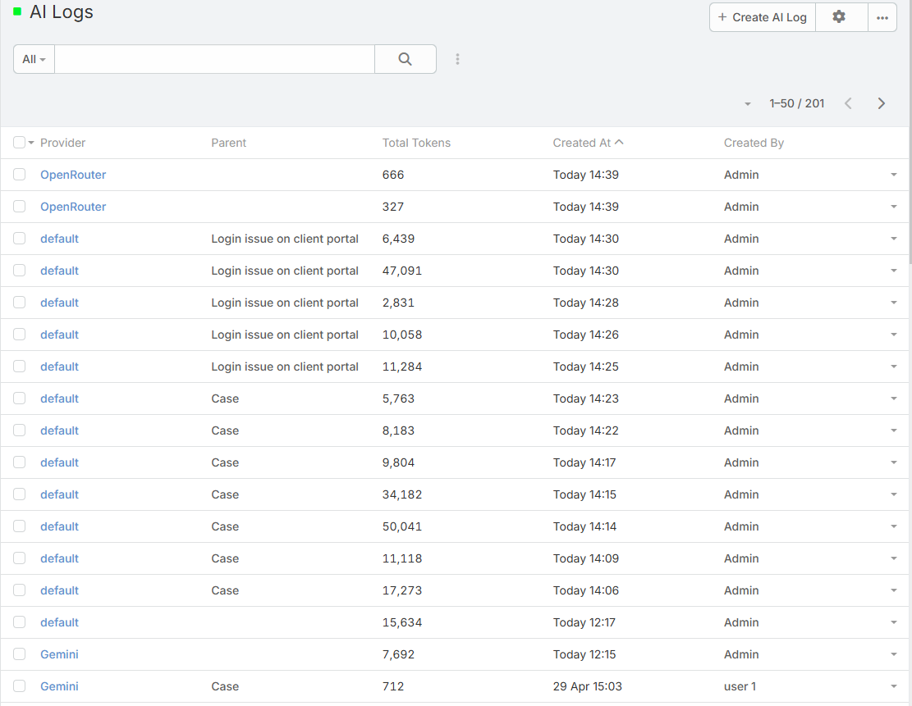
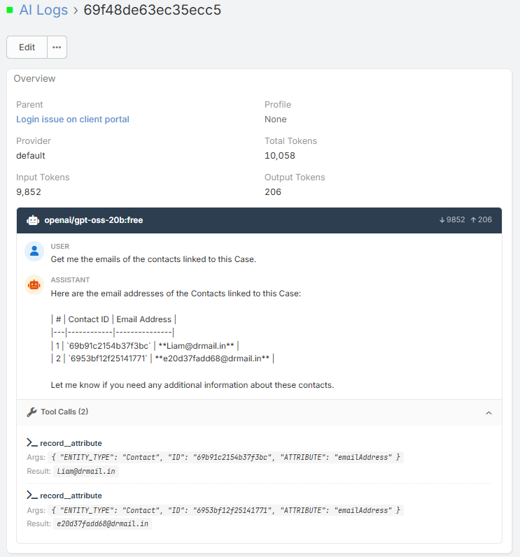

# AI Log

The AI Log stores individual AI requests and responses generated by Ebla AI. It is the main troubleshooting and auditing view for administrators who need to inspect how the extension is being used and what each AI request consumed.

## Overview

Each log entry may include:

- The AI provider used
- The AI Profile used
- The raw request payload
- The raw response payload
- Input, output, and total token counts
- Whether the response came from cache
- The related parent record, when applicable
- The linked daily token usage aggregate record

## Where to Find It

1. Navigate to **{{siteUrl}}/#AiLog**.

## What the AI Log Is Useful For

Use the AI Log when you need to:

- Debug unexpected AI output
- Confirm which provider or profile handled a request
- Check whether a result came from the response cache
- Review token usage for a specific action
- Trace AI activity back to a related record

## Important Fields

### Provider

Shows which provider handled the request, such as OpenAI, Gemini, Anthropic, OpenRouter, or Ollama.

### Profile

Shows the AI Profile used for the request when a profile was resolved.

### Request

Stores the outgoing AI request payload. This is especially useful for understanding:

- The final prompt sent to the provider
- The selected model
- Whether tools were used

### Response

Stores the raw AI response returned by the provider.

### Tokens

The log stores:

- **Input Tokens**
- **Output Tokens**
- **Total Token**

### Cache Hit

If **Cache Hit** is enabled on the record, the response was served from the AI response cache instead of calling the provider again.

When a cache hit occurs:

- The response is returned faster
- No new provider request is made
- The log entry records 0 token usage for that cached result

## Relationship to Token Usage

Each log entry can be associated with the daily usage aggregate stored in **AI Token Usage**.

This makes it possible to:

- Start from a daily token total and inspect contributing requests
- Start from a single AI request and understand where it counts in usage tracking

## Tips

- Filter by **Created By** to review one user's AI activity.
- Filter by **Parent** when troubleshooting AI behavior on a specific record.
- Check **Cache Hit** when validating response cache behavior.

## Related Features

- [Token Usage & Limits](token-usage.md) - Daily aggregates and usage limits
- [Admin Settings](admin-settings.md) - Response cache settings
- [AI Profiles](ai-profiles.md) - Provider and model configuration
