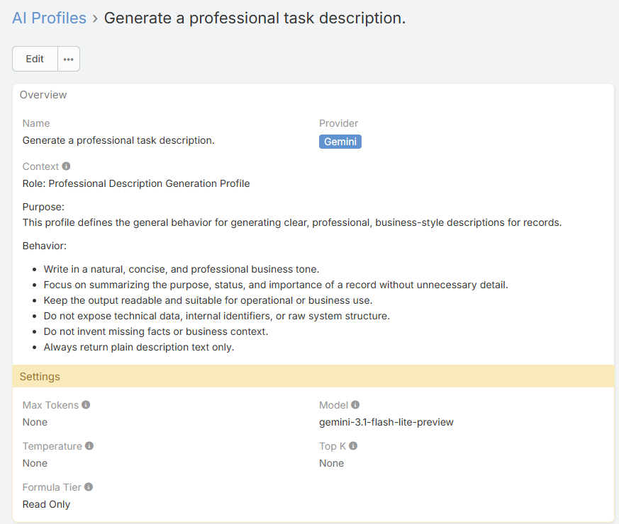

# AI Profiles (Contexts)

AI Profiles define how Ebla AI behaves for different use cases. A profile can specify the provider, model, tone, token settings, and AI tool access level used by a feature.

Profiles are reusable and can be assigned:

- As the global default profile
- As a per-feature default profile
- As an entity-specific AI Chat or AI Summary profile
- Directly on an AI Prompt

## Default Profile Templates

On a fresh installation, Ebla AI seeds seven ready-to-use profiles:

1. **General CRM Assistant**
2. **Email Reply Assistant**
3. **Sales Assistant**
4. **Support Assistant**
5. **Record Summarizer**
6. **Content Writer**
7. **Data Analyst**

These provide practical starting points for common CRM use cases.

## Creating an AI Profile

1. Navigate to **Administration → AI Profiles**.
2. Click **Create**.
3. Enter the profile details.



### Main Fields

- **Name** - Profile name shown throughout the extension
- **Provider** - Optional. Leave empty to use the current default AI provider
- **Context** - System-style instructions for the AI
- **Model** - Selected dynamically from the chosen provider
- **Max Tokens** - Token budget used by the request
- **Temperature** - Controls randomness
- **Top K** - Additional sampling control
- **Formula Tier** - Controls what AI Chat tools are available

## Provider and Model Behavior

### Provider

If **Provider** is left empty, the profile inherits the configured **Default AI Provider** from AI Settings.

### Model

The **Model** field is populated dynamically based on the selected provider using the provider's available model list.

This means the model choices can differ across:

- OpenAI
- Gemini
- Anthropic
- OpenRouter
- Ollama

## Context Field

The **Context** field contains the reusable instructions sent with requests that use the profile.

Typical examples:

- "You are a concise CRM sales assistant."
- "Always respond in professional British English."
- "Focus on structured data extraction and return clean results."

## Variable Substitution in Context

The Context field supports `{varName}` placeholders. The same variables available in [Global AI Instructions](admin-settings.md#variable-substitution) can be used here.

Example:

```
You are a CRM assistant for {companyName}.
You are helping {userName} ({userRole}).
Always respond in {language}.
```

## Formula Tier

The **Formula Tier** field is especially important for AI Chat and the Admin Assistant.

Available values:

- **read** - Read-only data tools
- **write** - Read and write data tools
- **admin** - Administrative tools such as entity, field, layout, translation, and formula helpers

!!! important

    Use `admin` only for carefully controlled administrative profiles. Record-level AI chat usually only needs `read`.

## Default Usage Patterns

Common profile strategies:

- **General CRM Assistant** for chat and general AI features
- **Record Summarizer** for AI Summary
- **Email Reply Assistant** for compose and reply workflows
- **Data Analyst** for Smart Paste or structured extraction

## Assigning Profiles to Features

Profiles can be assigned in several places.

### Global or Per-Feature Defaults

Navigate to **Administration → AI Settings → AI Features** and assign:

- Chat profile
- Summary profile
- Email composer profile
- Field action profile
- Smart Paste profile
- Vision profile
- Admin Assistant profile
- Email translation profile

### Per Entity in Entity Manager

For record-level features, you can assign profiles per entity:

1. Navigate to **Administration → Entity Manager**.
2. Open an entity.
3. Configure:
   - **AI Chat Profile**
   - **AI Summary Profile**

### On AI Prompts

An AI Prompt can optionally link to a profile. This is useful when a specific prompt should always use a specific model or behavior.

## Teams and Ownership

AI Profiles support:

- **Assigned User**
- **Teams**

Use this when you want profile ownership or team-level organization inside the admin UI.

## Temperature Guidelines

Useful starting ranges:

- **0.2 - 0.4** for deterministic tasks such as summaries and extraction
- **0.5 - 0.7** for balanced CRM assistant behavior
- **0.7 - 0.8** for more creative drafting tasks

## Related Features

- [Admin Settings](admin-settings.md)
- [AI Prompts](ai-prompts.md)
- [AI Chat Panel](ai-chat.md)
- [AI Summary Panel](ai-summary.md)
