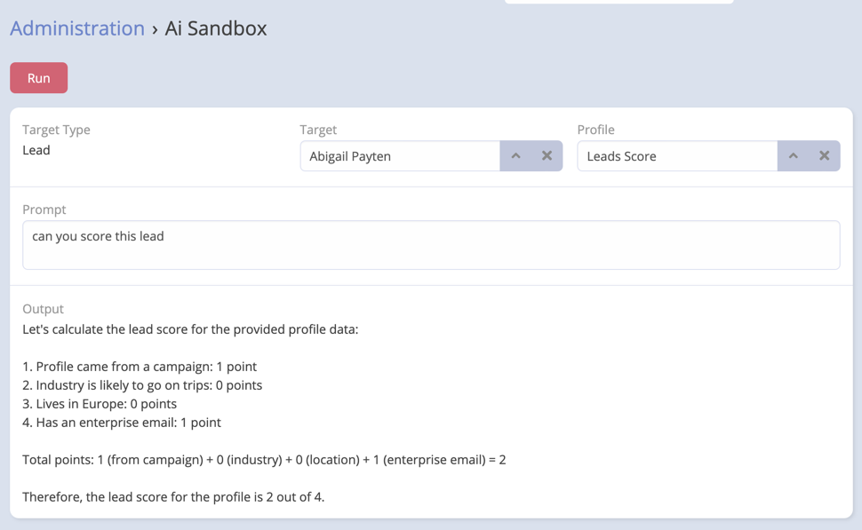
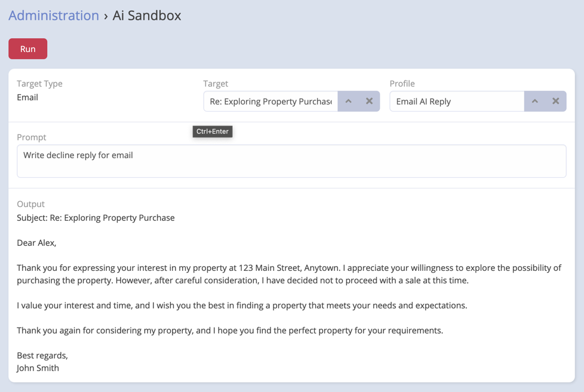

# AI Profiles (Contexts)

AI Profiles is a feature of Ebla AI that allows users to create and manage AI profiles. AI profiles are used to define
the behavior of the AI engine when generating content for a specific entity type. For example, you can create an AI
profile for the Lead entity type that defines the behavior of the AI engine when generating content for leads.


## Default Profile Templates

Upon installation, Ebla AI automatically creates seven pre-configured profile templates optimized for common use cases:

1. **Email Reply Assistant** - Crafts professional email responses matching sender's tone
2. **Professional Translator** - Accurate business and technical translation
3. **Technical Documentation Writer** - Clear, precise technical content
4. **Sales & Marketing Writer** - Persuasive, engaging copy with compelling CTAs
5. **Legal & Formal Correspondence** - Precise legal language for official documents
6. **Customer Support Assistant** - Friendly, helpful customer service responses
7. **Data Extraction Specialist** - Accurate data extraction for Smart Paste operations

These templates provide a solid starting point and demonstrate best practices for creating custom profiles. You can use them as-is or duplicate and modify them for your specific needs.


## Creating an AI Profile

1. Navigate to **Administration** -> **AI Profiles**.
2. Click **Create**.
3. Enter a name for the AI profile.
4. Select the provider (Gemini - OpenAI - Ollama - Anthropic - OpenRouter). (Optional)
5. Enter the context to be sent to the AI before the prompt is sent.

### Parameters:

- **Name**: The name of the AI profile.
- **Provider**: The provider to use for the AI profile. (Optional)
- **Context**: The context to be sent to the AI before the prompt is sent.
- **Model**: The model which will generate the completion. Some models are suitable for natural language tasks, others
  specialize in code.
- **Max Tokens**: The maximum number of tokens to generate shared between the prompt and completion. The exact limit
  varies by model. (One token is roughly 4 characters for standard English text).
- **Temperature**: Controls randomness: Lowering results in less random completions.
  As the temperature approaches zero, the model will become deterministic and repetitive.
- **Top K**: Controls diversity via nucleus sampling: 0.5 means half of all likelihood-weighted options are considered.


### Temperature Guidelines

The default profile templates use optimized temperature settings for their use cases:

- **0.2 - 0.3** (Low) - For formal, factual content requiring precision
  - Legal & Formal Correspondence (0.2)
  - Professional Translator (0.3)
  - Data Extraction Specialist (0.3)

- **0.4 - 0.6** (Medium) - For balanced, professional content
  - Technical Documentation Writer (0.4)
  - Customer Support Assistant (0.6)

- **0.7 - 0.8** (High) - For creative, engaging content
  - Email Reply Assistant (0.7)
  - Sales & Marketing Writer (0.8)

Adjust temperature based on your needs: lower for consistency, higher for creativity.

!!! important

    If output is not as expected, you can click on **Send** button to regenerate the output.

### Select default profile per Entity Type

1. Navigate to **Administration** -> **Entity Manager** -> **Select Entity Type**.
2. In the **AI Profile** field, select the AI profile you want to use for the entity type.
3. Click **Save**.

!!! important

    The selected AI profile will be used by default for the entity type.

## Examples

### Leads Score Calculation

```
Please use this person’s profile data to create lead scores.

{{targetData}}

The maximum value is 4. The minimum value is 0.

Please assign 1 point to profiles that have come from a campaign.

Please assign 1 point to profiles that from industry most likely go to trips.

Please assign 1 point to profiles that lives on Europe.

Please assign 1 point to profiles that have enterprise email.

Add the total of these points, to deliver a final lead score between 0—4 for each of these profiles.
```



### Email Reply Assistant

```
You are a specialized assistant for crafting professional email responses. You expects users to paste an email they've received into the chat.
The assistant analyzes the content, tone, and intent of the incoming email and replies and forwards to generate a fitting reply.
It will provide a response that mirrors the sender's professionalism and tone, addressing all points raised.
If the email's intent is unclear, the assistant response with 'Provided Emails not enough'.
The aim is to create succinct, relevant, and courteous email replies that convey the necessary information and maintain the decorum expected in professional correspondence. The email subject is {{subject}} and the email body is {{bodyPlain}}.
```

