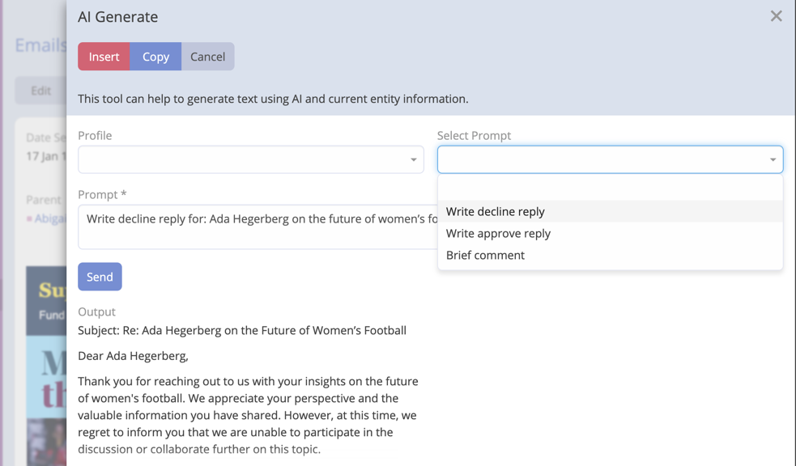
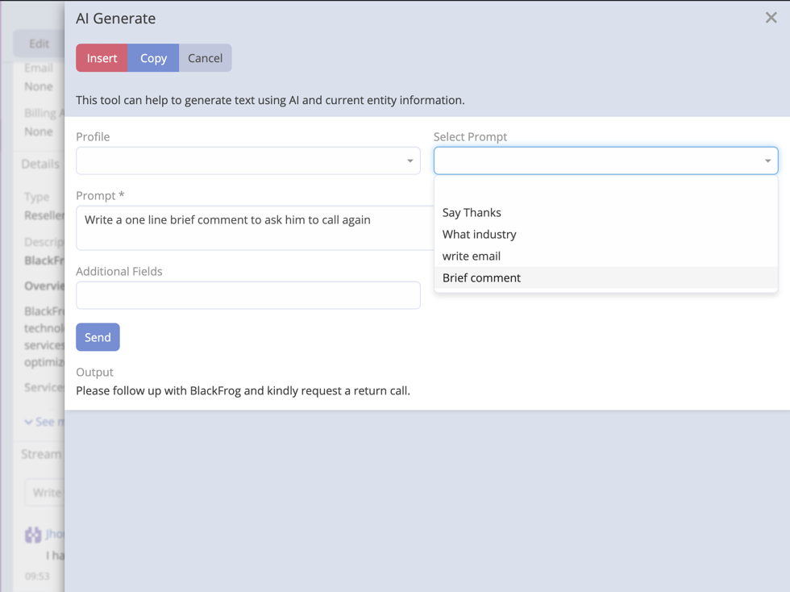
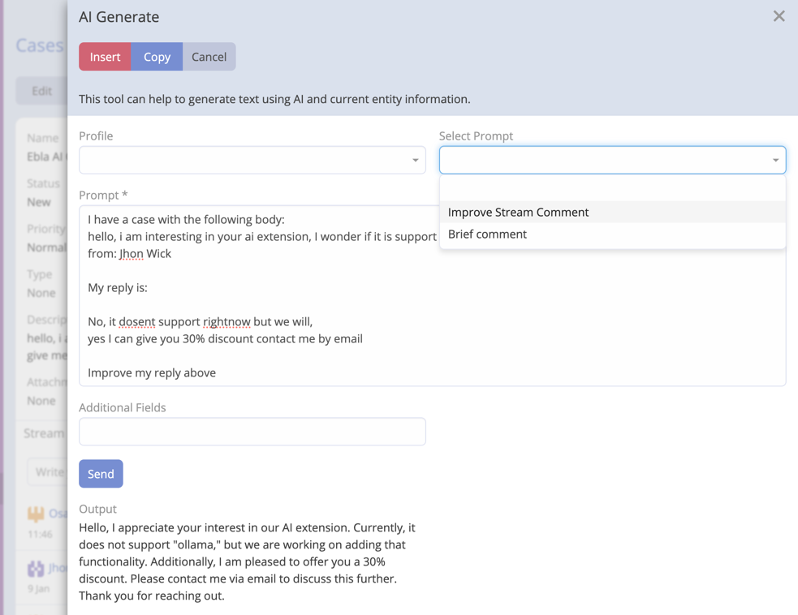

# AI Prompts

AI Prompts is a feature of Ebla AI that allows users to create and manage AI prompts. AI prompts are used as templates
of prompts.

## Default Prompts

Upon installation, Ebla AI seeds **13 ready-to-use prompts** across common entity types and general scopes:

| Scope | Examples |
|-------|---------|
| **Email** | Write a professional reply, Summarize this email thread, Draft a follow-up |
| **Lead** | Qualify this lead, Write a lead outreach message |
| **Opportunity** | Summarize opportunity status, Draft a proposal intro |
| **Contact** | Write a contact introduction, Summarize contact activity |
| **Account** | Write an account summary, Draft an account update |
| **General** | Improve writing, Fix grammar |

These prompts are immediately available and can be used as-is or edited to suit your workflow.

## Creating an AI Prompt

1. Navigate to **Administration** -> **AI Prompts**.
2. Click **Create**.
3. Enter a name for the AI prompt.
4. Select Entity Type.
5. Enter the prompt context.


!!! important

    If output is not as expected, you can click on **Send** button to regenerate the output.

## Examples

### Email Reply

```
Write decline reply for: {{name}}
```

```
Write approve reply for: {{name}}
```



### Stream Comment

```
Write a one line brief comment to ADD_COMMENT_HERE
```



### Improve Stream Comment for Case entity

```
I have a case with the following body:
{{{description}}}

My reply is:

MY_REPLAY

Improve my reply above
```

