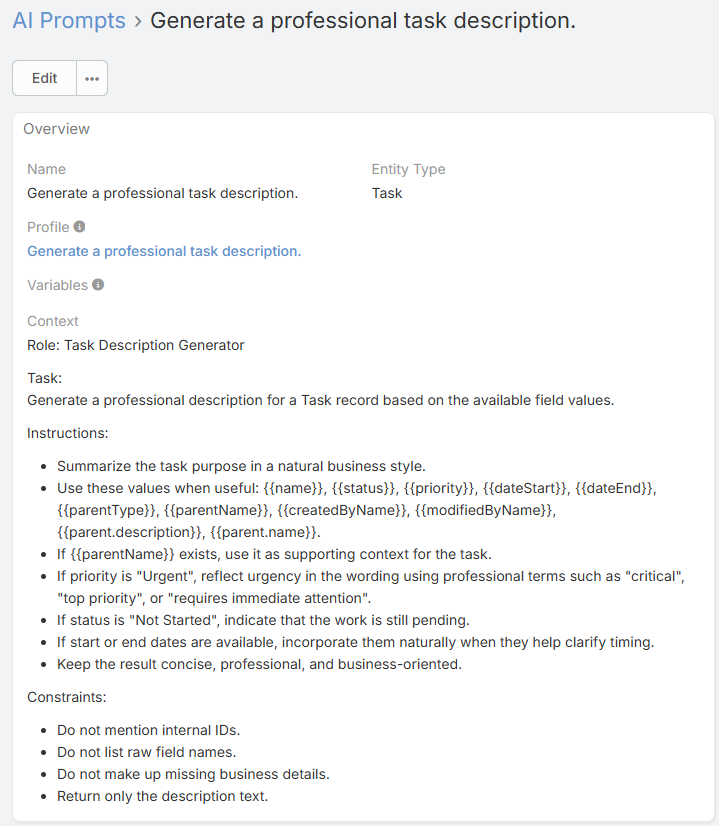
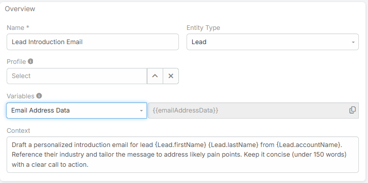

# AI Prompts

AI Prompts are reusable prompt templates stored in EspoCRM. They can be used by several Ebla AI features, including quick field generation, custom prompt dialogs, email translation, AI Summary configuration, formula-based prompt execution, and chat prompt shortcuts.

## Default Prompts

On a fresh installation, Ebla AI seeds 13 prompts across general and entity-specific use cases.

Examples include:

- **Brief Comment**
- **Record Summary**
- **Follow-up Email**
- **Meeting Preparation**
- **Approve Reply**
- **Decline Reply**
- **Email Summary**
- **Lead Qualification**
- **Lead Introduction Email**
- **Deal Strategy**
- **Proposal Draft**
- **Contact Bio**
- **Account Review**

## Creating an AI Prompt

1. Navigate to **Administration → AI Prompts**.
2. Click **Create**.
3. Enter:
   - **Name**
   - **Profile** (optional)
   - **Entity Type** (optional)
   - **Context**



## Main Fields

### Name

The label shown in prompt selectors and prompt shortcut menus.

### Profile

Optional linked AI Profile. When set, features that run this prompt can use that profile as the prompt's preferred execution profile.

### Entity Type

Optional. Use it when the prompt is meant for a specific record type such as:

- `Email`
- `Lead`
- `Opportunity`
- `Contact`
- `Account`

Entity-specific prompts can also appear in the AI Chat prompt shortcut menu for that entity.

### Context

The actual prompt template text.

## Where AI Prompts Are Used

Depending on the feature, AI Prompts can be used in different ways:

- **Field quick prompts** on text and varchar fields
- **Custom AI Generate** dialogs
- **Record AI Chat** prompt shortcut menu
- **Email translation** default prompt
- **AI Summary** entity-specific prompt assignment
- **Formula** execution via `eblaAi\runPrompt`

## Placeholder and Variable Support

Prompt preparation supports a mix of variable styles depending on where the prompt is used.

Common patterns include:

- `{{name}}`
- `{{description}}`
- `{Contact.firstName}`
- `{Account.name}`
- `%all%`
- `%value%`

### `%all%`

In supported prompt contexts, `%all%` inserts the full available data payload for the current record.

### `%value%`

In supported stream or field-generation contexts, `%value%` represents the current text value being refined.

### Prompt Variable Helper

The AI Prompt form includes a **Variables** helper field so you can browse and copy placeholder tokens more easily.



## Prompt Scope Strategy

A practical structure is:

- Use **global prompts** for reusable generic instructions
- Use **entity-specific prompts** for prompts that depend on record fields or business context
- Link a **profile** only when the prompt needs a dedicated model or behavior

## Example Prompts

### Quick Comment

```
Write a concise one-line professional comment for this record.
```

### Lead Qualification

```
Analyze this lead and provide a short qualification summary.
Highlight budget signals, urgency, likely next step, and whether the lead is Hot, Warm, or Cold.
```

### Stream Comment Improvement

```
Improve the following stream comment while keeping the meaning unchanged:

%value%
```

## Best Practices

- Keep prompts focused on one task
- Use entity-specific prompts when record data matters
- Test prompts in the relevant feature flow, not only in isolation
- Use linked profiles only when necessary

## Related Features

- [AI Profiles](ai-profiles.md)
- [AI Chat Panel](ai-chat.md)
- [AI Summary Panel](ai-summary.md)
- [Email Translation](email-translation.md)
- [Formula Functions](formula.md)
