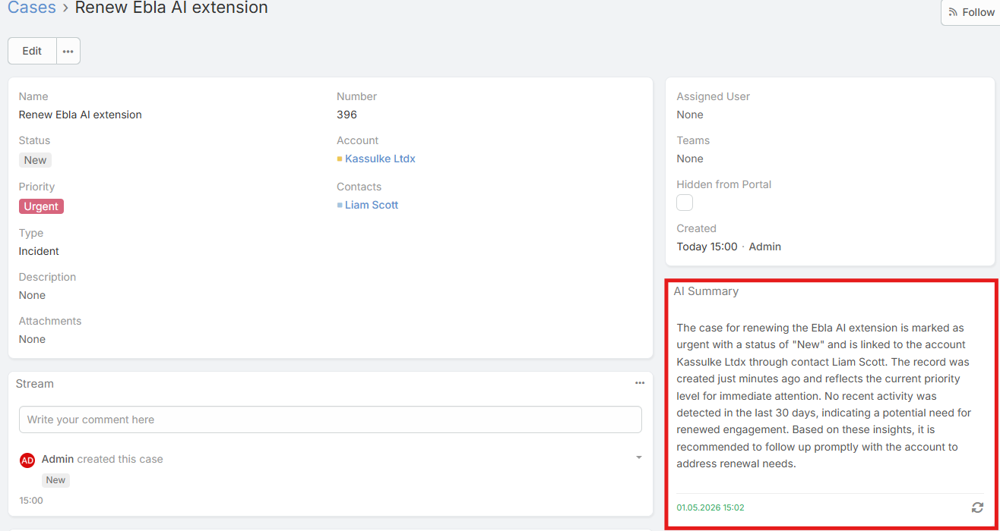
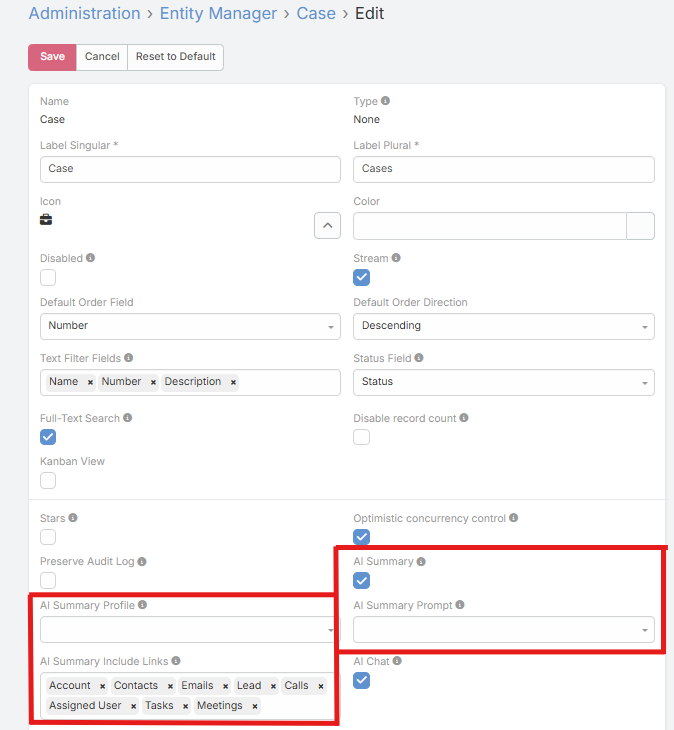
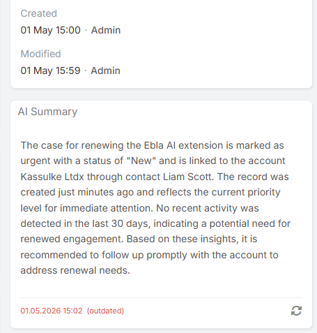

# AI Summary Panel

The AI Summary Panel shows an AI-generated summary of the current record in the side panel area of the detail view.

The panel is designed to surface a concise overview of the record using the record fields, recent activity, selected relationships, and recent related communication.

The generated summary is cached in the database.

## Requirements

Users need:

- `Ai Summary` access
- Read access to the current record

## Enabling AI Summary for an Entity

1. Navigate to **Administration → Entity Manager**.
2. Open the entity.
3. Enable **AI Summary**.
4. Optionally configure:
   - **AI Summary Profile**
   - **AI Summary Prompt**
   - **AI Summary Include Links**
5. Save.

## First Load Behavior

When the panel opens, it first checks for an existing cached summary.

Current behavior:

- If a cached summary exists, it is displayed immediately
- If no cached summary exists, the panel stays empty until the user clicks the generate button

## Generating and Regenerating

### First Generation

If no summary exists yet:

1. Open the record
2. Open the **AI Summary** panel
3. Click **Generate Summary**

### Regenerate

If a summary already exists, the panel can show a regenerate control when:

- The record has changed since the summary was generated
- The current user is an administrator

## Outdated Indicator

The panel compares:

- The summary generation time
- The record's `modifiedAt` timestamp

If the record was modified after the summary was generated, the panel marks the summary as **outdated**.

## What Data Is Included in the Summary Context

The current implementation can include:

- Readable record fields
- Assigned user
- Selected related records from **AI Summary Include Links**
- Recent stream items
- Recent activities such as Meetings, Calls, and Tasks
- Recent related emails
- Record age and last-updated timing

## Prompt and Profile Resolution

Summary generation follows this priority:

### Profile

1. Entity-specific **AI Summary Profile**
2. **AI Summary Default Profile**
3. Global default AI Profile

### Prompt

1. Entity-specific **AI Summary Prompt**
2. Admin-level fallback summary prompt if configured
3. Built-in default summary prompt

## Tips

- Use **AI Summary Include Links** to keep related-record context focused
- Assign a dedicated summarizer profile for more consistent output
- Add an entity-specific summary prompt if a record type needs a special summary structure

## Related Features

- [AI Profiles](ai-profiles.md)
- [AI Prompts](ai-prompts.md)
- [AI Chat Panel](ai-chat.md)
- [AI Log](ai-log.md)
